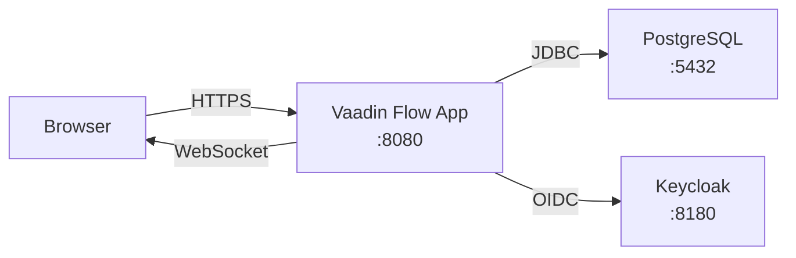
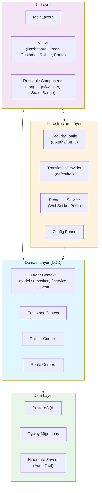
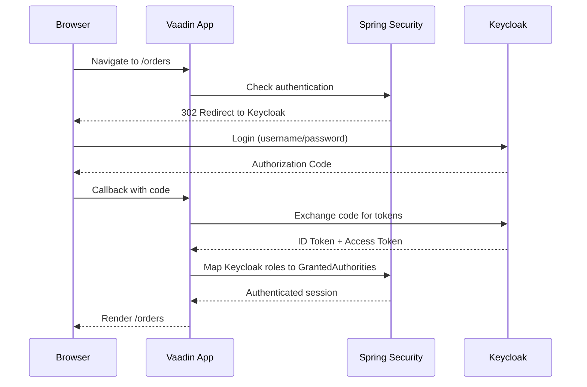
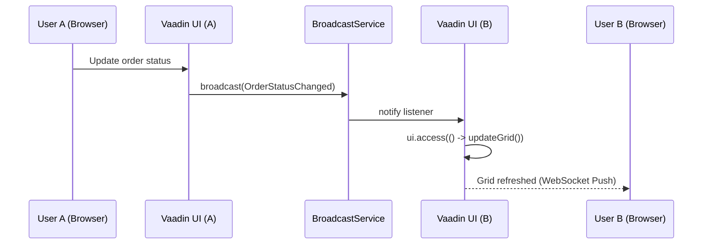
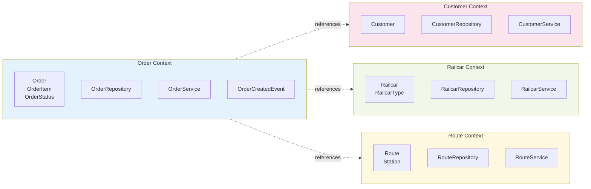
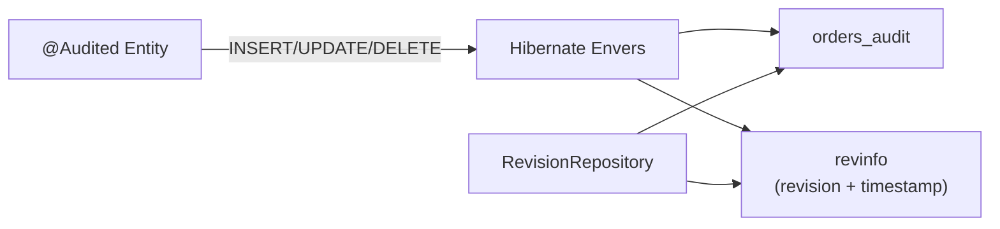
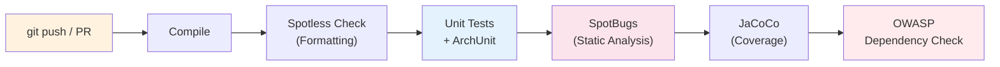

# Architecture Overview

## System Context

## Layer Architecture

## Authentication Flow

## Live Updates (Push)

## Bounded Contexts (DDD)

## Audit Trail (Envers)

## CI/CD Pipeline

## Layers

### UI Layer (`ui/`)
- **Vaadin Flow** server-side UI framework
- `layout/` — AppLayout-based MainLayout with navigation + language switcher
- `view/` — Route-annotated views per module (dashboard, order, customer, railcar, route)
- `component/` — Reusable custom components
- Styling: Tailwind CSS utilities + Vaadin Lumo theme

### Domain Layer (`domain/`)
- Organized by **Bounded Context** (DDD)
- Each context has: `model/`, `repository/`, `service/`, `event/`
- Bounded Contexts: **Order**, **Customer**, **Railcar**, **Route**

### Infrastructure Layer (`infrastructure/`)
- `security/` — Spring Security + Keycloak OIDC configuration
- `i18n/` — TranslationProvider (de, en, it, fr)
- `push/` — BroadcastService for live updates via WebSocket
- `config/` — Application configuration beans

## Database
- PostgreSQL 16 with Flyway migrations
- Schema managed in `src/main/resources/db/migration/`
- HikariCP connection pool (Spring Boot default)

## Quality Gates
- **Spotless** — Google Java Style (AOSP variant), enforced in CI
- **ArchUnit** — DDD layer rules, naming conventions, annotation checks
- **JaCoCo** — Minimum 60% line coverage
- **SpotBugs** — Static analysis, fail on Medium+ findings
- **OWASP Dependency Check** — CVE scanning on PRs
