# Architecture Overview

## System Context

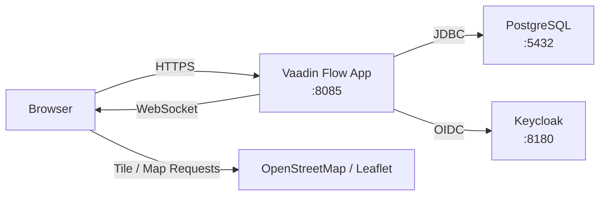

## Layer Architecture

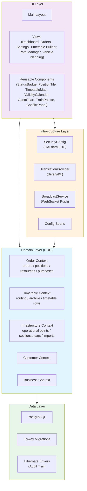

## Authentication Flow

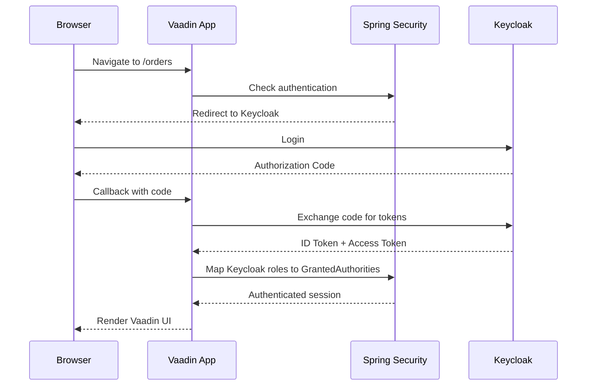

## Order Position Architecture

Order positions are stored in a single table (`order_positions`) and distinguished by `PositionType`.

- `LEISTUNG` uses a modal dialog editor and persists its business data directly on `order_positions`
- `FAHRPLAN` uses a dedicated full-screen builder and persists its detailed timetable in `timetable_archives`
- Both types share the same overview, detail, tagging, status, audit, and purchase-calendar presentation

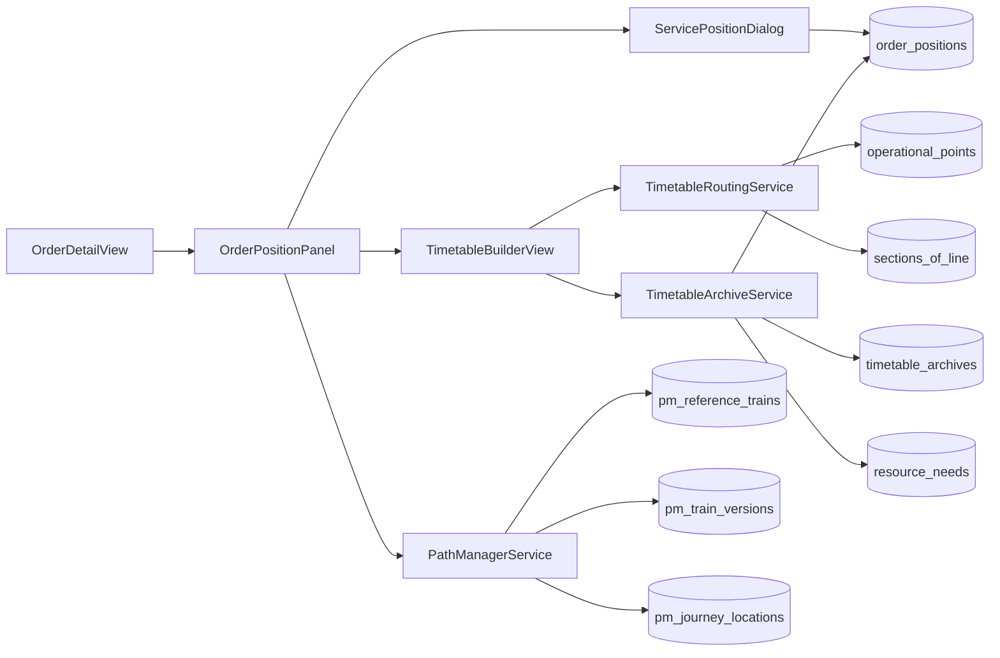

## Timetable Builder Flow

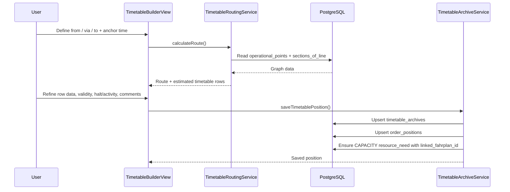

### Timetable Component Hierarchy

The timetable builder is decomposed into the following component tree:

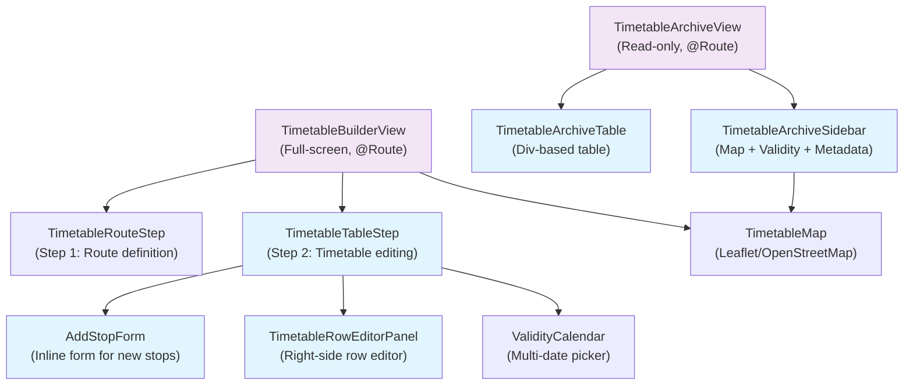

| Component | File | Responsibility |
|---|---|---|
| `TimetableBuilderView` | `ui/view/order/` | Full-screen view orchestrating both steps, map, and save logic |
| `TimetableArchiveView` | `ui/view/order/` | Read-only timetable detail view with split layout (table + sidebar) |
| `TimetableRouteStep` | `ui/component/timetable/` | Step 1: from/via/to selection, anchor time, route calculation |
| `TimetableTableStep` | `ui/component/timetable/` | Step 2: editable grid of all route points with split layout |
| `TimetableRowEditorPanel` | `ui/component/timetable/` | Right-side panel for editing a single row: times (shift/stretch), halt/activity, time modes (NONE/EXACT/WINDOW/COMMERCIAL), pinning |
| `AddStopForm` | `ui/component/timetable/` | Inline form shown below the grid for adding a new stop with OP selection and activity code |
| `TimetableArchiveTable` | `ui/component/timetable/` | Read-only Div-based timetable table with color-coded rows (origin/destination amber, halts teal, pass-through muted, deleted strikethrough) |
| `TimetableArchiveSidebar` | `ui/component/timetable/` | Right-side sidebar for archive view: map card, validity card, metadata card |
| `TimetableEditingService` | `domain/timetable/service/` | Backend service for insertStop, softDeleteStop, propagateTimeChange, resolveRelativeTime |
| `TimetableFormatUtils` | `ui/component/timetable/` | Static formatting helpers for times, distances, roles, TTT qualifier codes |

### Time Propagation Architecture

When a user edits a time in the timetable, the change can propagate to other rows via `TimetableEditingService.propagateTimeChange()`. Two modes are supported:

**SHIFT mode** translates all following times by the same delta (e.g., +15 minutes). Propagation stops at the next pinned row, creating a boundary. This is the default mode and is suitable when the overall schedule should move forward or backward.

**STRETCH mode** proportionally distributes time between the changed row and the next pinned row. If the available time between two pins changes, intermediate travel times are scaled by the same ratio. This is suitable for adjusting dwell times without shifting the entire downstream schedule.

The **pin** concept acts as an anchor: pinned rows are never modified by propagation. Users can pin key commercial stops (e.g., border crossings, interchange points) to preserve their times while editing surrounding rows.

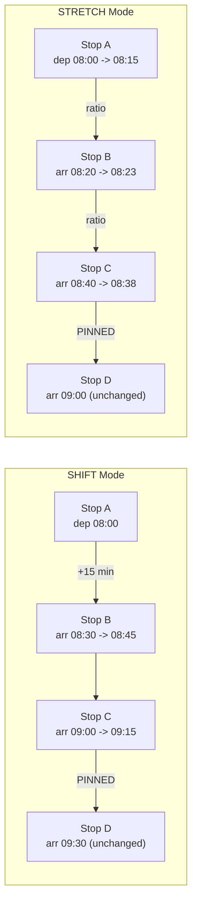

## Live Updates (Push)

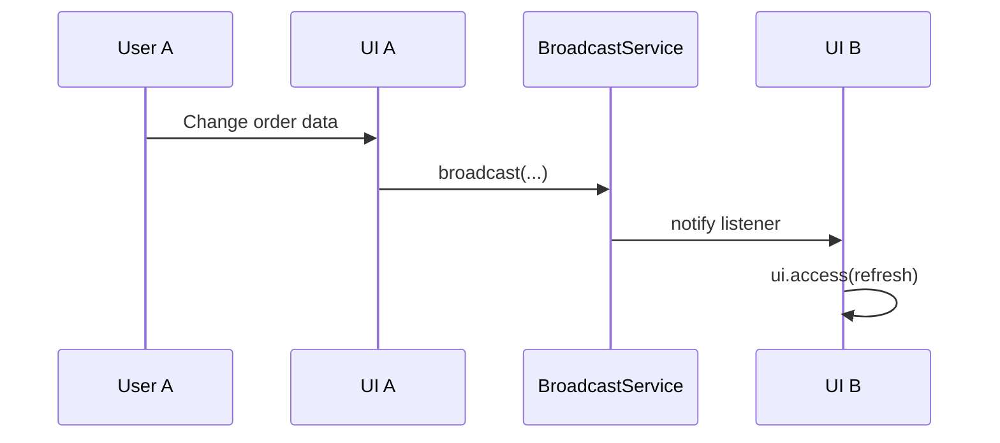

## Bounded Contexts

```mermaid
graph LR
    subgraph Order["Order Context"]
        O_M["Order<br/>OrderPosition<br/>ResourceNeed<br/>PurchasePosition"]
        O_R["Repositories"]
        O_S["OrderService"]
    end

    subgraph Timetable["Timetable Context"]
        T_M["TimetableArchive<br/>TimetableRowData<br/>TimePropagationMode<br/>JourneyLocationType"]
        T_R["TimetableArchiveRepository"]
        T_S["Routing + Archive + Editing Services"]
    end

    subgraph InfraDomain["Infrastructure Context"]
        I_M["OperationalPoint<br/>SectionOfLine<br/>PredefinedTag<br/>ImportLog"]
        I_R["Repositories"]
        I_S["CSV Import Services"]
    end

    subgraph PathManager["Path Manager Context"]
        PM_M["PmReferenceTrain<br/>PmTrainVersion<br/>PmJourneyLocation<br/>PmRoute<br/>PmPath<br/>PmPathRequest<br/>PmProcessStep<br/>PmTimetableYear<br/>TtrPhase"]
        PM_R["Repositories"]
        PM_S["PathManagerService<br/>PathProcessEngine<br/>TtrPhaseResolver<br/>DiffService<br/>IdentifierGenerator"]
    end

    subgraph VehiclePlanning["Vehicle Planning Context"]
        VP_M["VpRotationSet<br/>VpVehicle<br/>VpRotationEntry<br/>VpVehicleOperation<br/>Conflict Record"]
        VP_R["Repositories"]
        VP_S["VehiclePlanningService<br/>ConflictDetectionService"]
    end

    subgraph Customer["Customer Context"]
        C_M["Customer"]
    end

    subgraph Business["Business Context"]
        B_M["Business"]
    end

    Order -.->|references| Customer
    Order -.->|optional links| Business
    Order -.->|capacity link| Timetable
    Order -.->|pm_reference_train_id| PathManager
    Timetable -.->|routes over| InfraDomain
    PathManager -.->|created from| Order
    VehiclePlanning -.->|assigns trains from| PathManager
```

## Layers

### UI Layer (`ui/`)

- Vaadin Flow server-side UI
- `layout/`: `MainLayout`, navigation, breadcrumbs, profile/theme context
- `view/`: route-annotated views such as `OrderListView`, `OrderDetailView`, `SettingsView`, `TimetableBuilderView`
- `component/`: reusable UI building blocks such as `PositionTile`, `OrderPositionRow`, `PurchaseCalendarPanel`, `TimetableMap`
- Styling: custom theme in `frontend/themes/order-mgmt/` plus Vaadin Lumo primitives

### Domain Layer (`domain/`)

- Organized by bounded context
- `order/`: orders, positions, resource needs, purchase positions, status model
- `timetable/`: route search, timetable archive, TTT-like row model
- `pathmanager/`: TTT reference trains, versions, journey locations, routes, paths, process steps, state machine, TTR phase resolver
- `vehicleplanning/`: rotation sets, vehicles, rotation entries, vehicle operations, conflict detection
- `infrastructure/`: operational points, sections of line, tag catalog, import logs
- `customer/`, `business/`: supporting master/business data

### REST API Layer (`api/`)

- `api/pathmanager/`: REST endpoints for the Path Manager bounded context
  - `PathManagerController`: CRUD for reference trains (submit, detail, list by year, update header, update journey location)
  - `PathProcessController`: query available actions, execute process step, view process history
  - `PathManagerDiffController`: diff between two train versions
- All endpoints documented via Springdoc/OpenAPI at `/swagger-ui/index.html`

### Path Manager Component Architecture

The Path Manager simulates TTT (Train Timetable Transfer) communication between the Responsible Applicant (RA) and an Infrastructure Manager (IM) within a single Spring Boot application. The REST API acts as the boundary between order management (RA side) and path management (IM simulation).

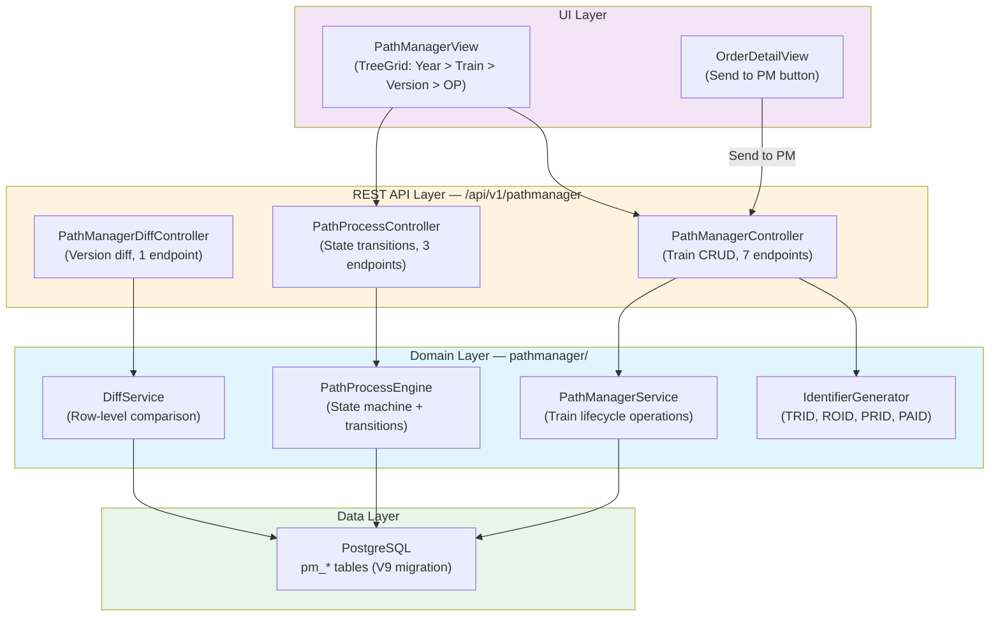

#### PathProcessEngine — State Machine Pattern

The `PathProcessEngine` implements a static transition table as an `EnumMap<PathProcessState, Set<PathAction>>`. For each state, only the explicitly listed actions are permitted. The engine:

1. Loads the reference train and its current `PathProcessState`
2. Validates that the requested `PathAction` is allowed for the current state
3. Resolves the target state via a `switch` expression (`resolveTargetState()`)
4. Creates an immutable `PmProcessStep` audit record with from/to states and optional comment
5. For version-creating actions (`IM_DRAFT_OFFER`, `IM_FINAL_OFFER`, `IM_ALTERATION_OFFER`), clones the latest `PmTrainVersion` with all its `PmJourneyLocations`

This pattern avoids external state machine libraries while keeping the transition logic auditable and testable. The complete state diagram is documented in [datenmodel.md](datenmodel.md#ttt-prozess-state-machine).

#### API Endpoint Summary

| # | Method | Path | Description |
|---|---|---|---|
| 1 | POST | `/api/v1/pathmanager/trains` | Submit a new reference train |
| 2 | GET | `/api/v1/pathmanager/trains` | List trains (optional `?year=` filter) |
| 3 | GET | `/api/v1/pathmanager/trains/{trainId}` | Get train detail |
| 4 | PUT | `/api/v1/pathmanager/trains/{trainId}` | Update train header |
| 5 | GET | `/api/v1/pathmanager/trains/{trainId}/versions` | List train versions |
| 6 | GET | `/api/v1/pathmanager/trains/{trainId}/versions/{versionId}/locations` | Get journey locations |
| 7 | PUT | `/api/v1/pathmanager/trains/{trainId}/versions/{versionId}/locations/{locationId}` | Update a journey location |
| 8 | POST | `/api/v1/pathmanager/process/{referenceTrainId}/step` | Execute a state transition |
| 9 | GET | `/api/v1/pathmanager/process/{referenceTrainId}/available-actions` | Query available actions |
| 10 | GET | `/api/v1/pathmanager/process/{referenceTrainId}/history` | Get process history |
| 11 | POST | `/api/v1/pathmanager/diff?referenceTrainId=` | Compute diff vs. order data |

### Vehicle Planning Component Architecture

The Vehicle Planning module provides visual rotation planning with a Gantt chart interface. It operates directly on Path Manager entities (reference trains, timetable years) without a REST API layer.

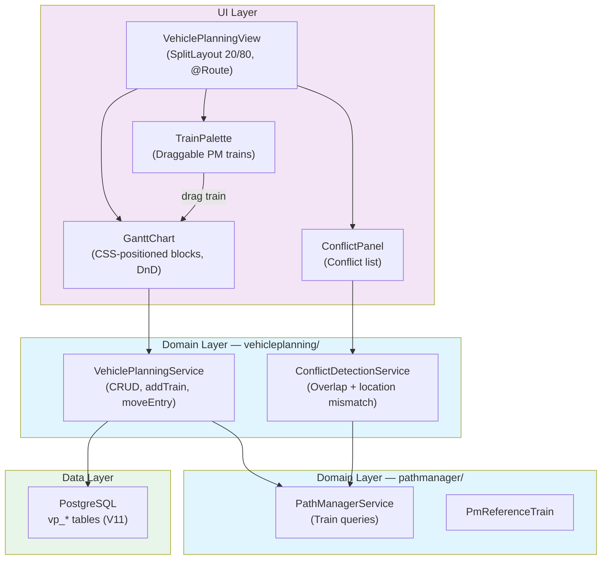

| Component | File | Responsibility |
|---|---|---|
| `VehiclePlanningView` | `ui/view/vehicleplanning/` | Full-screen view with rotation set selector, day-of-week picker, new-rotation dialog, SplitLayout |
| `GanttChart` | `ui/component/vehicleplanning/` | Div-based Gantt with time ruler, vehicle rows, absolutely positioned train blocks, DragSource/DropTarget |
| `TrainPalette` | `ui/component/vehicleplanning/` | Sidebar with search field and draggable PM reference trains |
| `ConflictPanel` | `ui/component/vehicleplanning/` | Lower panel displaying detected conflicts with severity icons |
| `VehiclePlanningService` | `domain/vehicleplanning/service/` | CRUD for rotation sets/vehicles, addTrainToVehicle, moveEntry, removeEntry |
| `ConflictDetectionService` | `domain/vehicleplanning/service/` | Detects time overlaps and location mismatches by inspecting PmJourneyLocation data |

### TtrPhaseResolver in Path Manager Architecture

The `TtrPhaseResolver` is a stateless Spring `@Service` that calculates the current TTR (Timetable Redesign) phase for any timetable year. It integrates into the Path Manager architecture as follows:

- **PathProcessEngine** calls `TtrPhaseResolver` to determine whether `IM_DRAFT_OFFER` is available (only in Bestellphase 2 / Annual Ordering)
- **PathManagerView** uses it to display color-coded TTR phase badges next to each timetable year
- **ProcessSimulationPanel** shows a phase info box when a train is in NEW state, indicating the auto-resolved ProcessType and any Bestellphase 3 warnings

The resolver has no persistence of its own -- it computes phases from `PmTimetableYear.startDate` and the current date using month-based offsets (X-60, X-36, X-18, X-11, X-8.5, X-2).

### Infrastructure Layer (`infrastructure/`)

- `security/`: Spring Security + Keycloak OIDC
- `i18n/`: translation provider for DE/EN/IT/FR
- `push/`: broadcast service for UI refresh
- `config/`: application-level configuration

## Database

- PostgreSQL 16 with Flyway migrations `V1` to `V14`
- Shared order-position table with typed behavior via `PositionType`
- `timetable_archives` stores the detailed timetable rows as `jsonb`
- `resource_needs.linked_fahrplan_id` provides the technical link from a `CAPACITY` need to an archived timetable
- Hibernate Envers tracks audited entities in dedicated `_audit` tables

## Quality Gates

- **Spotless**: formatting
- **ArchUnit**: DDD layer rules and conventions
- **JaCoCo**: coverage
- **SpotBugs**: static analysis
- **OWASP Dependency Check**: dependency CVE scanning
- **Playwright**: browser-based regression paths, including the timetable builder
