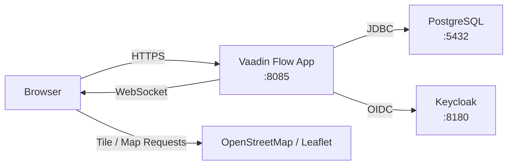
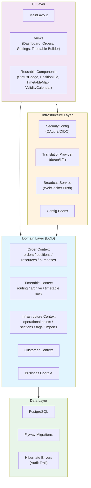
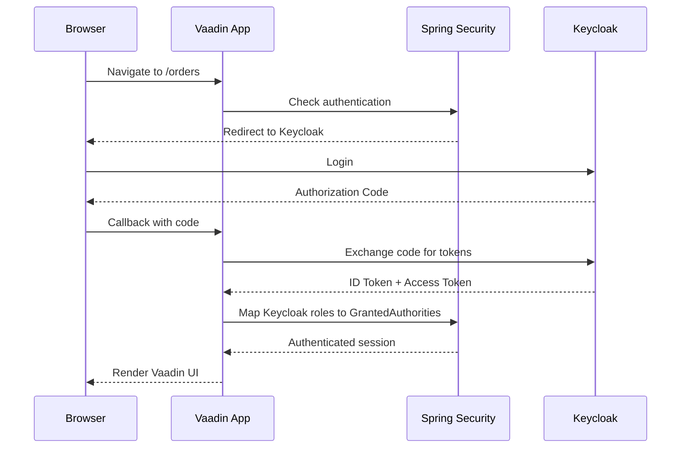
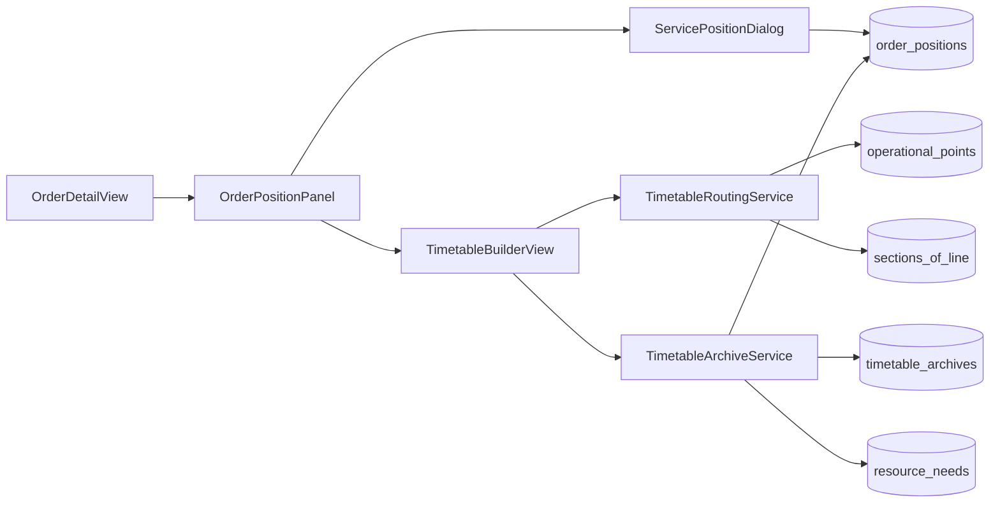
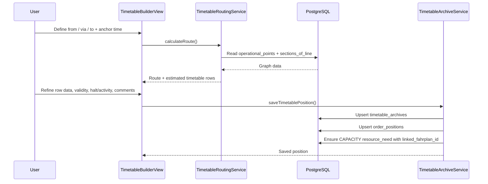
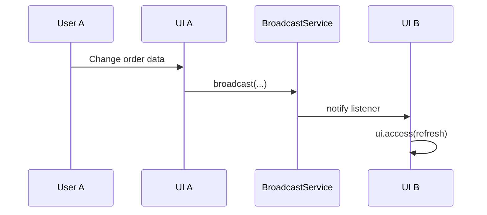
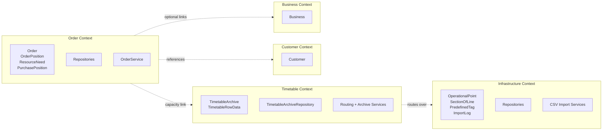

# Architecture Overview

## System Context

## Layer Architecture

## Authentication Flow

## Order Position Architecture

Order positions are stored in a single table (`order_positions`) and distinguished by `PositionType`.

- `LEISTUNG` uses a modal dialog editor and persists its business data directly on `order_positions`
- `FAHRPLAN` uses a dedicated full-screen builder and persists its detailed timetable in `timetable_archives`
- Both types share the same overview, detail, tagging, status, audit, and purchase-calendar presentation

## Timetable Builder Flow

## Live Updates (Push)

## Bounded Contexts

## Layers

### UI Layer (`ui/`)

- Vaadin Flow server-side UI
- `layout/`: `MainLayout`, navigation, breadcrumbs, profile/theme context
- `view/`: route-annotated views such as `OrderListView`, `OrderDetailView`, `SettingsView`, `TimetableBuilderView`
- `component/`: reusable UI building blocks such as `PositionTile`, `OrderPositionRow`, `PurchaseCalendarPanel`, `TimetableMap`
- Styling: custom theme in `frontend/themes/order-mgmt/` plus Vaadin Lumo primitives

### Domain Layer (`domain/`)

- Organized by bounded context
- `order/`: orders, positions, resource needs, purchase positions, status model
- `timetable/`: route search, timetable archive, TTT-like row model
- `infrastructure/`: operational points, sections of line, tag catalog, import logs
- `customer/`, `business/`: supporting master/business data

### Infrastructure Layer (`infrastructure/`)

- `security/`: Spring Security + Keycloak OIDC
- `i18n/`: translation provider for DE/EN/IT/FR
- `push/`: broadcast service for UI refresh
- `config/`: application-level configuration

## Database

- PostgreSQL 16 with Flyway migrations `V1` to `V7`
- Shared order-position table with typed behavior via `PositionType`
- `timetable_archives` stores the detailed timetable rows as `jsonb`
- `resource_needs.linked_fahrplan_id` provides the technical link from a `CAPACITY` need to an archived timetable
- Hibernate Envers tracks audited entities in dedicated `_audit` tables

## Quality Gates

- **Spotless**: formatting
- **ArchUnit**: DDD layer rules and conventions
- **JaCoCo**: coverage
- **SpotBugs**: static analysis
- **OWASP Dependency Check**: dependency CVE scanning
- **Playwright**: browser-based regression paths, including the timetable builder
