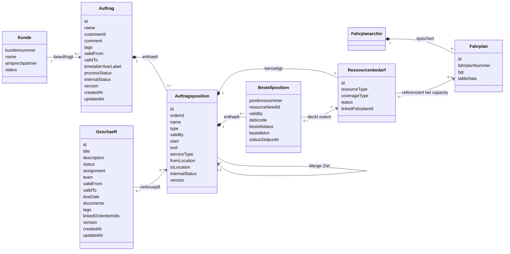
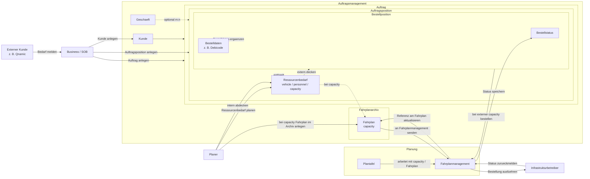

# Datenmodell Auftragsmanagement

## Ziel und Scope

Dieses Dokument beschreibt zentral das fachliche Datenmodell fuer Auftraege, Auftragspositionen, Ressourcenplanung und externe Bestellung im Umfeld des Fahrplans.

Beispiel:
Ein externer Kunde wie Qnamic moechte einen Zug fahren. Das Business bzw. SOB nimmt den Bedarf entgegen und legt Kunde, Auftrag und Auftragsposition an. Danach uebernimmt der Planer die fachliche Planung des Fahrplans und die Bestellung.

Eine `Auftragsposition` kann fachlich unterschiedliche Typen haben. Im aktuellen Modell werden insbesondere zwei Typen betrachtet:

- `Fahrplan`: Position fuer die Planung und Bestellung einer Zugfahrt
- `Leistung`: Position fuer sonstige fachliche Leistungen ohne den hier beschriebenen Fahrplanprozess

Unabhaengig vom Positionstyp kann eine `Auftragsposition` einen oder mehrere flexible `Ressourcenbedarfe` enthalten. Im aktuellen Modell werden insbesondere drei Ressourcentypen betrachtet:

- `vehicle`
- `personnel`
- `capacity`

Jeder Ressourcenbedarf wird entweder intern in der Planung abgedeckt oder extern ueber eine `Bestellposition` beschafft. Der Ressourcentyp `capacity` entspricht der Kapazitaet im Netz und wird fachlich ueber einen `Fahrplan` im `Fahrplanarchiv` abgebildet.

## Zentrales fachliches Datenmodell

Im Diagramm sind fuer die `Auftragsposition` nur die wichtigsten Kernattribute dargestellt. Die vollstaendige aktuelle Feldliste mit Varianten-, Merge- und Referenzfeldern steht weiter unten.

## Objektattribute

### Kunde

| Attribut | Pflicht | Beschreibung |
| --- | --- | --- |
| kundennummer | ja | Eindeutige fachliche ID des Kunden |
| name | ja | Name des Kundenunternehmens |
| ansprechpartner | nein | Fachlicher Ansprechpartner |
| status | ja | Fachlicher Status des Kunden |

### Auftrag

| Attribut | Typ | Pflicht | Beschreibung |
| --- | --- | --- | --- |
| id | string | ja | Eindeutige ID |
| name | string | ja | Auftragsname |
| customerId | string? | nein | FK zum Kunden |
| comment | string? | nein | Kommentar |
| tags | string[] | ja | Schlagwoerter |
| validFrom | date? | nein | Gueltig ab |
| validTo | date? | nein | Gueltig bis |
| timetableYearLabel | string? | nein | Fahrplanjahr-Label |
| processStatus | enum? | nein | Prozessstatus: `auftrag`, `planung`, `produkt_leistung`, `produktion`, `abrechnung_nachbereitung` |
| internalStatus | string? | nein | Interner Bearbeitungsstatus analog zum Business-Status |
| version | int | ja | Versionszaehler |
| createdAt | datetime | ja | Erstellungszeitpunkt |
| updatedAt | datetime | ja | Letzter Aenderungszeitpunkt |
| items | OrderItem[] | ja | Liste der Auftragspositionen; fachlich ueber die Beziehung `Auftrag -> Auftragsposition` modelliert |

### Auftragsposition

Die aktuelle Feldliste der `Auftragsposition` mischt fachliche Kernattribute mit Variantenlogik, Merge-Informationen und technischen Referenzen. Eine `Auftragsposition` kann vom Typ `Fahrplan` oder vom Typ `Leistung` sein. Zusaetzlich enthaelt sie einen oder mehrere `Ressourcenbedarfe`. Im Zielmodell enthaelt die `Auftragsposition` keinen Fahrplan selbst, sondern referenziert bei `capacity`-Bedarfen einen Fahrplan ueber den jeweiligen `Ressourcenbedarf`. Fuer das Zielmodell sollte geprueft werden, welche bisherigen Fahrplan-Referenzfelder aus der Position in den archivierten Fahrplan oder in den Ressourcenbedarf verschoben werden.

| Attribut | Typ | Pflicht | Bereich | Beschreibung |
| --- | --- | --- | --- | --- |
| id | string | ja | Kern | Eindeutige ID |
| orderId | string | ja | Kern | FK zum Auftrag |
| name | string | ja | Kern | Positionsname |
| type | string | ja | Kern | Typ: Leistung oder Fahrplan |
| tags | string[] | ja | Kern | Schlagwoerter |
| start | datetime? | nein | Kern | Startzeitpunkt |
| end | datetime? | nein | Kern | Endzeitpunkt |
| serviceType | string? | nein | Kern | Leistungsart |
| fromLocation | string? | nein | Kern | Startort |
| toLocation | string? | nein | Kern | Zielort |
| validity | json? | nein | Kern | Gueltigkeitssegmente als `startDate`/`endDate`-Paare |
| resourceNeeds | ResourceNeed[] | ja im Zielmodell | Fachmodell | Liste flexibler Ressourcenbedarfe; fachlich ueber die Beziehung `Auftragsposition -> Ressourcenbedarf` modelliert |
| linkedTemplateId | string? | nein | Fahrplan-Verknuepfung im Bestandsmodell | FK zur `ScheduleTemplate`; im Zielmodell fachlich eher am archivierten Fahrplan |
| linkedTrainPlanId | string? | nein | Fahrplan-Verknuepfung im Bestandsmodell | FK zum `TrainPlan`; im Zielmodell fachlich eher am archivierten Fahrplan |
| generatedTimetableRefId | string? | nein | Fahrplan-Verknuepfung im Bestandsmodell | Referenz auf generierten Fahrplan; im Zielmodell fachlich eher am archivierten Fahrplan |
| variantType | string? | nein | Variantenmodell | `productive` oder `simulation` |
| variantOfItemId | string? | nein | Variantenmodell | FK zur Ursprungsvariante |
| variantGroupId | string? | nein | Variantenmodell | Gruppen-ID fuer zusammengehoerige Varianten |
| variantLabel | string? | nein | Variantenmodell | Varianten-Label |
| simulationId | string? | nein | Variantenmodell | Simulations-ID |
| simulationLabel | string? | nein | Variantenmodell | Simulations-Label |
| mergeStatus | string? | nein | Merge | `open`, `applied`, `proposed` |
| mergeTargetId | string? | nein | Merge | Ziel-Position fuer Merge |
| originalTimetable | json? | nein | Merge | Snapshot des originalen Fahrplans vor Aenderungen |
| internalStatus | string? | nein | Status | `in_bearbeitung`, `freigegeben`, `ueberarbeiten`, `uebermittelt`, `beantragt`, `abgeschlossen`, `annulliert` |
| businessLinks | pivot | nein | Geschaeftsverknuepfung | Technische m:n-Verknuepfung zu Geschaeften ueber `business_order_items` |
| linkedBusinessIds | string[]? | nein | Geschaeftsverknuepfung | IDs verknuepfter Geschaefte im Frontend oder DTO |
| version | int | ja | Technische Metadaten | Versionszaehler |
| createdAt | datetime | ja | Technische Metadaten | Erstellungszeitpunkt |
| updatedAt | datetime | ja | Technische Metadaten | Letzter Aenderungszeitpunkt |

### Ressourcenbedarf

Ein `Ressourcenbedarf` beschreibt, welche Ressource fuer eine `Auftragsposition` benoetigt wird und ob diese intern in der Planung oder extern ueber eine Bestellung abgedeckt wird. Der Ressourcentyp `capacity` repraesentiert die Kapazitaet im Netz und referenziert daher einen `Fahrplan` aus dem `Fahrplanarchiv`.

| Attribut | Typ | Pflicht | Beschreibung |
| --- | --- | --- | --- |
| id | string | ja | Eindeutige ID des Ressourcenbedarfs |
| resourceType | enum | ja | Ressourcentyp: `vehicle`, `personnel`, `capacity` |
| coverageType | enum | ja | Art der Abdeckung: `internal` oder `external` |
| status | string? | nein | Status der Ressourcenabdeckung |
| linkedFahrplanId | string? | nein | Referenz auf den Fahrplan im Fahrplanarchiv; nur relevant fuer `resourceType = capacity` |

### Fahrplanarchiv

Das `Fahrplanarchiv` ist der fachliche Ablageort fuer Fahrplaene im Auftragsmanagement. Auftragspositionen und Bestellpositionen speichern den Fahrplan nicht selbst. Stattdessen referenziert ein `Ressourcenbedarf` vom Typ `capacity` den Fahrplan aus dem Archiv.

Die konkreten Attribute des `Fahrplanarchiv` sind noch offen. Fuer das Zielmodell ist zunaechst entscheidend, dass das Archiv als eigener fachlicher Container existiert.

### Fahrplan

Im Zielmodell wird der `Fahrplan` im `Fahrplanarchiv` gespeichert. Fachlich repraesentiert er den Ressourcentyp `capacity`, also die Kapazitaet im Netz. Die fachliche Gueltigkeit liegt nicht am Fahrplan selbst, sondern an der jeweiligen Auftrags- oder Bestellposition.

Fachlich ist der `Fahrplan` keine flache Struktur, sondern tabellarisch aufgebaut. Jede Zeile repraesentiert einen `Betriebspunkt`. Die fachlich relevanten Spalten pro Zeile sind `an`, `ab`, `von`, `nach` und `activity`.

Technisch kann diese tabellarische Struktur gut als `json` gespeichert werden. Im Datenmodell wird das ueber `tableData` am `Fahrplan` beschrieben. Damit bleibt fachlich sichtbar, dass es sich um eine Tabelle handelt, waehrend die technische Speicherung flexibel bleibt.

| Attribut | Pflicht | Beschreibung |
| --- | --- | --- |
| id | ja | Eindeutige ID des archivierten Fahrplans |
| fahrplanNummer | nein | Fachliche oder technische Kennung des Fahrplans |
| typ | nein | Kennzeichnung des Fahrplantyps oder der fachlichen Auspraegung |
| tableData | ja im Zielmodell | JSON-Struktur der Fahrplantabelle mit Zeilen je Betriebspunkt und Spalten wie `an`, `ab`, `von`, `nach`, `activity` |

### Bestellposition

Eine `Bestellposition` deckt einen extern zu beschaffenden `Ressourcenbedarf`. Die fachliche Gueltigkeit der Bestellung wird an der `Bestellposition` gespeichert. Bei `resourceType = capacity` wird ueber den referenzierten Fahrplan im `Fahrplanarchiv` bestellt. Bei `vehicle` und `personnel` repraesentiert die Bestellposition eine generische externe Beschaffung; der unten dargestellte Integrationsablauf ueber `Fahrplanmanagement` und `Infrastrukturbetreiber` betrifft fachlich vor allem `capacity`.

| Attribut | Pflicht | Beschreibung |
| --- | --- | --- |
| positionsnummer | ja | Eindeutige ID der Bestellposition |
| resourceNeedId | ja im Zielmodell | Referenz auf den extern zu deckenden Ressourcenbedarf |
| validity | ja im Zielmodell | Gueltigkeitssegmente der Bestellung; die Gueltigkeit liegt fachlich an der Bestellposition |
| debicode | ja fuer externe `capacity`-Bestellung | Bestellrelevantes Attribut fuer die externe Bestellung von Netzkapazitaet |
| bestellstatus | ja | Aktueller Status der Bestellung |
| bestelltAm | nein | Zeitpunkt der Bestellung |
| statusZeitpunkt | nein | Zeitpunkt der letzten Rueckmeldung |

### Geschaeft

| Attribut | Typ | Pflicht | Beschreibung |
| --- | --- | --- | --- |
| id | string | ja | Eindeutige ID |
| title | string | ja | Titel des Geschaefts |
| description | string | ja | Beschreibung |
| status | enum | ja | `in_bearbeitung`, `freigegeben`, `ueberarbeiten`, `abgeschlossen`, `annulliert` |
| assignment | object | ja | Zuordnung mit `type` (`group` oder `person`) und `name` |
| team | string? | nein | Team-Zuordnung |
| validFrom | date? | nein | Gueltig ab |
| validTo | date? | nein | Gueltig bis |
| dueDate | date? | nein | Faelligkeitsdatum, deprecated fuer Migration |
| documents | array? | nein | Dokumente mit `name` und `url` |
| tags | string[]? | nein | Schlagwoerter |
| linkedOrderItemIds | string[]? | nein | Verknuepfte Auftragspositionen |
| version | int | ja | Versionszaehler |
| createdAt | datetime | ja | Erstellungszeitpunkt |
| updatedAt | datetime | ja | Letzter Aenderungszeitpunkt |

## Beziehungen und Kardinalitaeten

| Von | Nach | Kardinalitaet | Art | Bedeutung |
| --- | --- | --- | --- | --- |
| Kunde | Auftrag | 1 zu 0..* | Assoziation | Ein Kunde kann keinen, einen oder mehrere Auftraege haben. |
| Auftrag | Auftragsposition | 1 zu 1..* | Komposition | Ein Auftrag enthaelt mindestens eine Auftragsposition. |
| Auftragsposition | Ressourcenbedarf | 1 zu 1..* | Komposition | Eine Auftragsposition enthaelt einen oder mehrere Ressourcenbedarfe. |
| Auftragsposition | Bestellposition | 1 zu 0..* | Komposition | Unter einer Auftragsposition koennen keine, eine oder mehrere Bestellpositionen entstehen. |
| Fahrplanarchiv | Fahrplan | 1 zu 0..* | Komposition | Das Fahrplanarchiv speichert die Fahrplaene des Auftragsmanagements. |
| Ressourcenbedarf | Fahrplan | 0..* zu 0..1 | Assoziation | Ressourcenbedarfe vom Typ `capacity` referenzieren genau einen Fahrplan aus dem Fahrplanarchiv. |
| Bestellposition | Ressourcenbedarf | 0..* zu 1 | Assoziation | Jede Bestellposition deckt genau einen externen Ressourcenbedarf. |
| Geschaeft | Auftragsposition | 0..* zu 0..* | Assoziation | Geschaefte und Auftragspositionen sind fachlich m:n verknuepfbar. |
| Auftragsposition | Auftragsposition | 0..* zu 0..1 | Selbstbeziehung | Eine Auftragsposition kann Variante einer anderen Auftragsposition sein. |
| Auftragsposition | Auftragsposition | 0..* zu 0..1 | Selbstbeziehung | Eine Auftragsposition kann auf ein Merge-Ziel zeigen. |

## Fachliche Regeln des Datenmodells

- Eine Auftragsposition gehoert immer zu genau einem Auftrag.
- Eine Auftragsposition hat mindestens den fachlichen Typ `Fahrplan` oder `Leistung`.
- Eine Auftragsposition enthaelt einen oder mehrere Ressourcenbedarfe.
- Ein Ressourcenbedarf hat genau einen Ressourcentyp: `vehicle`, `personnel` oder `capacity`.
- Ein Ressourcenbedarf wird entweder intern in der Planung oder extern ueber eine Bestellung abgedeckt.
- Eine Bestellposition gehoert immer zu genau einer Auftragsposition.
- Eine Bestellposition deckt genau einen externen Ressourcenbedarf.
- Ein Fahrplan wird fachlich im Fahrplanarchiv gefuehrt und nicht in Auftrags- oder Bestellposition gespeichert.
- Ein Fahrplan ist fachlich tabellarisch aufgebaut.
- Die tabellarische Fahrplanstruktur kann technisch als `json` im Attribut `tableData` gespeichert werden.
- `tableData` enthaelt fachlich Zeilen je Betriebspunkt mit Spalten wie `an`, `ab`, `von`, `nach` und `activity`.
- Der Ressourcentyp `capacity` entspricht der Kapazitaet im Netz und wird fachlich ueber einen Fahrplan aus dem Fahrplanarchiv abgebildet.
- Nur Ressourcenbedarfe vom Typ `capacity` referenzieren einen Fahrplan aus dem Fahrplanarchiv.
- Die fachliche Gueltigkeit liegt an der Auftragsposition und an der Bestellposition, nicht am Fahrplan.
- Der Fahrplan wird zuerst fachlich erstellt und erst danach an das Fahrplanmanagement uebergeben.
- Die externe Fahrplanreferenz sollte im Zielmodell am archivierten Fahrplan oder am `capacity`-Ressourcenbedarf gefuehrt werden und nicht an der Position.
- Eine Bestellung darf erst ausgelost werden, wenn die erforderlichen Bestelldaten in der Bestellposition gepflegt sind.
- `debicode` ist fuer eine externe Bestellung von `capacity` ein Pflichtattribut.
- Der Rueckmeldestatus des Infrastrukturbetreibers wird in `bestellstatus` der Bestellposition gespeichert.
- Ein Geschaeft kann allein stehen und muss keiner Auftragsposition zugeordnet sein.
- Zwischen Geschaeft und Auftragsposition besteht nach aktuellem Modell eine m:n-Beziehung.
- Die direkte Verknuepfung von Geschaeft zu Bestellposition ist in der aktuell gelieferten Attributliste nicht explizit modelliert und bleibt fachlich offen.
- Varianten- und Merge-Felder in der Auftragsposition sind derzeit Teil desselben Objekts, koennten fachlich aber eigene Teilmodelle rechtfertigen.

## Prozesskontext

Dieses Diagramm ergaenzt das Datenmodell um den fachlichen Ablauf zwischen Business, Planung und externen Systemen.

## Use Cases

Die folgenden Use Cases beschreiben den Ablauf fuer Auftragspositionen mit flexiblen Ressourcenbedarfen. Der Integrationspfad ueber `Fahrplanmanagement` und `Infrastrukturbetreiber` betrifft vor allem Ressourcenbedarfe vom Typ `capacity`.

### 1. Auftrag fuer eine Zugfahrt anlegen

1. Der externe Kunde meldet einen Bedarf fuer eine Zugfahrt.
2. Das Business bzw. SOB legt den Kunden an oder ordnet einen bestehenden Kunden zu.
3. Das Business bzw. SOB legt einen Auftrag an.
4. Innerhalb des Auftrags wird eine Auftragsposition angelegt.

### 2. Ressourcenbedarfe planen

1. Der Planer legt an der Auftragsposition einen oder mehrere Ressourcenbedarfe an.
2. Fuer jeden Ressourcenbedarf wird festgelegt, ob er intern oder extern abgedeckt wird.
3. Ressourcenbedarfe vom Typ `vehicle` und `personnel` koennen intern in der Planung disponiert werden.
4. Ein Ressourcenbedarf vom Typ `capacity` wird fachlich ueber einen Fahrplan im Fahrplanarchiv abgebildet.
5. Der Fahrplan wird an das Fahrplanmanagement uebergeben.
6. Das Fahrplanmanagement liefert eine externe Fahrplanreferenz zurueck und aktualisiert den archivierten Fahrplan.
7. Die Plantafel arbeitet auf Basis des gefuehrten Fahrplans.

### 3. Externen Ressourcenbedarf bestellen

1. Fuer einen extern zu deckenden Ressourcenbedarf wird unter der Auftragsposition eine Bestellposition angelegt.
2. Die Bestellposition referenziert genau den Ressourcenbedarf, den sie extern deckt.
3. Bei `capacity` werden in der Bestellposition Bestelldaten wie `debicode` gepflegt.
4. Bei `capacity` wird der referenzierte Fahrplan dadurch fuer die Bestellung fachlich angereichert.
5. Das Fahrplanmanagement aktualisiert den Fahrplan und fuehrt die Bestellung gegenueber dem Infrastrukturbetreiber aus.
6. Der Rueckmeldestatus wird in der Bestellposition gespeichert.
7. Externe Beschaffungen fuer `vehicle` oder `personnel` sind fachlich ebenfalls Bestellpositionen, werden hier aber nicht weiter integrationsseitig ausgefuehrt.

## Datenfluss

| Schritt | Quelle | Ziel | Fachliche Bedeutung |
| --- | --- | --- | --- |
| 1 | Externer Kunde | Business / SOB | Bedarf fuer eine Zugfahrt wird gemeldet. |
| 2 | Business / SOB | Kunde | Kunde wird angelegt oder zugeordnet. |
| 3 | Business / SOB | Auftrag | Auftrag wird angelegt. |
| 4 | Business / SOB | Auftragsposition | Auftragsposition wird angelegt. |
| 5 | Planer | Ressourcenbedarf | Ressourcenbedarfe `vehicle`, `personnel`, `capacity` werden an der Auftragsposition angelegt. |
| 6 | Planer | Ressourcenbedarf | Fuer jeden Ressourcenbedarf wird festgelegt, ob er intern oder extern abgedeckt wird. |
| 7 | Planer | Fahrplanarchiv / Fahrplan | Bei `capacity` wird der fachliche Fahrplan im Archiv angelegt. |
| 8 | Ressourcenbedarf | Fahrplanarchiv / Fahrplan | Ein `capacity`-Ressourcenbedarf wird mit einem archivierten Fahrplan verknuepft. |
| 9 | Fahrplanarchiv / Fahrplan | Fahrplanmanagement | Der Fahrplan wird an das Planungssystem uebergeben. |
| 10 | Fahrplanmanagement | Fahrplanarchiv / Fahrplan | Eine externe Fahrplanreferenz wird am archivierten Fahrplan gespeichert. |
| 11 | Planer | Bestellposition | Fuer extern zu deckende Ressourcenbedarfe wird eine Bestellposition angelegt. |
| 12 | Bestellposition | Ressourcenbedarf | Die Bestellposition referenziert den externen Ressourcenbedarf. |
| 13 | Bestellposition | Fahrplanmanagement | Bei externer `capacity` wird der referenzierte Fahrplan mit Bestelldaten aktualisiert. |
| 14 | Fahrplanmanagement | Infrastrukturbetreiber | Die Bestellung von Netzkapazitaet wird extern ausgefuehrt. |
| 15 | Infrastrukturbetreiber | Fahrplanmanagement | Der Rueckmeldestatus wird zurueckgemeldet. |
| 16 | Fahrplanmanagement | Bestellposition | Der Rueckmeldestatus wird fachlich gespeichert. |

## Einordnung

Dieses Dokument ist jetzt primaer ein fachliches Datenmodell mit ergaenzendem Prozesskontext.

State of the art fuer solche Beschreibungen ist meist:

- ein zentrales fachliches Datenmodell mit Objekten, Attributen, Beziehungen und Kardinalitaeten
- ein separates Prozessdiagramm fuer den Ablauf
- optional ein Sequenzdiagramm fuer die Systemkommunikation
