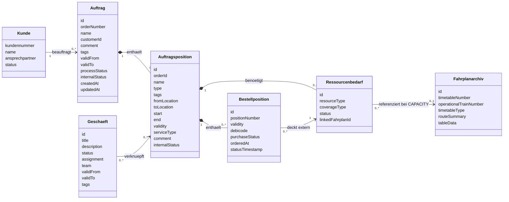
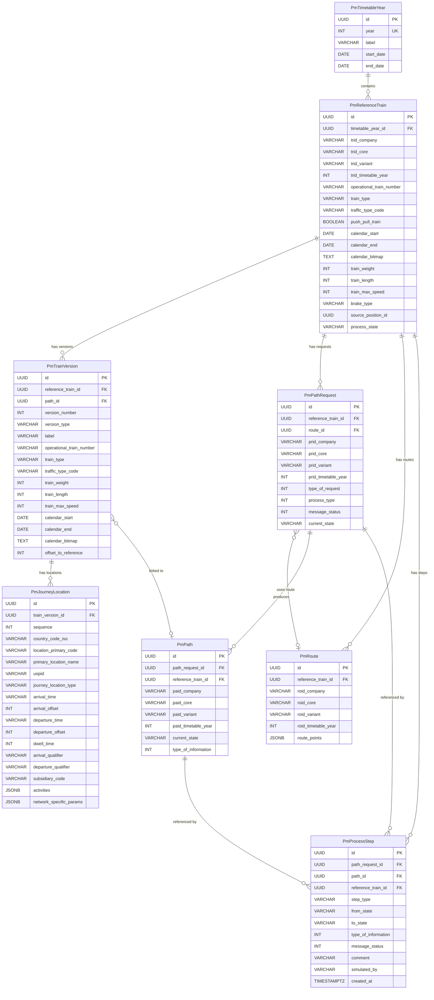
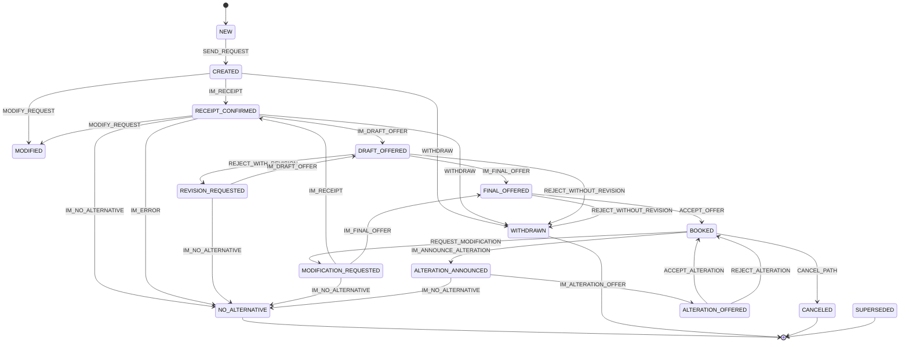
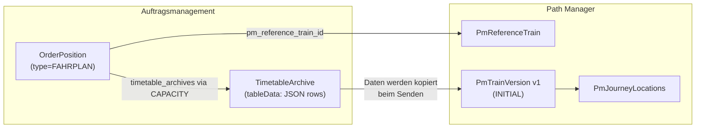
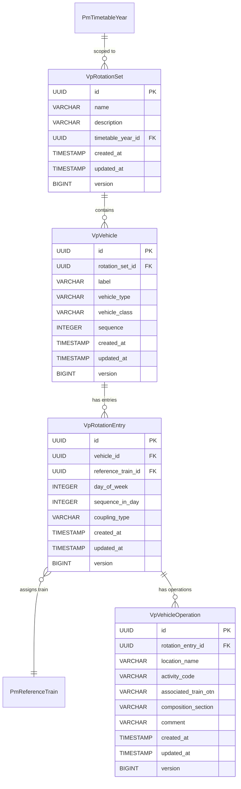
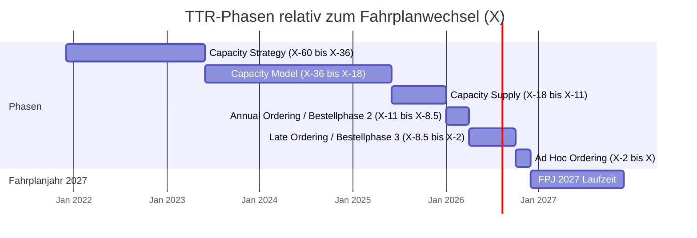
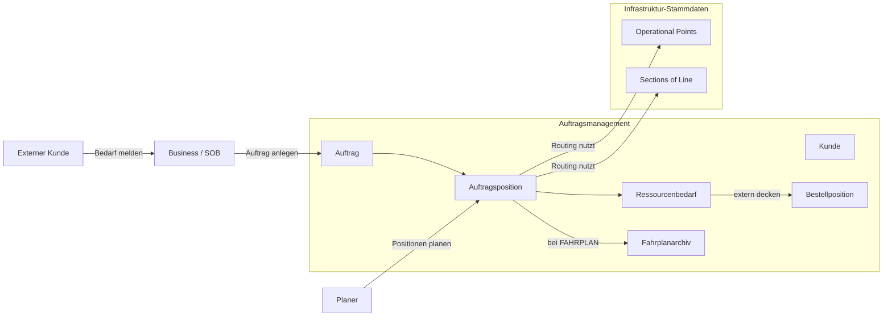

# Datenmodell Auftragsmanagement

## Ziel und Scope

Dieses Dokument beschreibt das aktuelle fachliche und technische Datenmodell fuer Auftraege, Auftragspositionen, Ressourcenplanung, Fahrplanarchiv und externe Bestellung.

Im aktuellen Stand gibt es genau zwei produktive Auftragspositionstypen:

- `LEISTUNG`: sonstige fachliche Leistung mit Zeitraum, Orten, Gueltigkeit, Tags und Kommentar
- `FAHRPLAN`: Zugfahrt mit vollstaendigem Fahrplan, Routing ueber Topologiedaten und Archivierung im Fahrplanarchiv

Der Schwerpunkt dieses Dokuments liegt bewusst auf allen Auftragspositionstypen und ihrer heutigen Persistenz.

## Zentrales fachliches Datenmodell

## Objektattribute

### Kunde

| Attribut | Pflicht | Beschreibung |
| --- | --- | --- |
| kundennummer | ja | Eindeutige fachliche ID des Kunden |
| name | ja | Name des Kundenunternehmens |
| ansprechpartner | nein | Fachlicher Ansprechpartner |
| status | ja | Fachlicher Status des Kunden |

### Auftrag

| Attribut | Typ | Pflicht | Beschreibung |
| --- | --- | --- | --- |
| id | UUID | ja | Eindeutige ID |
| orderNumber | string | ja | Eindeutige Auftragsnummer (max. 50 Zeichen) |
| name | string | ja | Auftragsname |
| customerId | UUID? | nein | FK zum Kunden |
| comment | string? | nein | Kommentar (max. 2000 Zeichen) |
| tags | string? | nein | Kommagetrennte Schlagwoerter; Auswahl im UI aus dem Katalog |
| validFrom | date | ja | Gueltig ab |
| validTo | date | ja | Gueltig bis |
| processStatus | enum | ja | `AUFTRAG`, `PLANUNG`, `PRODUKT_LEISTUNG`, `PRODUKTION`, `ABRECHNUNG_NACHBEREITUNG` |
| internalStatus | string? | nein | Interner Bearbeitungsstatus auf Auftragsebene |
| version | int | ja | Optimistic Locking |
| createdAt / updatedAt | datetime | ja | Technische Zeitstempel |
| createdBy / updatedBy | string? | ja | Fachlicher Benutzerkontext |

## Auftragsposition

Alle Auftragspositionen liegen physisch in `order_positions`. Der Typ wird ueber `PositionType` unterschieden. Gemeinsame Felder, UI-Verhalten und Persistenz sind unten getrennt nach Basis und Typ beschrieben.

### Gemeinsame Basisfelder

| Attribut | Typ | Pflicht | Beschreibung |
| --- | --- | --- | --- |
| id | UUID | ja | Eindeutige ID |
| orderId | UUID | ja | FK zum Auftrag |
| name | string | ja | Positionsname |
| type | enum | ja | `FAHRPLAN` oder `LEISTUNG` |
| tags | string? | nein | Kommagetrennte Schlagwoerter; Auswahl im UI aus `POSITION` / `GENERAL` |
| fromLocation | string? | nein | Fachlicher Startort; bei `FAHRPLAN` aus erster Archivzeile gespiegelt |
| toLocation | string? | nein | Fachlicher Zielort; bei `FAHRPLAN` aus letzter Archivzeile gespiegelt |
| start | datetime? | nein | Startzeitpunkt; bei `FAHRPLAN` aus erster relevanter Zeit abgeleitet |
| end | datetime? | nein | Endzeitpunkt; bei `FAHRPLAN` aus letzter relevanter Zeit abgeleitet |
| validity | jsonb? | nein | Gueltigkeit als Segmente `[{startDate,endDate}, ...]` |
| serviceType | string? | nein | Leistungsart; vor allem fuer `LEISTUNG` relevant |
| comment | string? | nein | Freitext (max. 2000 Zeichen) |
| internalStatus | enum | nein | `IN_BEARBEITUNG`, `FREIGEGEBEN`, `UEBERARBEITEN`, `UEBERMITTELT`, `BEANTRAGT`, `ABGESCHLOSSEN`, `ANNULLIERT` |
| operationalTrainNumber | string? | nein | Betriebliche Zugnummer (OTN), max. 20 Zeichen. Dupliziert aus `timetable_archives` fuer Anzeige in Positionslisten und -kacheln. |
| variantOf / mergeTarget | FK? | nein | Vorbereitete Varianten-/Merge-Beziehungen |
| resourceNeeds | `ResourceNeed[]` | nein | Ressourcenbedarfe zur Position |
| purchasePositions | `PurchasePosition[]` | nein | Zugeordnete Bestellpositionen |
| version | int | ja | Optimistic Locking |
| createdAt / updatedAt | datetime | ja | Technische Zeitstempel |

### Typ `LEISTUNG`

`LEISTUNG`-Positionen werden im `ServicePositionDialog` bearbeitet. Die Position speichert ihre Fachdaten direkt in `order_positions`; ein separates Archiv existiert hier nicht.

| Feld / Verhalten | Aktueller Stand |
| --- | --- |
| Name | Pflichtfeld |
| Service-Typ | Freies Fachfeld `serviceType` |
| Von / Nach | Auswahl aus importierten `OperationalPoint`-Stammdaten |
| Startzeit / Endzeit | Pflichtfelder als `TimePicker` im Format `HH:mm` |
| Gueltigkeit | Auswahl einzelner Tage innerhalb der Auftragsgueltigkeit; Speicherung als JSON-Segmente |
| Start / Ende in DB | Kombination aus erstem/letztem Gueltigkeitstag und eingegebener Uhrzeit |
| Schlagwoerter | Auswahl aus `POSITION` und `GENERAL` |
| Kommentar | Optional, wird in Listen und Bearbeitungsansicht sichtbar angezeigt |

Fachliche Regeln fuer `LEISTUNG`:

- Ohne Start- und Endzeit kann die Position im UI nicht gespeichert werden
- `Von` und `Nach` werden aus den Infrastruktur-Stammdaten gewaehlt, aber aktuell nicht erzwungen
- Die Position hat heute keinen automatisch angelegten Ressourcenbedarf

### Typ `FAHRPLAN`

`FAHRPLAN`-Positionen werden nicht im Standarddialog, sondern im Full-screen `TimetableBuilderView` gepflegt.

#### Schritt 1: Route festlegen

| Feld / Verhalten | Aktueller Stand |
| --- | --- |
| Positionsname | Pflichtfeld |
| Schlagwoerter | Auswahl aus `POSITION` und `GENERAL` |
| Kommentar | Optionales Freitextfeld |
| Von / Nach | Pflichtpunkte aus den importierten `OperationalPoint`-Stammdaten |
| Ueber | Geordnete Zwangspunkte fuer die Route |
| Zwischenhalt | Optional pro `Ueber`-Punkt; kann als Halt mit Activity gepflegt werden |
| Ankerzeit | Entweder exakte Abfahrtszeit am Start oder exakte Ankunftszeit am Ziel |
| Karte | OpenStreetMap/Leaflet mit geraden Linien zwischen den OP-Koordinaten |

Routing und Schaetzung:

- kuerzester Weg ueber `sections_of_line.length_meters`
- Graph wird aktuell bidirektional behandelt
- Geschwindigkeitsannahme: `70 km/h`
- Wenn fuer ein Segment kein Pfad existiert, blockiert der Builder das Speichern
- Fuer CH/DE wurden vier synthetische `0m`-Grenzverbinder eingefuehrt, damit relevante Grenzuebergaenge im aktuellen Datenbestand routbar bleiben

#### Schritt 2: Fahrplan nacharbeiten

Schritt 2 zeigt die **komplette berechnete Route** als Tabelle. Nicht nur `von`, `ueber`, `nach`, sondern alle berechneten Betriebspunkte werden als bearbeitbare Zeilen sichtbar.

| Spalte / Verhalten | Aktueller Stand |
| --- | --- |
| Betriebspunkt | Name + UOPID des Betriebspunkts |
| Rollenmodell | `ORIGIN`, `VIA`, `DESTINATION`, `AUTO` |
| `von` / `nach` | Kontext aus vorherigem bzw. naechstem Betriebspunkt |
| Geschaetzte Zeiten | Automatisch aus der Route abgeleitet |
| Halt | Optional pro Zeile |
| Activity | Pflicht, sobald ein echter Halt gepflegt wird |
| Haltezeit | `dwellMinutes`, optional aber fachlich fuer Halte relevant |
| Ankunft / Abfahrt | Jeweils `NONE`, `EXACT`, `WINDOW` |
| Gueltigkeit | Kalenderauswahl innerhalb der Auftragsgueltigkeit |

TTT-nahe Zeitlogik:

- `NONE`: keine explizite Vorgabe, nur geschaetzte Zeit
- `EXACT`: exakte Zeit (`ALA` / `ALD`-Denke)
- `WINDOW`: frueheste/spaeteste Zeit (`ELA`/`LLA`, `ELD`/`LLD`)
- `COMMERCIAL`: publizierte/kommerzielle Zeit (`PLA` / `PLD`)
- Zwischenhalte mit `halt = true` brauchen Zeiten und Activity
- Reine Durchfahrten koennen ohne Activity und ohne explizite Zeitvorgabe bestehen bleiben
- Eine Zeile wird als `tttRelevant` markiert, sobald explizite fachliche Angaben fuer den spaeteren Export vorhanden sind

#### TTT TimingQualifierCode Mapping

| TimeConstraintMode | Ankunft (Arrival) | Abfahrt (Departure) | Beschreibung |
| --- | --- | --- | --- |
| `NONE` | — (kein Code) | — (kein Code) | Keine Zeitvorgabe, nur geschaetzte Zeit |
| `EXACT` | ALA (Actual/Latest Arrival) | ALD (Actual/Latest Departure) | Exakte Zeitvorgabe |
| `WINDOW` | ELA + LLA (Earliest + Latest Arrival) | ELD + LLD (Earliest + Latest Departure) | Zeitfenster mit fruehester und spaetester Zeit |
| `COMMERCIAL` | PLA (Published/Commercial Arrival) | PLD (Published/Commercial Departure) | Kommerzielle/publizierte Fahrplanzeit |

#### JourneyLocationType (TTT JourneyLocationTypeCode)

Klassifiziert die Rolle eines Betriebspunkts im Sinne der TSI TAF/TAP (TTT Anlage 1, Abschnitt 5.5).

| Enum-Wert | TTT Code | Beschreibung |
| --- | --- | --- |
| `ORIGIN` | 01 | Ausgangspunkt der Fahrt |
| `INTERMEDIATE` | 02 | Zwischenpunkt |
| `DESTINATION` | 03 | Zielpunkt der Fahrt |
| `HANDOVER` | 04 | Uebergabepunkt |
| `INTERCHANGE` | 05 | Umsteigepunkt |
| `HANDOVER_AND_INTERCHANGE` | 06 | Uebergabe- und Umsteigepunkt |
| `STATE_BORDER` | 07 | Staatsgrenze |
| `NETWORK_BORDER` | 09 | Netzgrenze |

#### TimePropagationMode

Definiert, wie eine Zeitaenderung an einem Halt auf andere Halte wirkt.

| Modus | Verhalten |
| --- | --- |
| `SHIFT` | Alle folgenden (nicht gepinnten) Zeiten werden um denselben Deltabetrag verschoben. Propagation stoppt am naechsten gepinnten Halt. |
| `STRETCH` | Fahrzeiten zwischen dem geaenderten Halt und dem naechsten gepinnten Halt werden proportional gestreckt oder gestaucht. Der Gesamtzeitraum zwischen den beiden Fixpunkten aendert sich, die Verhaeltnisse bleiben erhalten. |

#### TimetableEditingService

Zentraler Service fuer Fahrplan-Bearbeitungsoperationen. Liegt in `domain/timetable/service/`.

| Methode | Beschreibung |
| --- | --- |
| `insertStop(rows, index, operationalPoint, activityCode)` | Fuegt einen neuen Halt an der gegebenen Position ein. Setzt `manuallyAdded = true`, interpoliert Zeiten aus den Nachbarzeilen, weist Default-Haltezeit (2 min) zu und nummeriert die Sequenz neu. |
| `softDeleteStop(rows, index)` | Markiert einen Halt als `deleted` (Toggle). Origin und Destination sind geschuetzt und koennen nicht geloescht werden. Soft-Delete ist umkehrbar. |
| `purgeDeleted(rows)` | Entfernt alle soft-deleted Zeilen dauerhaft und nummeriert die Sequenz neu. |
| `propagateTimeChange(rows, index, isArrival, newTime, mode)` | Propagiert eine Zeitaenderung gemaess dem gewaehlten `TimePropagationMode` (SHIFT oder STRETCH). Bei SHIFT werden alle folgenden Zeiten um dasselbe Delta verschoben bis zum naechsten Pin. Bei STRETCH werden die Zeiten proportional gestreckt. |
| `resolveRelativeTime(input, baseTime)` | Loest relative Zeiteingaben wie `+5` oder `-3` gegen eine Basiszeit auf. Gibt `null` zurueck, wenn die Eingabe nicht relativ ist. |
| `resequence(rows)` | Nummeriert die Sequenz aller Zeilen ab 1 neu durch. |

#### Persistenz von `FAHRPLAN`

Beim Speichern passiert fachlich und technisch Folgendes:

1. Die vollstaendige Fahrplantabelle wird als JSON in `timetable_archives.table_data` gespeichert
2. `routeSummary` fasst die Route fachlich zusammen
3. Die `OrderPosition` bekommt `type = FAHRPLAN`
4. `fromLocation`, `toLocation`, `start`, `end`, `validity`, `tags`, `comment` und `operationalTrainNumber` werden auf der Position gespiegelt
5. Genau ein `ResourceNeed` mit `resourceType = CAPACITY` und `coverageType = EXTERNAL` wird erstellt oder wiederverwendet
6. Dieser Ressourcenbedarf verlinkt ueber `linkedFahrplanId` auf das `TimetableArchive`

Die aktuelle Beziehung ist damit bewusst **1:1**:

- eine `FAHRPLAN`-Position
- genau ein `CAPACITY`-Ressourcenbedarf
- genau ein `TimetableArchive`

## Vordefinierte Schlagwoerter

Der Schlagwort-Katalog wird als eigene Stammdatenliste in `predefined_tags` gepflegt. Die Datengrundlage liegt als CSV in `data/seeds/predefined-tags.csv` und wird ueber den Settings-Bereich importiert.

| Attribut | Typ | Pflicht | Beschreibung |
| --- | --- | --- | --- |
| name | string | ja | Anzeigename des Schlagworts |
| category | enum | ja | `ORDER`, `POSITION`, `GENERAL` |
| color | string? | nein | Optionale UI-Farbe |
| sortOrder | int | nein | Sortierung im Katalog |
| active | boolean | ja | Steuert, ob das Schlagwort im UI angeboten wird |

Verwendung:

- `ORDER` und `GENERAL` erscheinen im Auftragsdialog
- `POSITION` und `GENERAL` erscheinen bei allen Auftragspositionstypen
- Die eigentliche Zuordnung bleibt aus Kompatibilitaetsgruenden als kommagetrennter String in `orders.tags` bzw. `order_positions.tags`

## Ressourcenbedarf

Ein `Ressourcenbedarf` beschreibt, welche Ressource fuer eine Auftragsposition benoetigt wird und wie sie gedeckt wird.

| Attribut | Typ | Pflicht | Beschreibung |
| --- | --- | --- | --- |
| id | UUID | ja | Eindeutige ID |
| orderPositionId | UUID | ja | FK zur Auftragsposition |
| resourceType | enum | ja | `VEHICLE`, `PERSONNEL`, `CAPACITY` |
| coverageType | enum | ja | `INTERNAL`, `EXTERNAL` |
| status | string? | nein | Fachlicher Status der Ressource |
| linkedFahrplanId | UUID? | nein | FK auf `timetable_archives`, heute nur fuer `CAPACITY` genutzt |

Aktueller Anwendungsfall:

- `FAHRPLAN` erzeugt automatisch einen `CAPACITY`-Bedarf mit externer Deckung
- `LEISTUNG` legt derzeit keinen automatischen Ressourcenbedarf an

## Fahrplanarchiv

Das Fahrplanarchiv ist heute konkret implementiert und nicht mehr nur Zielbild.

| Attribut | Typ | Pflicht | Beschreibung |
| --- | --- | --- | --- |
| id | UUID | ja | Eindeutige Archiv-ID |
| timetableNumber | string? | nein | Optionale fachliche Kennung |
| timetableType | string? | nein | Aktuell `FAHRPLAN` |
| routeSummary | string? | nein | Fachliche Kurzbeschreibung der Route |
| operationalTrainNumber | string? | nein | Betriebliche Zugnummer (OTN), max. 20 Zeichen. Freitext, unterstuetzt auch Platzhaltermuster wie `95xxx`. Mappt auf TTT `OperationalTrainNumber`. |
| tableData | jsonb | ja | Vollstaendige Fahrplantabelle |
| createdAt / updatedAt | datetime | ja | Technische Zeitstempel |
| version | int | ja | Optimistic Locking |

### Fahrplanzeile im Archiv (`tableData`)

Jede JSON-Zeile entspricht einem Betriebspunkt der berechneten Route.

| Attribut | Typ | Beschreibung |
| --- | --- | --- |
| sequence | int | Laufende Reihenfolge |
| uopid | string | Referenz auf den Betriebspunkt |
| name | string | Anzeigename |
| country | string | Laendercode |
| routePointRole | enum | `ORIGIN`, `VIA`, `DESTINATION`, `AUTO` |
| journeyLocationType | enum | TTT JourneyLocationTypeCode (siehe unten) |
| fromName / toName | string | Vorheriger bzw. naechster Betriebspunkt |
| segmentLengthMeters | number | Kantenlaenge vom Vorgaenger |
| distanceFromStartMeters | number | Kumulierte Distanz |
| halt | boolean | Echte Haltmarkierung |
| tttRelevant | boolean | Fuer spaeteren TTT-Versand relevant |
| activityCode | string? | TTT-Activity / Haltegrund |
| dwellMinutes | int? | Haltezeit |
| estimatedArrival / estimatedDeparture | string? | Geschaetzte Zeiten `HH:mm` |
| arrivalMode / departureMode | enum | `NONE`, `EXACT`, `WINDOW`, `COMMERCIAL` |
| arrivalExact / departureExact | string? | Exakte Zeit |
| arrivalEarliest / arrivalLatest | string? | Zeitfenster Ankunft |
| departureEarliest / departureLatest | string? | Zeitfenster Abfahrt |
| commercialArrival | string? | Kommerzielle Ankunftszeit (PLA — Publizierter Fahrplan) |
| commercialDeparture | string? | Kommerzielle Abfahrtszeit (PLD — Publizierter Fahrplan) |
| pinned | boolean | Ob die Zeiten dieser Zeile bei Shift/Stretch fixiert sind |
| manuallyAdded | boolean | Ob dieser Halt manuell hinzugefuegt wurde (nicht aus Routing) |
| deleted | boolean | Ob dieser Halt soft-deleted ist (Durchstreichung, wiederherstellbar) |

## Bestellposition

Eine `Bestellposition` deckt einen extern zu beschaffenden Ressourcenbedarf.

| Attribut | Typ | Pflicht | Beschreibung |
| --- | --- | --- | --- |
| id | UUID | ja | Eindeutige ID |
| positionNumber | string | ja | Eindeutige Bestellnummer |
| orderPositionId | UUID | ja | FK zur Auftragsposition |
| resourceNeedId | UUID | ja | FK zum Ressourcenbedarf |
| validity | jsonb? | nein | Gueltigkeit der Bestellung |
| debicode | string? | nein | Bestellrelevant fuer Netzkapazitaet |
| purchaseStatus | enum | ja | `OFFEN`, `BESTELLT`, `BESTAETIGT`, `ABGELEHNT`, `STORNIERT` |
| orderedAt | datetime? | nein | Bestellzeitpunkt |
| statusTimestamp | datetime? | nein | Zeitpunkt der letzten Rueckmeldung |

## Geschaeft

| Attribut | Typ | Pflicht | Beschreibung |
| --- | --- | --- | --- |
| id | string | ja | Eindeutige ID |
| title | string | ja | Titel |
| description | string | ja | Beschreibung |
| status | enum | ja | `IN_BEARBEITUNG`, `FREIGEGEBEN`, `UEBERARBEITEN`, `ABGESCHLOSSEN`, `ANNULLIERT` |
| assignment | object | ja | Zuordnung mit `type` und `name` |
| team | string? | nein | Team-Zuordnung |
| validFrom / validTo | date? | nein | Gueltigkeit |
| documents | array? | nein | Dokumente |
| tags | string[]? | nein | Schlagwoerter |
| linkedOrderItemIds | string[]? | nein | Verknuepfte Auftragspositionen |

## Beziehungen und Kardinalitaeten

| Von | Nach | Kardinalitaet | Art | Bedeutung |
| --- | --- | --- | --- | --- |
| Kunde | Auftrag | 1 zu 0..* | Assoziation | Ein Kunde kann mehrere Auftraege haben |
| Auftrag | Auftragsposition | 1 zu 0..* | Komposition | Ein Auftrag enthaelt seine Positionen |
| Auftragsposition | Ressourcenbedarf | 1 zu 0..* | Komposition | Ressourcenbedarfe gehoeren zur Position |
| Auftragsposition | Bestellposition | 1 zu 0..* | Komposition | Bestellpositionen entstehen unter einer Position |
| Ressourcenbedarf | Fahrplanarchiv | 0..* zu 0..1 | Assoziation | Nur `CAPACITY` verweist auf ein Archiv |
| Geschaeft | Auftragsposition | 0..* zu 0..* | Assoziation | Fachliche Verknuepfung m:n |

## Fachliche Regeln des Datenmodells

- Eine Auftragsposition gehoert immer zu genau einem Auftrag
- Es gibt aktuell genau zwei aktive Positionstypen: `LEISTUNG` und `FAHRPLAN`
- Alle Positionstypen koennen Tags, Kommentar, Status, Gueltigkeit und Kauf-/Ressourcenbezug tragen
- `LEISTUNG` speichert ihre fachlichen Daten direkt auf der Position
- `FAHRPLAN` speichert die detaillierte Fahrplantabelle ausschliesslich im Fahrplanarchiv
- `FAHRPLAN` spiegelt nur die wichtigsten Metadaten auf `order_positions` (inkl. OTN, falls gesetzt)
- Die betriebliche Zugnummer (OTN) ist ein Freitextfeld (VARCHAR 20), nicht strikt numerisch — Platzhaltermuster wie `95xxx` sind zulaessig
- Eine `FAHRPLAN`-Position hat heute genau einen `CAPACITY`-Ressourcenbedarf und genau ein verlinktes Archiv
- Die fachliche Gueltigkeit liegt an der Position, nicht am Archiv
- Halte in Fahrplanzeilen brauchen Activity und Zeiten
- Reine Durchfahrten duerfen ohne Activity bestehen bleiben
- Der Katalog vordefinierter Schlagwoerter ist Stammdatenbestand; die Zuordnung an Auftrag und Position bleibt String-basiert

## UI-Sicht auf alle Auftragspositionen

Die Daten werden im UI heute an drei Stellen unterschiedlich verdichtet dargestellt:

### 1. Auftragsliste (`/orders`)

- kompakte Kachel-/Accordion-Sicht
- pro Position sichtbar: Name, Typ, Route, Kommentar, Zeitfenster, Service-Typ, Tags, Bestellanzahl, Status
- Status-Chips filtern Positionen innerhalb eines Auftrags

### 2. Auftragsdetail (`/orders/{id}`)

- angereicherte Positionszeilen
- Anzeige von Name, Typ, Status, Route, Zeitfenster, Service-Typ, Tags und Kommentar
- Kalender-Toggle pro Position

### 3. Bearbeitung

- `LEISTUNG`: Dialog
- `FAHRPLAN`: Full-screen Builder mit Karte und Tabelleneditor

### 4. Fahrplan-Detailansicht (`/orders/{orderId}/timetable/{positionId}`)

- Read-only Darstellung einer gespeicherten `FAHRPLAN`-Position
- Erreichbar ueber das Auge-Icon in der `OrderPositionRow` fuer FAHRPLAN-Positionen
- SplitLayout 65/35: links Div-basierte Fahrplantabelle, rechts Karte + Gueltigkeit + Metadaten
- "Bearbeiten"-Button navigiert zum Timetable Builder zur Weiterbearbeitung

## Path Manager Domain Model

Der Path Manager bildet den Lifecycle einer Trassenanfrage (TTT — Train Timetable Transfer) ab. Er simuliert die Kommunikation zwischen dem Responsible Applicant (RA) und dem Infrastructure Manager (IM) innerhalb derselben Applikation, damit das Auftragsmanagement gegen eine realistische API-Schnittstelle entwickelt und getestet werden kann.

### Entitaetsuebersicht

| Entity | Tabelle | Beschreibung |
| --- | --- | --- |
| `PmTimetableYear` | `pm_timetable_years` | Fahrplanjahr mit Start-/Enddatum (i.d.R. Mitte Dezember bis Mitte Dezember) |
| `PmReferenceTrain` | `pm_reference_trains` | Referenzzug mit TRID (Company, Core, Variant, Timetable Year), OTN, Zugdaten und Kalender |
| `PmTrainVersion` | `pm_train_versions` | Versionierter Snapshot eines Zuges (Initial, Modification, Alteration) |
| `PmJourneyLocation` | `pm_journey_locations` | Betriebspunkt innerhalb einer Zugversion (Sequence, Zeiten, Qualifier, Aktivitaet) |
| `PmRoute` | `pm_routes` | Route eines Referenzzuges mit ROID und RoutePoints (JSON) |
| `PmPath` | `pm_paths` | Zugewiesener Pfad / Trasse (nach Buchung durch IM) |
| `PmPathRequest` | `pm_path_requests` | Antrag auf eine Trasse (verknuepft Zug mit Pfad) |
| `PmProcessStep` | `pm_process_steps` | Einzelner Prozessschritt der TTT State Machine (Aktion, Kommentar, Zeitstempel) |

### Entity-Relationship-Diagramm

### Detailierte Feldtabellen

#### PmTimetableYear

| Feld | Typ | Nullable | Beschreibung |
| --- | --- | --- | --- |
| `id` | UUID | nein | Primaerschluessel |
| `year` | INT | nein | Fahrplanjahr (eindeutig), z.B. 2026 |
| `label` | VARCHAR(100) | ja | Anzeigename, z.B. "Fahrplanjahr 2026" |
| `start_date` | DATE | nein | Beginn des Fahrplanjahrs (i.d.R. Mitte Dezember Vorjahr) |
| `end_date` | DATE | nein | Ende des Fahrplanjahrs (i.d.R. Mitte Dezember) |
| `created_at` | TIMESTAMPTZ | nein | Erstellungszeitpunkt |
| `updated_at` | TIMESTAMPTZ | nein | Letzter Aenderungszeitpunkt |
| `version` | BIGINT | nein | Optimistic Locking |

#### PmReferenceTrain (Zugkopf)

Der Referenzzug ist das zentrale Aggregat im Path Manager. Er traegt alle Zugkopf-Attribute (Train Header) gemaess TTT-Standard:

| Feld | Typ | Nullable | Beschreibung |
| --- | --- | --- | --- |
| `id` | UUID | nein | Primaerschluessel |
| `timetable_year_id` | UUID (FK) | nein | Zugehoeriges Fahrplanjahr |
| `trid_company` | VARCHAR(4) | nein | TRID Unternehmenskuerzel (z.B. "SOB0") |
| `trid_core` | VARCHAR(20) | nein | TRID Kernnummer (generierter Identifier) |
| `trid_variant` | VARCHAR(2) | nein | TRID Variante (Default "01") |
| `trid_timetable_year` | INT | nein | TRID Fahrplanjahr |
| `operational_train_number` | VARCHAR(20) | ja | Betriebliche Zugnummer (OTN) — Freitext, Platzhaltermuster moeglich |
| `train_type` | VARCHAR(2) | ja | Zugart nach TTT (z.B. "IC", "EC", "RE") |
| `traffic_type_code` | VARCHAR(10) | ja | Verkehrsart |
| `push_pull_train` | BOOLEAN | ja | Wendezug (Default false) |
| `calendar_start` | DATE | ja | Beginn des Verkehrstagskalenders |
| `calendar_end` | DATE | ja | Ende des Verkehrstagskalenders |
| `calendar_bitmap` | TEXT | ja | Bitmap-String der Verkehrstage (1 = faehrt, 0 = faehrt nicht) |
| `train_weight` | INT | ja | Zuggewicht in Tonnen |
| `train_length` | INT | ja | Zuglaenge in Metern |
| `train_max_speed` | INT | ja | Hoechstgeschwindigkeit in km/h |
| `brake_type` | VARCHAR(10) | ja | Bremsart |
| `source_position_id` | UUID | ja | Urspruengliche Auftragsposition (Rueckverweis) |
| `process_state` | VARCHAR(30) | nein | Aktueller Prozessstatus (Default "NEW") |
| `created_at` | TIMESTAMPTZ | nein | Erstellungszeitpunkt |
| `updated_at` | TIMESTAMPTZ | nein | Letzter Aenderungszeitpunkt |
| `version` | BIGINT | nein | Optimistic Locking |

Zusammengesetzter Identifier TRID: `{trid_company}-{trid_core}-{trid_variant}-{trid_timetable_year}` (z.B. `SOB0-000042-01-2026`). Dieser Identifier ist gemaess TTT-Standard aufgebaut und bildet die Train Request ID.

#### PmTrainVersion

Jede Veraenderung am Zug erzeugt eine neue Version. Versionstypen:

| VersionType | Beschreibung |
| --- | --- |
| `INITIAL` | Erstversion bei Submission |
| `MODIFICATION` | IM-Angebot (Draft Offer oder Final Offer) |
| `ALTERATION` | Nachtraegliche Aenderung nach Buchung |
| `CANCELLATION` | Stornierungsversion |

| Feld | Typ | Nullable | Beschreibung |
| --- | --- | --- | --- |
| `id` | UUID | nein | Primaerschluessel |
| `reference_train_id` | UUID (FK) | nein | Zugehoeriger Referenzzug |
| `path_id` | UUID (FK) | ja | Verknuepfter Path (bei IM-Angeboten) |
| `version_number` | INT | nein | Laufende Versionsnummer (1, 2, 3, ...) — eindeutig pro Referenzzug |
| `version_type` | VARCHAR(20) | nein | `INITIAL`, `MODIFICATION`, `ALTERATION`, `CANCELLATION` |
| `label` | VARCHAR(255) | ja | Beschriftung (z.B. "MODIFICATION v2") |
| `operational_train_number` | VARCHAR(20) | ja | OTN dieser Version (kann vom Zugkopf abweichen) |
| `train_type` | VARCHAR(2) | ja | Zugart dieser Version |
| `traffic_type_code` | VARCHAR(10) | ja | Verkehrsart dieser Version |
| `train_weight` | INT | ja | Zuggewicht in Tonnen |
| `train_length` | INT | ja | Zuglaenge in Metern |
| `train_max_speed` | INT | ja | Hoechstgeschwindigkeit in km/h |
| `calendar_start` | DATE | ja | Beginn Verkehrstagekalender |
| `calendar_end` | DATE | ja | Ende Verkehrstagekalender |
| `calendar_bitmap` | TEXT | ja | Bitmap-String der Verkehrstage |
| `offset_to_reference` | INT | ja | Zeitversatz zum Referenzzug in Minuten (Default 0) |
| `created_at` | TIMESTAMPTZ | nein | Erstellungszeitpunkt |
| `updated_at` | TIMESTAMPTZ | nein | Letzter Aenderungszeitpunkt |
| `version` | BIGINT | nein | Optimistic Locking |

#### PmJourneyLocation (Betriebspunkt / OP-Attribute)

Jede Journey Location repraesentiert einen einzelnen Betriebspunkt im Laufweg einer Zugversion. Die Felder folgen dem TTT-Standard (TSI TAF/TAP Anlage 1):

| Feld | Typ | Nullable | Beschreibung |
| --- | --- | --- | --- |
| `id` | UUID | nein | Primaerschluessel |
| `train_version_id` | UUID (FK) | nein | Zugehoerige Zugversion |
| `sequence` | INT | nein | Reihenfolge im Laufweg (1-basiert) — eindeutig pro Version |
| `country_code_iso` | VARCHAR(2) | ja | ISO 3166-1 Laendercode (z.B. "CH", "DE") |
| `location_primary_code` | VARCHAR(10) | ja | Primaerer Ortsschluessel |
| `primary_location_name` | VARCHAR(255) | ja | Ortsname / Betriebspunktname |
| `uopid` | VARCHAR(20) | ja | Unified Operational Point ID (ERA RINF) |
| `journey_location_type` | VARCHAR(2) | ja | TTT JourneyLocationTypeCode: 01=Origin, 02=Intermediate, 03=Destination, 04=Handover, etc. |
| `arrival_time` | VARCHAR(8) | ja | Ankunftszeit im Format `HH:mm:ss` oder `HH:mm` |
| `arrival_offset` | INT | ja | Tagesoffset Ankunft (0 = gleicher Tag, 1 = Folgetag) |
| `departure_time` | VARCHAR(8) | ja | Abfahrtszeit im Format `HH:mm:ss` oder `HH:mm` |
| `departure_offset` | INT | ja | Tagesoffset Abfahrt |
| `dwell_time` | INT | ja | Haltezeit in Minuten |
| `arrival_qualifier` | VARCHAR(3) | ja | TTT TimingQualifierCode Ankunft (ALA, ELA, LLA, PLA) |
| `departure_qualifier` | VARCHAR(3) | ja | TTT TimingQualifierCode Abfahrt (ALD, ELD, LLD, PLD) |
| `subsidiary_code` | VARCHAR(10) | ja | Untergeordneter Ortsschluessel (Gleisangabe, etc.) |
| `activities` | JSONB | ja | TTT TrainActivityType-Codes als JSON-Array (z.B. `["0001","0012"]`) |
| `network_specific_params` | JSONB | ja | Netzwerkspezifische Parameter als JSON (fuer Schweizer Netze: TPNSP) |
| `created_at` | TIMESTAMPTZ | nein | Erstellungszeitpunkt |
| `updated_at` | TIMESTAMPTZ | nein | Letzter Aenderungszeitpunkt |
| `version` | BIGINT | nein | Optimistic Locking |

#### PmRoute

| Feld | Typ | Nullable | Beschreibung |
| --- | --- | --- | --- |
| `id` | UUID | nein | Primaerschluessel |
| `reference_train_id` | UUID (FK) | nein | Zugehoeriger Referenzzug |
| `roid_company` | VARCHAR(4) | nein | ROID Unternehmenskuerzel |
| `roid_core` | VARCHAR(20) | nein | ROID Kernnummer |
| `roid_variant` | VARCHAR(2) | nein | ROID Variante (Default "01") |
| `roid_timetable_year` | INT | nein | ROID Fahrplanjahr |
| `route_points` | JSONB | ja | Geordnete Routenpunkte als JSON (Koordinaten + Betriebspunktverweise) |
| `created_at` | TIMESTAMPTZ | nein | Erstellungszeitpunkt |
| `updated_at` | TIMESTAMPTZ | nein | Letzter Aenderungszeitpunkt |
| `version` | BIGINT | nein | Optimistic Locking |

#### PmPathRequest (Trassenantrag)

| Feld | Typ | Nullable | Beschreibung |
| --- | --- | --- | --- |
| `id` | UUID | nein | Primaerschluessel |
| `reference_train_id` | UUID (FK) | nein | Zugehoeriger Referenzzug |
| `route_id` | UUID (FK) | ja | Verknuepfte Route |
| `prid_company` | VARCHAR(4) | nein | PRID Unternehmenskuerzel |
| `prid_core` | VARCHAR(20) | nein | PRID Kernnummer |
| `prid_variant` | VARCHAR(2) | nein | PRID Variante (Default "01") |
| `prid_timetable_year` | INT | nein | PRID Fahrplanjahr |
| `type_of_request` | INT | ja | TTT TypeOfRequest-Code |
| `process_type` | INT | ja | TTT ProcessType-Code |
| `message_status` | INT | ja | TTT MessageStatus-Code |
| `current_state` | VARCHAR(30) | nein | Aktueller Antragsstatus (Default "CREATED") |
| `created_at` | TIMESTAMPTZ | nein | Erstellungszeitpunkt |
| `updated_at` | TIMESTAMPTZ | nein | Letzter Aenderungszeitpunkt |
| `version` | BIGINT | nein | Optimistic Locking |

#### PmPath (Trasse / Pfad)

| Feld | Typ | Nullable | Beschreibung |
| --- | --- | --- | --- |
| `id` | UUID | nein | Primaerschluessel |
| `path_request_id` | UUID (FK) | ja | Zugehoeriger Trassenantrag |
| `reference_train_id` | UUID (FK) | nein | Zugehoeriger Referenzzug |
| `paid_company` | VARCHAR(4) | nein | PAID Unternehmenskuerzel |
| `paid_core` | VARCHAR(20) | nein | PAID Kernnummer |
| `paid_variant` | VARCHAR(2) | nein | PAID Variante (Default "01") |
| `paid_timetable_year` | INT | nein | PAID Fahrplanjahr |
| `current_state` | VARCHAR(30) | nein | Trassenstatus (Default "DRAFT_OFFER") |
| `type_of_information` | INT | ja | TTT TypeOfInformation-Code |
| `created_at` | TIMESTAMPTZ | nein | Erstellungszeitpunkt |
| `updated_at` | TIMESTAMPTZ | nein | Letzter Aenderungszeitpunkt |
| `version` | BIGINT | nein | Optimistic Locking |

#### PmProcessStep (Prozessschritt)

Immutable Audit-Record. Kein Envers-Auditing noetig, da Prozessschritte nur geschrieben, nie geaendert werden.

| Feld | Typ | Nullable | Beschreibung |
| --- | --- | --- | --- |
| `id` | UUID | nein | Primaerschluessel |
| `path_request_id` | UUID (FK) | ja | Verknuepfter Trassenantrag |
| `path_id` | UUID (FK) | ja | Verknuepfte Trasse |
| `reference_train_id` | UUID (FK) | nein | Zugehoeriger Referenzzug |
| `step_type` | VARCHAR(30) | nein | PathAction-Name (z.B. "SEND_REQUEST", "IM_DRAFT_OFFER") |
| `from_state` | VARCHAR(30) | ja | Ausgangszustand |
| `to_state` | VARCHAR(30) | ja | Zielzustand |
| `type_of_information` | INT | ja | TTT TypeOfInformation |
| `message_status` | INT | ja | TTT MessageStatus |
| `comment` | VARCHAR(2000) | ja | Optionaler Kommentar zum Prozessschritt |
| `simulated_by` | VARCHAR(100) | ja | Benutzer, der die Simulation ausgeloest hat |
| `created_at` | TIMESTAMPTZ | nein | Erstellungszeitpunkt (Write-Once) |

### TTT-Prozess State Machine

Die State Machine steuert den Lebenszyklus einer Trassenanfrage. Der `PathProcessEngine` validiert erlaubte Uebergaenge und erzeugt bei bestimmten Aktionen (IM_DRAFT_OFFER, IM_FINAL_OFFER, IM_ALTERATION_OFFER) automatisch eine neue Zugversion.

**Zustandsbeschreibungen:**

| Zustand | Beschreibung |
| --- | --- |
| `NEW` | Frisch erstellt, noch nicht eingereicht |
| `CREATED` | Antrag eingereicht beim IM |
| `MODIFIED` | Antrag wurde modifiziert (vor IM-Bestaetigung) |
| `WITHDRAWN` | Antrag zurueckgezogen oder Angebot abgelehnt |
| `RECEIPT_CONFIRMED` | IM hat Eingang bestaetigt |
| `DRAFT_OFFERED` | IM hat Vorangebot gemacht (erzeugt neue Zugversion) |
| `NO_ALTERNATIVE` | IM kann keine Alternative anbieten (Endstatus) |
| `REVISION_REQUESTED` | RA bittet IM um Ueberarbeitung des Angebots |
| `FINAL_OFFERED` | IM hat verbindliches Angebot gemacht (erzeugt neue Zugversion) |
| `BOOKED` | Trasse gebucht — im Fahrplan eingetragen |
| `MODIFICATION_REQUESTED` | RA beantragt Aenderung einer gebuchten Trasse |
| `ALTERATION_ANNOUNCED` | IM kuendigt nachtraegliche Aenderung an |
| `ALTERATION_OFFERED` | IM bietet Aenderung an (erzeugt neue Zugversion) |
| `CANCELED` | Gebuchte Trasse storniert (Endstatus) |
| `SUPERSEDED` | Durch neue Version ersetzt (Endstatus) |

**Aktionen und ihre Rollenverteilung:**

| Aktion | Ausloesende Rolle | Erzeugt Version? | Beschreibung |
| --- | --- | --- | --- |
| `SEND_REQUEST` | RA | nein | Antrag erstmalig einreichen |
| `MODIFY_REQUEST` | RA | nein | Eingereichten Antrag modifizieren |
| `WITHDRAW` | RA | nein | Antrag zurueckziehen |
| `IM_RECEIPT` | IM | nein | Eingangsbestaetigung |
| `IM_DRAFT_OFFER` | IM | ja | Vorangebot mit ggf. geaenderten Zugdaten |
| `IM_NO_ALTERNATIVE` | IM | nein | Keine Alternative verfuegbar |
| `IM_ERROR` | IM | nein | Fehler in der Verarbeitung |
| `REJECT_WITH_REVISION` | RA | nein | Vorangebot ablehnen, Ueberarbeitung erbeten |
| `REJECT_WITHOUT_REVISION` | RA | nein | Angebot endgueltig ablehnen |
| `IM_FINAL_OFFER` | IM | ja | Verbindliches Angebot |
| `ACCEPT_OFFER` | RA | nein | Angebot annehmen, Buchung ausloesen |
| `IM_BOOK` | IM | nein | Buchung durch IM bestaetigen |
| `REQUEST_MODIFICATION` | RA | nein | Aenderungswunsch an gebuchter Trasse |
| `CANCEL_PATH` | RA | nein | Gebuchte Trasse stornieren |
| `IM_ANNOUNCE_ALTERATION` | IM | nein | Nachtraegliche Aenderung ankuendigen |
| `IM_ALTERATION_OFFER` | IM | ja | Aenderungsangebot nach Buchung |
| `ACCEPT_ALTERATION` | RA | nein | Aenderungsangebot annehmen |
| `REJECT_ALTERATION` | RA | nein | Aenderungsangebot ablehnen (Trasse bleibt gebucht) |

### Verknuepfung mit dem Auftragsmodell

Eine `FAHRPLAN`-Position kann ueber `pm_reference_train_id` auf einen Referenzzug im Path Manager verweisen. Dieses Feld wird gesetzt, wenn der Benutzer die Position an den Fahrplanmanager sendet.

**Datenfluss beim Senden an den Path Manager:**

1. Benutzer klickt "An Fahrplanmanager senden" auf einer gespeicherten FAHRPLAN-Position
2. `PathManagerService.createTrainFromOrderPosition()` liest das gespeicherte TimetableArchive
3. Ein `PmTimetableYear` wird aufgeloest oder erstellt (basierend auf dem Startdatum der Position)
4. Ein `PmReferenceTrain` wird mit generiertem TRID, OTN und Zugkopf-Attributen erstellt
5. Eine `PmRoute` wird aus den Routenpunkten des Archivs erstellt
6. Eine initiale `PmTrainVersion` (v1, INITIAL) wird mit allen `PmJourneyLocations` aus den Archivzeilen erstellt
7. `order_positions.pm_reference_train_id` wird auf die ID des neuen Referenzzuges gesetzt
8. Die Position erscheint im Path Manager unter dem korrekten Fahrplanjahr

### Path Manager REST API

Die API stellt 11 REST Endpoints bereit, dokumentiert ueber Swagger UI unter `/swagger-ui/index.html`:

| # | Methode | Pfad | Controller | Beschreibung |
| --- | --- | --- | --- | --- |
| 1 | POST | `/api/v1/pathmanager/trains` | PathManagerController | Neuen Referenzzug einreichen |
| 2 | GET | `/api/v1/pathmanager/trains` | PathManagerController | Alle Zuege auflisten (optional `?year=`) |
| 3 | GET | `/api/v1/pathmanager/trains/{trainId}` | PathManagerController | Zugdetail abrufen |
| 4 | PUT | `/api/v1/pathmanager/trains/{trainId}` | PathManagerController | Zugkopf-Attribute aktualisieren |
| 5 | GET | `/api/v1/pathmanager/trains/{trainId}/versions` | PathManagerController | Alle Versionen eines Zuges |
| 6 | GET | `/api/v1/pathmanager/trains/{trainId}/versions/{versionId}/locations` | PathManagerController | Journey Locations einer Version |
| 7 | PUT | `/api/v1/pathmanager/trains/{trainId}/versions/{versionId}/locations/{locationId}` | PathManagerController | Einzelne Journey Location aktualisieren |
| 8 | POST | `/api/v1/pathmanager/process/{referenceTrainId}/step` | PathProcessController | Prozessschritt ausfuehren |
| 9 | GET | `/api/v1/pathmanager/process/{referenceTrainId}/available-actions` | PathProcessController | Verfuegbare Aktionen abfragen |
| 10 | GET | `/api/v1/pathmanager/process/{referenceTrainId}/history` | PathProcessController | Prozesshistorie abrufen |
| 11 | POST | `/api/v1/pathmanager/diff?referenceTrainId=` | PathManagerDiffController | Diff zwischen Order-Daten und PM-Version |

## Vehicle Planning (Umlaufplanung) Domain Model

Die Fahrzeugumlaufplanung ordnet Referenzzuege aus dem Path Manager konkreten Fahrzeugen zu und stellt so den physischen Fahrzeugeinsatz fuer ein Fahrplanjahr sicher. Der Bounded Context `vehicleplanning` referenziert direkt auf `PmReferenceTrain` und `PmTimetableYear` aus dem Path Manager.

### Entity-Relationship-Diagramm

### Detaillierte Feldtabellen

#### VpRotationSet (Umlaufplan)

Ein Umlaufplan gruppiert Fahrzeuge fuer ein bestimmtes Fahrplanjahr. Er ist das Top-Level-Aggregat im Vehicle Planning Context.

| Feld | Typ | Nullable | Beschreibung |
| --- | --- | --- | --- |
| `id` | UUID | nein | Primaerschluessel |
| `name` | VARCHAR(100) | nein | Name des Umlaufplans (z.B. "FLIRT Olten-Aarau") |
| `description` | VARCHAR(500) | ja | Optionale Beschreibung |
| `timetable_year_id` | UUID (FK) | nein | Zugehoeriges Fahrplanjahr (`pm_timetable_years`) |
| `created_at` | TIMESTAMP | nein | Erstellungszeitpunkt |
| `updated_at` | TIMESTAMP | nein | Letzter Aenderungszeitpunkt |
| `version` | BIGINT | nein | Optimistic Locking |

#### VpVehicle (Fahrzeug)

Ein Fahrzeug repraesentiert eine physische Einheit (Triebzug, Lokomotive oder Wagenkomposition) innerhalb eines Umlaufplans.

| Feld | Typ | Nullable | Beschreibung |
| --- | --- | --- | --- |
| `id` | UUID | nein | Primaerschluessel |
| `rotation_set_id` | UUID (FK) | nein | Zugehoeriger Umlaufplan |
| `label` | VARCHAR(100) | nein | Bezeichnung (z.B. "FLIRT RABe 526 201") |
| `vehicle_type` | VARCHAR(30) | nein | Fahrzeugtyp: `MULTIPLE_UNIT`, `LOCOMOTIVE`, `COACH_SET` |
| `vehicle_class` | VARCHAR(50) | ja | Fahrzeugklasse (z.B. "RABe 526", "Re 460") |
| `sequence` | INTEGER | nein | Sortierung innerhalb des Umlaufplans (Default 0) |
| `created_at` | TIMESTAMP | nein | Erstellungszeitpunkt |
| `updated_at` | TIMESTAMP | nein | Letzter Aenderungszeitpunkt |
| `version` | BIGINT | nein | Optimistic Locking |

#### VpRotationEntry (Umlaufeintrag)

Ein Umlaufeintrag weist einen Referenzzug einem Fahrzeug an einem bestimmten Wochentag zu. Dies ist die zentrale Zuordnungsentitaet zwischen Fahrzeug und Fahrplan.

| Feld | Typ | Nullable | Beschreibung |
| --- | --- | --- | --- |
| `id` | UUID | nein | Primaerschluessel |
| `vehicle_id` | UUID (FK) | nein | Zugehoeriges Fahrzeug |
| `reference_train_id` | UUID (FK) | nein | Zugewiesener Referenzzug aus dem Path Manager |
| `day_of_week` | INTEGER | nein | Wochentag (1=Montag bis 7=Sonntag), CHECK 1-7 |
| `sequence_in_day` | INTEGER | nein | Reihenfolge innerhalb des Tages (Default 0) |
| `coupling_type` | VARCHAR(20) | nein | Kupplungsposition: `FULL`, `FRONT`, `REAR` (Default `FULL`) |
| `created_at` | TIMESTAMP | nein | Erstellungszeitpunkt |
| `updated_at` | TIMESTAMP | nein | Letzter Aenderungszeitpunkt |
| `version` | BIGINT | nein | Optimistic Locking |

#### VpVehicleOperation (Fahrzeugoperation)

Operationsdetails fuer einen Umlaufeintrag, z.B. Kupplungs-/Abkupplungsvorgaenge an bestimmten Orten.

| Feld | Typ | Nullable | Beschreibung |
| --- | --- | --- | --- |
| `id` | UUID | nein | Primaerschluessel |
| `rotation_entry_id` | UUID (FK) | nein | Zugehoeriger Umlaufeintrag |
| `location_name` | VARCHAR(255) | ja | Ortsname der Operation |
| `activity_code` | VARCHAR(50) | ja | TTT-Aktivitaetscode (z.B. "0010" Kuppeln, "0017" Abkuppeln, "0044"/"0045" Richtungswechsel) |
| `associated_train_otn` | VARCHAR(20) | ja | OTN des verbundenen Zuges (bei Fluegelungen) |
| `composition_section` | VARCHAR(50) | ja | Kompositionsabschnitt |
| `comment` | VARCHAR(500) | ja | Optionaler Kommentar |
| `created_at` | TIMESTAMP | nein | Erstellungszeitpunkt |
| `updated_at` | TIMESTAMP | nein | Letzter Aenderungszeitpunkt |
| `version` | BIGINT | nein | Optimistic Locking |

### Enums

#### VehicleType

| Wert | Beschreibung |
| --- | --- |
| `MULTIPLE_UNIT` | Triebzug (z.B. FLIRT, Giruno, ICE) |
| `LOCOMOTIVE` | Lokomotive (z.B. Re 460, Vectron) |
| `COACH_SET` | Wagenkomposition / Wagen-Set |

#### CouplingPosition

| Wert | Beschreibung |
| --- | --- |
| `FULL` | Gesamter Zug wird vom Fahrzeug gefuehrt (Default) |
| `FRONT` | Fahrzeug am vorderen Zugteil (Fluegelung) |
| `REAR` | Fahrzeug am hinteren Zugteil (Fluegelung) |

### Conflict Record

Konflikte werden nicht persistiert, sondern bei jeder Anzeige durch den `ConflictDetectionService` berechnet:

| Feld | Typ | Beschreibung |
| --- | --- | --- |
| `vehicleId` | UUID | Betroffenes Fahrzeug |
| `vehicleLabel` | String | Fahrzeugbezeichnung |
| `dayOfWeek` | int | Betroffener Wochentag |
| `description` | String | Menschenlesbare Konfliktbeschreibung |
| `severity` | Severity | `WARNING` (z.B. Standort-Mismatch) oder `ERROR` (z.B. Zeitueberlappung) |

**Konflikterkennung:**

Der `ConflictDetectionService` prueft fuer jedes Fahrzeug und jeden Wochentag:

1. **Zeitueberlappung (ERROR):** Zwei Umlaufeintraege desselben Fahrzeugs ueberlappen zeitlich (basierend auf Abfahrt/Ankunft der PmJourneyLocations des Referenzzugs)
2. **Standort-Mismatch (WARNING):** Der Ankunftsort des vorherigen Zuges stimmt nicht mit dem Abfahrtsort des naechsten Zuges ueberein und es bleibt keine ausreichende Wendezeit

### Gantt-Chart UI-Konzept

Die Visualisierung erfolgt als Div-basiertes Gantt-Diagramm:

- **Y-Achse:** Fahrzeuge des aktuellen Umlaufplans, eine Zeile pro Fahrzeug
- **X-Achse:** Zeitlineal (00:00 bis 24:00 fuer den ausgewaehlten Wochentag)
- **Zugbloecke:** Absolut positionierte `
`-Elemente pro Umlaufeintrag, breite proportional zur Fahrzeit
- **Drag & Drop:** Zuege werden aus der TrainPalette (Sidebar) per DragSource auf die Gantt-Zeilen (DropTarget) gezogen
- **Farben:** Zugbloecke sind farbcodiert nach Fahrzeugtyp, Konflikte werden rot hervorgehoben
- **Konfliktpanel:** Unterhalb des Gantt-Charts zeigt ein Panel alle erkannten Konflikte mit Severity-Icons

### VP-Tabellen und Indexes (V11-Migration)

| Tabelle | Beschreibung |
| --- | --- |
| `vp_rotation_sets` | Umlaufplaene mit FK auf `pm_timetable_years` |
| `vp_vehicles` | Fahrzeuge mit FK auf `vp_rotation_sets` (CASCADE DELETE) |
| `vp_rotation_entries` | Umlaufeintraege mit FK auf `vp_vehicles` (CASCADE DELETE) und `pm_reference_trains` |
| `vp_vehicle_operations` | Fahrzeugoperationen mit FK auf `vp_rotation_entries` (CASCADE DELETE) |

6 Indexes: `timetable_year_id`, `rotation_set_id`, `vehicle_id`, `reference_train_id`, `day_of_week`, `rotation_entry_id`.

> **Hinweis:** VP-Entitaeten sind bewusst nicht mit `@Audited` versehen, da es sich um Planungsdaten handelt, nicht um verbindliche Betriebsdaten.

## TTR Phase Mapping (Timetable Redesign)

Die TTR-Phasen bestimmen, in welcher Bestellphase sich ein Fahrplanjahr befindet. Der `TtrPhaseResolver` berechnet die aktuelle Phase automatisch aus dem Startdatum des Fahrplanjahres und leitet den zugehoerigen TTT ProcessType ab.

### TTR-Timeline

*Beispiel: Fahrplanjahr 2027 mit Start am 13.12.2026. X = Startdatum des Fahrplanjahres.*

### Phasentabelle

| TTR Phase | Zeitraum relativ zu X | TTT ProcessType | Code | Bestellphase | Beschreibung |
| --- | --- | --- | --- | --- | --- |
| **Capacity Strategy** | X-60 bis X-36 | — (kein Ordering) | — | — | Langfristige Kapazitaetsplanung |
| **Capacity Model** | X-36 bis X-18 | — (kein Ordering) | — | — | Kapazitaetsmodellierung |
| **Capacity Supply** | X-18 bis X-11 | — (kein Ordering) | — | — | Kapazitaetsbereitstellung |
| **Annual Ordering** | X-11 bis X-8.5 | `ANNUAL_NEW` | 0 | **Bestellphase 2** | Regulaere Jahresbestellung. Draft Offers erlaubt. Voller Prozess: SEND_REQUEST > IM_RECEIPT > IM_DRAFT_OFFER > IM_FINAL_OFFER > ACCEPT_OFFER |
| **Late Ordering** | X-8.5 bis X-2 | `ANNUAL_LATE` | 1 | **Bestellphase 3** | Spaetbestellung. Kein IM_DRAFT_OFFER moeglich. Direkt: SEND_REQUEST > IM_RECEIPT > IM_FINAL_OFFER > ACCEPT_OFFER |
| **Ad Hoc Ordering** | X-2 bis X (und darueber) | `AD_HOC` | 2 | Ad-hoc | Kurzfristige Bestellungen |
| **Past** | nach Fahrplanjahrende | — | — | — | Fahrplanjahr abgelaufen |

### Kritische Stichtage (Beispiel FPJ 2027, Start 13.12.2026)

| Stichtag | Datum | Bedeutung |
| --- | --- | --- |
| X-11 | ca. 13.01.2026 | Beginn Annual Ordering (Bestellphase 2) |
| X-8.5 | ca. 29.03.2026 | Ende Bestellphase 2, Beginn Bestellphase 3 (Late Ordering) |
| X-2 | ca. 13.10.2026 | Ende Late Ordering, Beginn Ad Hoc |
| X | 13.12.2026 | Fahrplanwechsel |

### TtrPhaseResolver — Logik

Der `TtrPhaseResolver` ist ein zustandsloser Spring `@Service` mit vier Methoden:

| Methode | Parameter | Rueckgabe | Beschreibung |
| --- | --- | --- | --- |
| `resolvePhase(year, today)` | PmTimetableYear, LocalDate | TtrPhase | Bestimmt die aktuelle Phase anhand der Datumsgrenzen relativ zum Fahrplanjahrstart |
| `resolveProcessType(year, today)` | PmTimetableYear, LocalDate | PathProcessType oder null | Gibt den TTT ProcessType zurueck; null wenn Ordering noch nicht moeglich |
| `isDraftOfferAllowed(year, today)` | PmTimetableYear, LocalDate | boolean | `true` nur in ANNUAL_ORDERING (Bestellphase 2) |
| `phaseDescription(year, today)` | PmTimetableYear, LocalDate | String | Menschenlesbare Phasenbeschreibung, z.B. "FPJ 2027 — Late Ordering (ProcessType=1)" |

**Phasenberechnung:** Der Resolver vergleicht das heutige Datum mit den aus `year.startDate` berechneten Grenzen:

1. `today > year.endDate` → `PAST`
2. `today < X - 36 Monate` → `CAPACITY_STRATEGY`
3. `today < X - 18 Monate` → `CAPACITY_MODEL`
4. `today < X - 11 Monate` → `CAPACITY_SUPPLY`
5. `today < X - 8 Monate - 15 Tage` → `ANNUAL_ORDERING`
6. `today < X - 2 Monate` → `LATE_ORDERING`
7. sonst → `AD_HOC_ORDERING`

### Auswirkung auf die State Machine

Der `PathProcessEngine` nutzt den `TtrPhaseResolver` um:

1. **Verfuegbare Aktionen zu filtern:** In Bestellphase 3 (Late Ordering) wird `IM_DRAFT_OFFER` aus den verfuegbaren Aktionen entfernt
2. **Direkte Final Offers zu erlauben:** In Bestellphase 3 ist der Uebergang `RECEIPT_CONFIRMED → FINAL_OFFERED` via `IM_FINAL_OFFER` direkt moeglich (ohne vorheriges Draft Offer)
3. **ProcessType automatisch zu setzen:** Beim Erstellen neuer Trassenantraege wird der ProcessType basierend auf der aktuellen Phase gesetzt

### UI: TTR-Phasen-Badge

In der PathManagerView wird neben jedem Fahrplanjahr ein farbcodierter Badge angezeigt:

| Farbe | Phase | Bedeutung |
| --- | --- | --- |
| Gruen | Annual Ordering | Bestellphase 2, regulaere Bestellung |
| Gelb | Late Ordering | Bestellphase 3, Spaetbestellung ohne Draft |
| Orange | Ad Hoc | Kurzfristige Bestellung |
| Grau | Past / Capacity Phases | Fahrplanjahr abgelaufen oder noch nicht in Bestellphase |

### Multi-Year Seed-Daten (V14-Migration)

| Fahrplanjahr | Start | Ende | Quelle |
| --- | --- | --- | --- |
| 2025 | 2024-12-15 | 2025-12-13 | V14 |
| 2026 | 2025-12-14 | 2026-12-12 | V9 (existierend) |
| 2027 | 2026-12-13 | 2027-12-11 | V14 |

Die V14-Migration verwendet `ON CONFLICT (year) DO NOTHING` um bei bereits vorhandenen Eintraegen keinen Fehler auszuloesen.

## Prozesskontext

