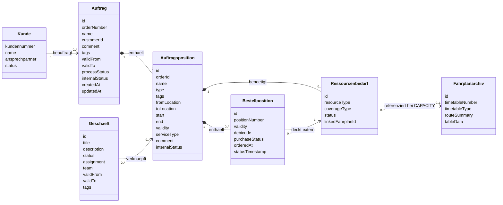
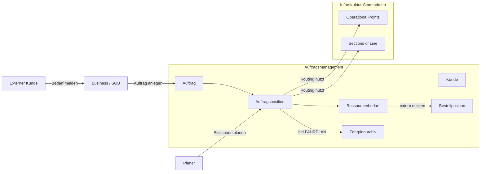

# Datenmodell Auftragsmanagement

## Ziel und Scope

Dieses Dokument beschreibt das aktuelle fachliche und technische Datenmodell fuer Auftraege, Auftragspositionen, Ressourcenplanung, Fahrplanarchiv und externe Bestellung.

Im aktuellen Stand gibt es genau zwei produktive Auftragspositionstypen:

- `LEISTUNG`: sonstige fachliche Leistung mit Zeitraum, Orten, Gueltigkeit, Tags und Kommentar
- `FAHRPLAN`: Zugfahrt mit vollstaendigem Fahrplan, Routing ueber Topologiedaten und Archivierung im Fahrplanarchiv

Der Schwerpunkt dieses Dokuments liegt bewusst auf allen Auftragspositionstypen und ihrer heutigen Persistenz.

## Zentrales fachliches Datenmodell

## Objektattribute

### Kunde

| Attribut | Pflicht | Beschreibung |
| --- | --- | --- |
| kundennummer | ja | Eindeutige fachliche ID des Kunden |
| name | ja | Name des Kundenunternehmens |
| ansprechpartner | nein | Fachlicher Ansprechpartner |
| status | ja | Fachlicher Status des Kunden |

### Auftrag

| Attribut | Typ | Pflicht | Beschreibung |
| --- | --- | --- | --- |
| id | UUID | ja | Eindeutige ID |
| orderNumber | string | ja | Eindeutige Auftragsnummer (max. 50 Zeichen) |
| name | string | ja | Auftragsname |
| customerId | UUID? | nein | FK zum Kunden |
| comment | string? | nein | Kommentar (max. 2000 Zeichen) |
| tags | string? | nein | Kommagetrennte Schlagwoerter; Auswahl im UI aus dem Katalog |
| validFrom | date | ja | Gueltig ab |
| validTo | date | ja | Gueltig bis |
| processStatus | enum | ja | `AUFTRAG`, `PLANUNG`, `PRODUKT_LEISTUNG`, `PRODUKTION`, `ABRECHNUNG_NACHBEREITUNG` |
| internalStatus | string? | nein | Interner Bearbeitungsstatus auf Auftragsebene |
| version | int | ja | Optimistic Locking |
| createdAt / updatedAt | datetime | ja | Technische Zeitstempel |
| createdBy / updatedBy | string? | ja | Fachlicher Benutzerkontext |

## Auftragsposition

Alle Auftragspositionen liegen physisch in `order_positions`. Der Typ wird ueber `PositionType` unterschieden. Gemeinsame Felder, UI-Verhalten und Persistenz sind unten getrennt nach Basis und Typ beschrieben.

### Gemeinsame Basisfelder

| Attribut | Typ | Pflicht | Beschreibung |
| --- | --- | --- | --- |
| id | UUID | ja | Eindeutige ID |
| orderId | UUID | ja | FK zum Auftrag |
| name | string | ja | Positionsname |
| type | enum | ja | `FAHRPLAN` oder `LEISTUNG` |
| tags | string? | nein | Kommagetrennte Schlagwoerter; Auswahl im UI aus `POSITION` / `GENERAL` |
| fromLocation | string? | nein | Fachlicher Startort; bei `FAHRPLAN` aus erster Archivzeile gespiegelt |
| toLocation | string? | nein | Fachlicher Zielort; bei `FAHRPLAN` aus letzter Archivzeile gespiegelt |
| start | datetime? | nein | Startzeitpunkt; bei `FAHRPLAN` aus erster relevanter Zeit abgeleitet |
| end | datetime? | nein | Endzeitpunkt; bei `FAHRPLAN` aus letzter relevanter Zeit abgeleitet |
| validity | jsonb? | nein | Gueltigkeit als Segmente `[{startDate,endDate}, ...]` |
| serviceType | string? | nein | Leistungsart; vor allem fuer `LEISTUNG` relevant |
| comment | string? | nein | Freitext (max. 2000 Zeichen) |
| internalStatus | enum | nein | `IN_BEARBEITUNG`, `FREIGEGEBEN`, `UEBERARBEITEN`, `UEBERMITTELT`, `BEANTRAGT`, `ABGESCHLOSSEN`, `ANNULLIERT` |
| variantOf / mergeTarget | FK? | nein | Vorbereitete Varianten-/Merge-Beziehungen |
| resourceNeeds | `ResourceNeed[]` | nein | Ressourcenbedarfe zur Position |
| purchasePositions | `PurchasePosition[]` | nein | Zugeordnete Bestellpositionen |
| version | int | ja | Optimistic Locking |
| createdAt / updatedAt | datetime | ja | Technische Zeitstempel |

### Typ `LEISTUNG`

`LEISTUNG`-Positionen werden im `ServicePositionDialog` bearbeitet. Die Position speichert ihre Fachdaten direkt in `order_positions`; ein separates Archiv existiert hier nicht.

| Feld / Verhalten | Aktueller Stand |
| --- | --- |
| Name | Pflichtfeld |
| Service-Typ | Freies Fachfeld `serviceType` |
| Von / Nach | Auswahl aus importierten `OperationalPoint`-Stammdaten |
| Startzeit / Endzeit | Pflichtfelder als `TimePicker` im Format `HH:mm` |
| Gueltigkeit | Auswahl einzelner Tage innerhalb der Auftragsgueltigkeit; Speicherung als JSON-Segmente |
| Start / Ende in DB | Kombination aus erstem/letztem Gueltigkeitstag und eingegebener Uhrzeit |
| Schlagwoerter | Auswahl aus `POSITION` und `GENERAL` |
| Kommentar | Optional, wird in Listen und Bearbeitungsansicht sichtbar angezeigt |

Fachliche Regeln fuer `LEISTUNG`:

- Ohne Start- und Endzeit kann die Position im UI nicht gespeichert werden
- `Von` und `Nach` werden aus den Infrastruktur-Stammdaten gewaehlt, aber aktuell nicht erzwungen
- Die Position hat heute keinen automatisch angelegten Ressourcenbedarf

### Typ `FAHRPLAN`

`FAHRPLAN`-Positionen werden nicht im Standarddialog, sondern im Full-screen `TimetableBuilderView` gepflegt.

#### Schritt 1: Route festlegen

| Feld / Verhalten | Aktueller Stand |
| --- | --- |
| Positionsname | Pflichtfeld |
| Schlagwoerter | Auswahl aus `POSITION` und `GENERAL` |
| Kommentar | Optionales Freitextfeld |
| Von / Nach | Pflichtpunkte aus den importierten `OperationalPoint`-Stammdaten |
| Ueber | Geordnete Zwangspunkte fuer die Route |
| Zwischenhalt | Optional pro `Ueber`-Punkt; kann als Halt mit Activity gepflegt werden |
| Ankerzeit | Entweder exakte Abfahrtszeit am Start oder exakte Ankunftszeit am Ziel |
| Karte | OpenStreetMap/Leaflet mit geraden Linien zwischen den OP-Koordinaten |

Routing und Schaetzung:

- kuerzester Weg ueber `sections_of_line.length_meters`
- Graph wird aktuell bidirektional behandelt
- Geschwindigkeitsannahme: `70 km/h`
- Wenn fuer ein Segment kein Pfad existiert, blockiert der Builder das Speichern
- Fuer CH/DE wurden vier synthetische `0m`-Grenzverbinder eingefuehrt, damit relevante Grenzuebergaenge im aktuellen Datenbestand routbar bleiben

#### Schritt 2: Fahrplan nacharbeiten

Schritt 2 zeigt die **komplette berechnete Route** als Tabelle. Nicht nur `von`, `ueber`, `nach`, sondern alle berechneten Betriebspunkte werden als bearbeitbare Zeilen sichtbar.

| Spalte / Verhalten | Aktueller Stand |
| --- | --- |
| Betriebspunkt | Name + UOPID des Betriebspunkts |
| Rollenmodell | `ORIGIN`, `VIA`, `DESTINATION`, `AUTO` |
| `von` / `nach` | Kontext aus vorherigem bzw. naechstem Betriebspunkt |
| Geschaetzte Zeiten | Automatisch aus der Route abgeleitet |
| Halt | Optional pro Zeile |
| Activity | Pflicht, sobald ein echter Halt gepflegt wird |
| Haltezeit | `dwellMinutes`, optional aber fachlich fuer Halte relevant |
| Ankunft / Abfahrt | Jeweils `NONE`, `EXACT`, `WINDOW` |
| Gueltigkeit | Kalenderauswahl innerhalb der Auftragsgueltigkeit |

TTT-nahe Zeitlogik:

- `NONE`: keine explizite Vorgabe, nur geschaetzte Zeit
- `EXACT`: exakte Zeit (`ALA` / `ALD`-Denke)
- `WINDOW`: frueheste/spaeteste Zeit (`ELA`/`LLA`, `ELD`/`LLD`)
- Zwischenhalte mit `halt = true` brauchen Zeiten und Activity
- Reine Durchfahrten koennen ohne Activity und ohne explizite Zeitvorgabe bestehen bleiben
- Eine Zeile wird als `tttRelevant` markiert, sobald explizite fachliche Angaben fuer den spaeteren Export vorhanden sind

#### Persistenz von `FAHRPLAN`

Beim Speichern passiert fachlich und technisch Folgendes:

1. Die vollstaendige Fahrplantabelle wird als JSON in `timetable_archives.table_data` gespeichert
2. `routeSummary` fasst die Route fachlich zusammen
3. Die `OrderPosition` bekommt `type = FAHRPLAN`
4. `fromLocation`, `toLocation`, `start`, `end`, `validity`, `tags`, `comment` werden auf der Position gespiegelt
5. Genau ein `ResourceNeed` mit `resourceType = CAPACITY` und `coverageType = EXTERNAL` wird erstellt oder wiederverwendet
6. Dieser Ressourcenbedarf verlinkt ueber `linkedFahrplanId` auf das `TimetableArchive`

Die aktuelle Beziehung ist damit bewusst **1:1**:

- eine `FAHRPLAN`-Position
- genau ein `CAPACITY`-Ressourcenbedarf
- genau ein `TimetableArchive`

## Vordefinierte Schlagwoerter

Der Schlagwort-Katalog wird als eigene Stammdatenliste in `predefined_tags` gepflegt. Die Datengrundlage liegt als CSV in `data/seeds/predefined-tags.csv` und wird ueber den Settings-Bereich importiert.

| Attribut | Typ | Pflicht | Beschreibung |
| --- | --- | --- | --- |
| name | string | ja | Anzeigename des Schlagworts |
| category | enum | ja | `ORDER`, `POSITION`, `GENERAL` |
| color | string? | nein | Optionale UI-Farbe |
| sortOrder | int | nein | Sortierung im Katalog |
| active | boolean | ja | Steuert, ob das Schlagwort im UI angeboten wird |

Verwendung:

- `ORDER` und `GENERAL` erscheinen im Auftragsdialog
- `POSITION` und `GENERAL` erscheinen bei allen Auftragspositionstypen
- Die eigentliche Zuordnung bleibt aus Kompatibilitaetsgruenden als kommagetrennter String in `orders.tags` bzw. `order_positions.tags`

## Ressourcenbedarf

Ein `Ressourcenbedarf` beschreibt, welche Ressource fuer eine Auftragsposition benoetigt wird und wie sie gedeckt wird.

| Attribut | Typ | Pflicht | Beschreibung |
| --- | --- | --- | --- |
| id | UUID | ja | Eindeutige ID |
| orderPositionId | UUID | ja | FK zur Auftragsposition |
| resourceType | enum | ja | `VEHICLE`, `PERSONNEL`, `CAPACITY` |
| coverageType | enum | ja | `INTERNAL`, `EXTERNAL` |
| status | string? | nein | Fachlicher Status der Ressource |
| linkedFahrplanId | UUID? | nein | FK auf `timetable_archives`, heute nur fuer `CAPACITY` genutzt |

Aktueller Anwendungsfall:

- `FAHRPLAN` erzeugt automatisch einen `CAPACITY`-Bedarf mit externer Deckung
- `LEISTUNG` legt derzeit keinen automatischen Ressourcenbedarf an

## Fahrplanarchiv

Das Fahrplanarchiv ist heute konkret implementiert und nicht mehr nur Zielbild.

| Attribut | Typ | Pflicht | Beschreibung |
| --- | --- | --- | --- |
| id | UUID | ja | Eindeutige Archiv-ID |
| timetableNumber | string? | nein | Optionale fachliche Kennung |
| timetableType | string? | nein | Aktuell `FAHRPLAN` |
| routeSummary | string? | nein | Fachliche Kurzbeschreibung der Route |
| tableData | jsonb | ja | Vollstaendige Fahrplantabelle |
| createdAt / updatedAt | datetime | ja | Technische Zeitstempel |
| version | int | ja | Optimistic Locking |

### Fahrplanzeile im Archiv (`tableData`)

Jede JSON-Zeile entspricht einem Betriebspunkt der berechneten Route.

| Attribut | Typ | Beschreibung |
| --- | --- | --- |
| sequence | int | Laufende Reihenfolge |
| uopid | string | Referenz auf den Betriebspunkt |
| name | string | Anzeigename |
| country | string | Laendercode |
| routePointRole | enum | `ORIGIN`, `VIA`, `DESTINATION`, `AUTO` |
| journeyLocationType | string | TTT-nahe Rollenklassifikation |
| fromName / toName | string | Vorheriger bzw. naechster Betriebspunkt |
| segmentLengthMeters | number | Kantenlaenge vom Vorgaenger |
| distanceFromStartMeters | number | Kumulierte Distanz |
| halt | boolean | Echte Haltmarkierung |
| tttRelevant | boolean | Fuer spaeteren TTT-Versand relevant |
| activityCode | string? | TTT-Activity / Haltegrund |
| dwellMinutes | int? | Haltezeit |
| estimatedArrival / estimatedDeparture | string? | Geschaetzte Zeiten `HH:mm` |
| arrivalMode / departureMode | enum | `NONE`, `EXACT`, `WINDOW` |
| arrivalExact / departureExact | string? | Exakte Zeit |
| arrivalEarliest / arrivalLatest | string? | Zeitfenster Ankunft |
| departureEarliest / departureLatest | string? | Zeitfenster Abfahrt |

## Bestellposition

Eine `Bestellposition` deckt einen extern zu beschaffenden Ressourcenbedarf.

| Attribut | Typ | Pflicht | Beschreibung |
| --- | --- | --- | --- |
| id | UUID | ja | Eindeutige ID |
| positionNumber | string | ja | Eindeutige Bestellnummer |
| orderPositionId | UUID | ja | FK zur Auftragsposition |
| resourceNeedId | UUID | ja | FK zum Ressourcenbedarf |
| validity | jsonb? | nein | Gueltigkeit der Bestellung |
| debicode | string? | nein | Bestellrelevant fuer Netzkapazitaet |
| purchaseStatus | enum | ja | `OFFEN`, `BESTELLT`, `BESTAETIGT`, `ABGELEHNT`, `STORNIERT` |
| orderedAt | datetime? | nein | Bestellzeitpunkt |
| statusTimestamp | datetime? | nein | Zeitpunkt der letzten Rueckmeldung |

## Geschaeft

| Attribut | Typ | Pflicht | Beschreibung |
| --- | --- | --- | --- |
| id | string | ja | Eindeutige ID |
| title | string | ja | Titel |
| description | string | ja | Beschreibung |
| status | enum | ja | `IN_BEARBEITUNG`, `FREIGEGEBEN`, `UEBERARBEITEN`, `ABGESCHLOSSEN`, `ANNULLIERT` |
| assignment | object | ja | Zuordnung mit `type` und `name` |
| team | string? | nein | Team-Zuordnung |
| validFrom / validTo | date? | nein | Gueltigkeit |
| documents | array? | nein | Dokumente |
| tags | string[]? | nein | Schlagwoerter |
| linkedOrderItemIds | string[]? | nein | Verknuepfte Auftragspositionen |

## Beziehungen und Kardinalitaeten

| Von | Nach | Kardinalitaet | Art | Bedeutung |
| --- | --- | --- | --- | --- |
| Kunde | Auftrag | 1 zu 0..* | Assoziation | Ein Kunde kann mehrere Auftraege haben |
| Auftrag | Auftragsposition | 1 zu 0..* | Komposition | Ein Auftrag enthaelt seine Positionen |
| Auftragsposition | Ressourcenbedarf | 1 zu 0..* | Komposition | Ressourcenbedarfe gehoeren zur Position |
| Auftragsposition | Bestellposition | 1 zu 0..* | Komposition | Bestellpositionen entstehen unter einer Position |
| Ressourcenbedarf | Fahrplanarchiv | 0..* zu 0..1 | Assoziation | Nur `CAPACITY` verweist auf ein Archiv |
| Geschaeft | Auftragsposition | 0..* zu 0..* | Assoziation | Fachliche Verknuepfung m:n |

## Fachliche Regeln des Datenmodells

- Eine Auftragsposition gehoert immer zu genau einem Auftrag
- Es gibt aktuell genau zwei aktive Positionstypen: `LEISTUNG` und `FAHRPLAN`
- Alle Positionstypen koennen Tags, Kommentar, Status, Gueltigkeit und Kauf-/Ressourcenbezug tragen
- `LEISTUNG` speichert ihre fachlichen Daten direkt auf der Position
- `FAHRPLAN` speichert die detaillierte Fahrplantabelle ausschliesslich im Fahrplanarchiv
- `FAHRPLAN` spiegelt nur die wichtigsten Metadaten auf `order_positions`
- Eine `FAHRPLAN`-Position hat heute genau einen `CAPACITY`-Ressourcenbedarf und genau ein verlinktes Archiv
- Die fachliche Gueltigkeit liegt an der Position, nicht am Archiv
- Halte in Fahrplanzeilen brauchen Activity und Zeiten
- Reine Durchfahrten duerfen ohne Activity bestehen bleiben
- Der Katalog vordefinierter Schlagwoerter ist Stammdatenbestand; die Zuordnung an Auftrag und Position bleibt String-basiert

## UI-Sicht auf alle Auftragspositionen

Die Daten werden im UI heute an drei Stellen unterschiedlich verdichtet dargestellt:

### 1. Auftragsliste (`/orders`)

- kompakte Kachel-/Accordion-Sicht
- pro Position sichtbar: Name, Typ, Route, Kommentar, Zeitfenster, Service-Typ, Tags, Bestellanzahl, Status
- Status-Chips filtern Positionen innerhalb eines Auftrags

### 2. Auftragsdetail (`/orders/{id}`)

- angereicherte Positionszeilen
- Anzeige von Name, Typ, Status, Route, Zeitfenster, Service-Typ, Tags und Kommentar
- Kalender-Toggle pro Position

### 3. Bearbeitung

- `LEISTUNG`: Dialog
- `FAHRPLAN`: Full-screen Builder mit Karte und Tabelleneditor

## Prozesskontext

