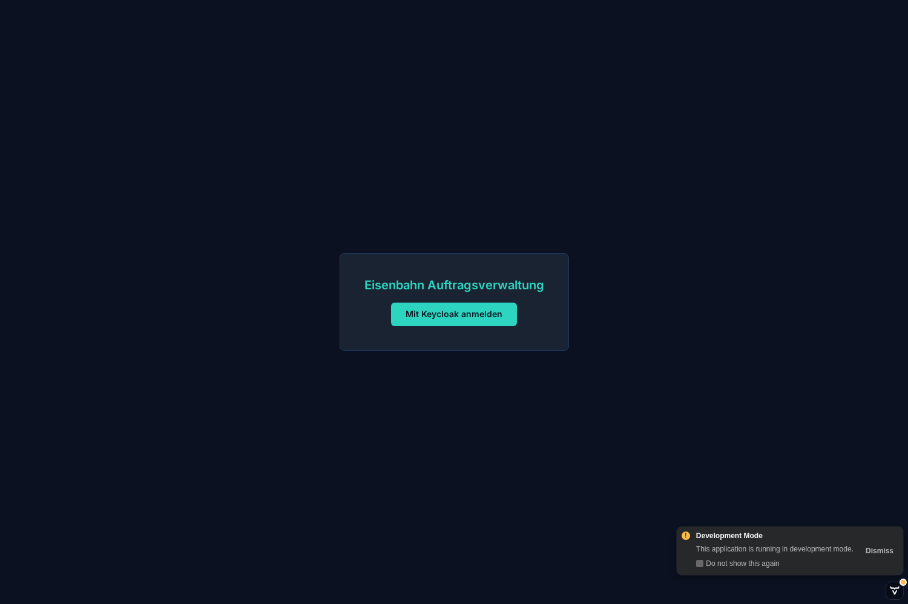
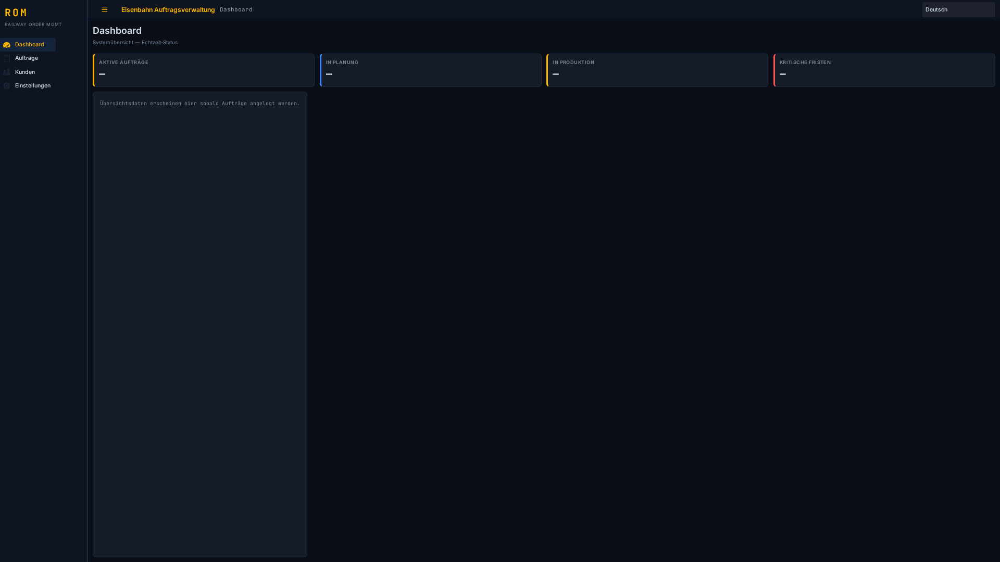
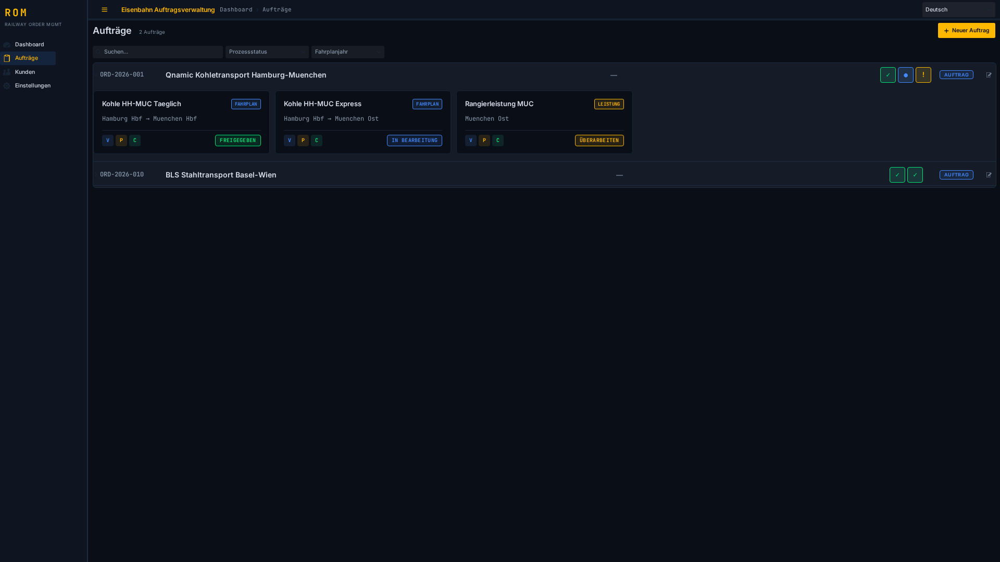
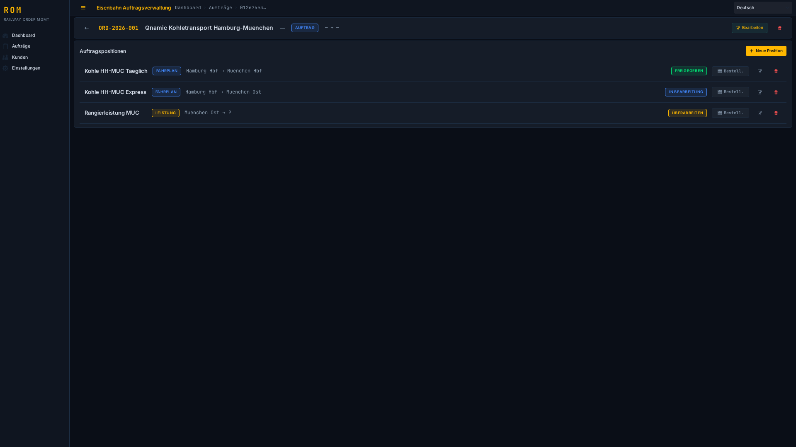
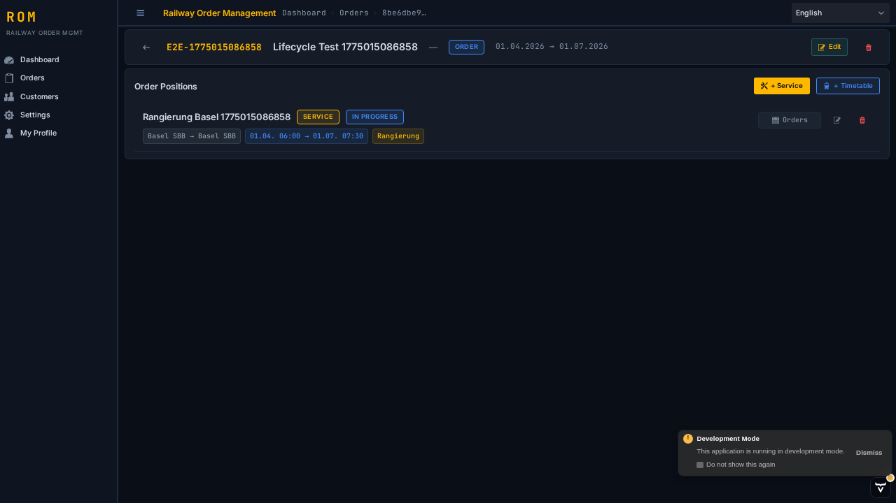
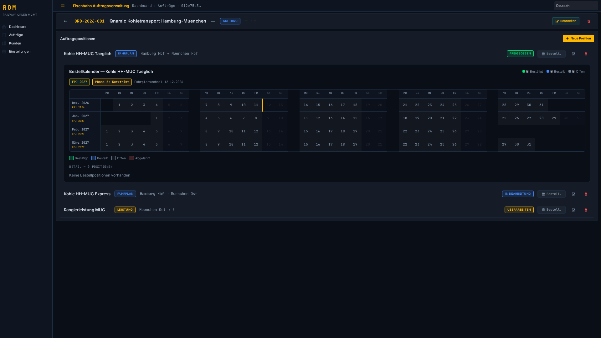
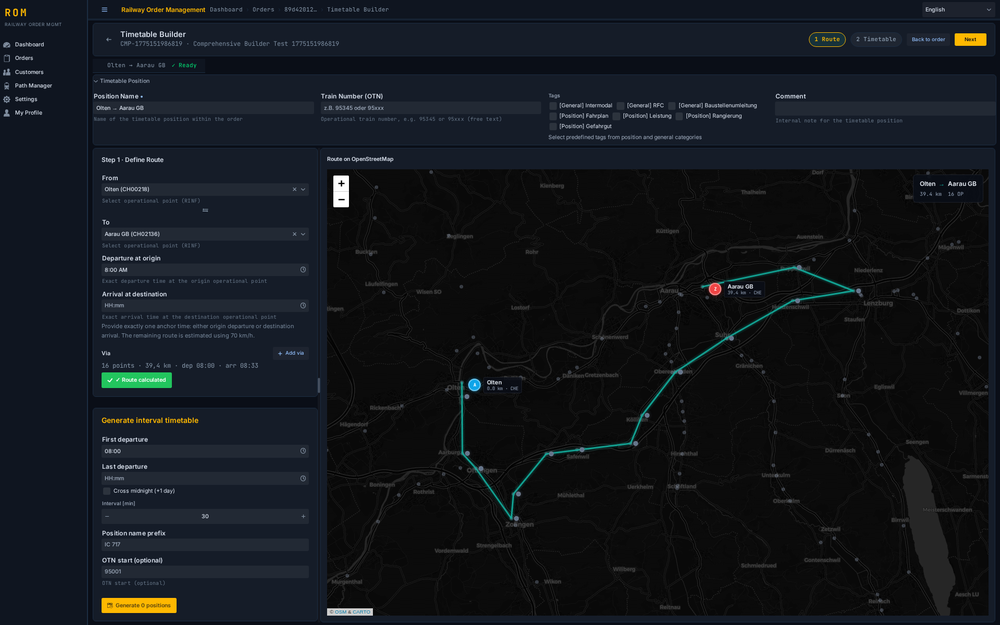
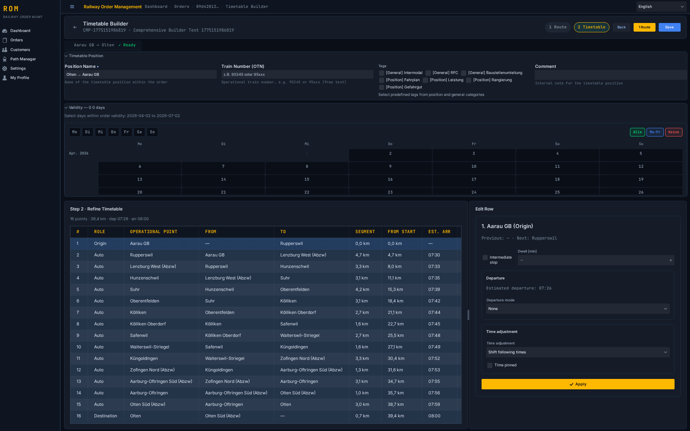
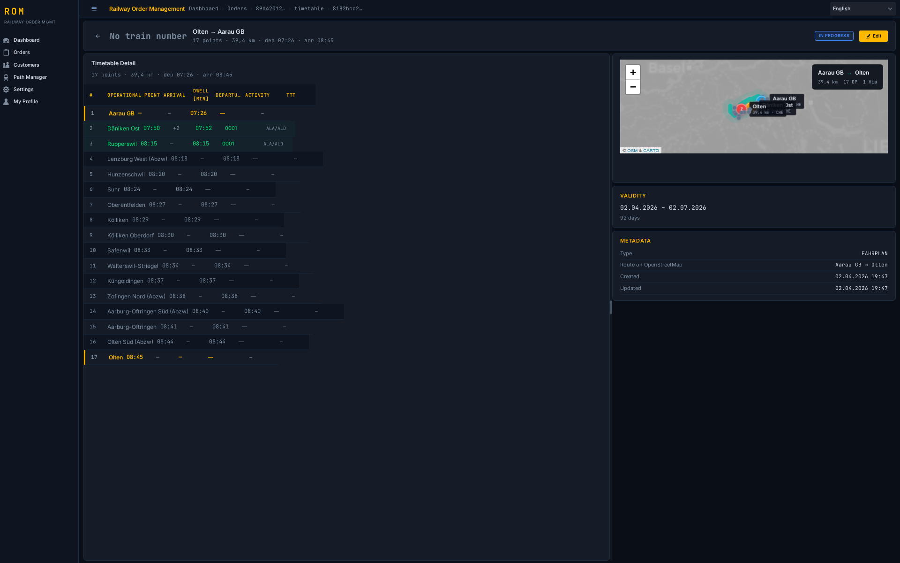
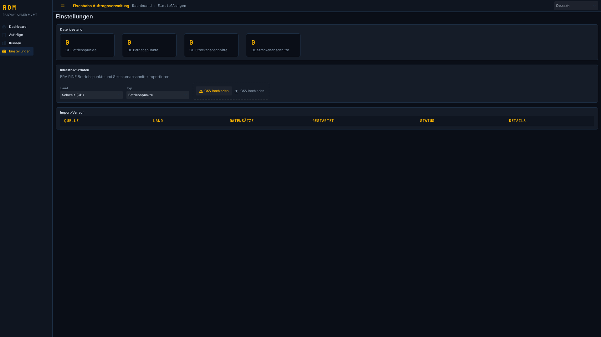

# Bedienungsanleitung — Railway Order Management

## Inhaltsverzeichnis

- [1. Ueberblick](#1-ueberblick)
- [2. Anmeldung und Navigation](#2-anmeldung-und-navigation)
- [3. Auftragsverwaltung](#3-auftragsverwaltung)
- [4. Auftragspositionen](#4-auftragspositionen)
- [5. Fahrplan-Builder](#5-fahrplan-builder)
- [6. Fahrplan-Detailansicht](#6-fahrplan-detailansicht)
- [7. Fahrplanmanager (Path Manager)](#7-fahrplanmanager-path-manager)
- [8. Einstellungen (nur ADMIN)](#8-einstellungen-nur-admin)
- [9. Benutzerprofil](#9-benutzerprofil)
- [10. Tastaturkuerzel](#10-tastaturkuerzel)
- [11. Haeufige Fragen (FAQ)](#11-haeufige-fragen-faq)
- [12. Fehlerbehebung](#12-fehlerbehebung)
- [13. Fahrzeugplanung (Vehicle Planning)](#13-fahrzeugplanung-vehicle-planning)
- [14. Ressourcen und Bestellungen](#14-ressourcen-und-bestellungen)

---

## 1. Ueberblick

### Was ist die Anwendung?

Railway Order Management ist ein webbasiertes System zur Verwaltung von Eisenbahn-Transportauftraegen. Die Anwendung unterstuetzt den gesamten Lebenszyklus eines Auftrags: von der Erfassung ueber die Fahrplanerstellung bis hin zur Kapazitaetsbestellung beim Infrastrukturbetreiber (IM).

Kernfunktionen:
- **Auftragsverwaltung**: Auftraege mit Leistungs- und Fahrplanpositionen erfassen und verwalten
- **Fahrplan-Builder**: Vollstaendige Fahrplaene auf Basis realer Infrastrukturdaten (ERA RINF) erstellen
- **Bestellkalender**: Kapazitaetsbestellungen mit TTR-Phasen (Timetable Redesign) verwalten
- **Fahrplanmanager**: Den TTT-Prozess (Train Timetable Transfer) zwischen Antragsteller (RA) und Infrastrukturbetreiber (IM) simulieren
- **Infrastruktur-Stammdaten**: Betriebspunkte und Streckenabschnitte aus dem ERA RINF-System importieren

### Zielgruppe

| Rolle | Beschreibung |
|---|---|
| **Disponenten** | Erfassen und verwalten Transportauftraege, erstellen Fahrplaene, steuern den Bestellprozess |
| **Planer** | Definieren Fahrplaene mit detaillierten Zeitmodi, pruefen IM-Angebote, verwalten den TTT-Lebenszyklus |
| **Administratoren** | Konfigurieren Stammdaten (Infrastruktur, Schlagwoerter), verwalten System-Einstellungen |

### Systemvoraussetzungen

- **Browser**: Aktuelle Version von Chrome, Firefox, Edge oder Safari
- **Bildschirm**: Mindestens 1280x720 Pixel empfohlen; die Anwendung ist responsiv, der volle Funktionsumfang steht ab Desktop-Groesse zur Verfuegung
- **Netzwerk**: Verbindung zum Anwendungsserver (Standard: Port 8085) und zum Keycloak-Identitaetsdienst

---

## 2. Anmeldung und Navigation

### Keycloak SSO Login

Die Anwendung verwendet Keycloak als zentralen Identitaetsdienst (Single Sign-On). Beim Aufruf der Anwendung werden Sie automatisch zur Keycloak-Anmeldeseite weitergeleitet.



1. Geben Sie Ihren **Benutzernamen** und Ihr **Passwort** ein
2. Klicken Sie auf **Anmelden**
3. Nach erfolgreicher Anmeldung werden Sie zum Dashboard weitergeleitet

Falls Sie bereits in einer anderen Anwendung des gleichen Keycloak-Realms angemeldet sind, erfolgt die Anmeldung automatisch (Single Sign-On).

### Dashboard-Uebersicht (KPI-Cards)

Das Dashboard ist die Startseite nach der Anmeldung (Route: `/`). Es zeigt KPI-Karten mit einer Uebersicht der wichtigsten Kennzahlen:



- Anzahl offener Auftraege
- Auftraege nach Status
- Anstehende Bestellungen

### Seitennavigation

Die Hauptnavigation befindet sich in der linken Seitenleiste (Drawer). Folgende Bereiche stehen zur Verfuegung:

| Navigationspunkt | Route | Beschreibung | Mindestrolle |
|---|---|---|---|
| **Dashboard** | `/` | KPI-Uebersicht | VIEWER |
| **Orders (Auftraege)** | `/orders` | Auftragsliste mit Accordion-Ansicht | VIEWER |
| **Settings (Einstellungen)** | `/settings` | Infrastruktur-Import, Schlagwort-Katalog | ADMIN |
| **Profil** | `/profile` | Benutzerprofil, Theme, Sprache | VIEWER |
| **Fahrplanmanager** | `/pathmanager` | TTT-Prozess-Simulation | VIEWER |
| **Fahrzeugplanung** | `/vehicleplanning` | Umlaufplanung (Gantt-Ansicht) | DISPATCHER |

Jede Seite zeigt eine **Breadcrumb-Navigation** unterhalb der Kopfzeile, die den aktuellen Pfad anzeigt und ein schnelles Zuruecknavigieren ermoeglicht.

### Sprache und Theme umschalten

Die Anwendung unterstuetzt vier Sprachen und mehrere visuelle Themes:

**Sprache aendern:**
1. Navigieren Sie zum **Profil** (Seitenleiste)
2. Waehlen Sie die gewuenschte Sprache: Deutsch, English, Italiano, Francais
3. Die Oberflaeche wird sofort in der neuen Sprache angezeigt

**Theme aendern:**
1. Navigieren Sie zum **Profil**
2. Waehlen Sie eines der verfuegbaren Themes:
   - **Dark Amber**: Dunkler Hintergrund mit bernsteinfarbenen Akzenten
   - **Dark Teal**: Dunkler Hintergrund mit blaugruenen Akzenten
   - **Light**: Heller Standard-Modus
3. Das Theme wird sofort angewendet und bleibt auch nach erneutem Anmelden erhalten

### Rollen: ADMIN, DISPATCHER, VIEWER — was darf wer?

Die Anwendung kennt drei Rollen, die im Keycloak-Realm zugewiesen werden:

| Funktion | ADMIN | DISPATCHER | VIEWER |
|---|---|---|---|
| Dashboard ansehen | Ja | Ja | Ja |
| Auftraege ansehen | Ja | Ja | Ja |
| Auftraege anlegen / bearbeiten | Ja | Ja | Nein |
| Auftraege loeschen | Ja | Ja | Nein |
| Positionen anlegen / bearbeiten | Ja | Ja | Nein |
| Fahrplan-Builder oeffnen | Ja | Ja | Nein |
| An Fahrplanmanager senden | Ja | Ja | Nein |
| Fahrplanmanager ansehen | Ja | Ja | Ja |
| TTT-Prozessschritte ausfuehren | Ja | Ja | Nein |
| Einstellungen (RINF, Tags) | Ja | Nein | Nein |
| Profil bearbeiten | Ja | Ja | Ja |

---

## 3. Auftragsverwaltung

### 3.1 Auftragsliste

Die Auftragsliste (Route: `/orders`) zeigt alle Auftraege in einer kompakten Accordion-Ansicht.



**Aufbau der Liste:**

Jeder Auftrag wird als aufklappbares Accordion-Element dargestellt. Im geschlossenen Zustand sehen Sie:
- **Auftragsnummer** und **Name**
- **Status-Chip**: farbcodierter Badge (z.B. DRAFT, ACTIVE, COMPLETED)
- **Gueltigkeitszeitraum**: Von-/Bis-Datum
- **Positionsanzahl**: Zaehler fuer LEISTUNG- und FAHRPLAN-Positionen
- **Kommentar-Vorschau**: Erste Zeile des Auftragskommentars (falls vorhanden)

Oben auf der Seite befinden sich **Summary-Metriken**: Gesamtanzahl der Auftraege und eine Aufschluesselung nach Status.

**Positionen als Kacheln:**

Beim Aufklappen eines Auftrags werden die zugehoerigen Positionen als Kacheln angezeigt. Jede Kachel zeigt:
- **Route**: Von-/Nach-Betriebspunkte (z.B. "Zuerich HB - Basel SBB")
- **Zeitfenster**: Start- und Endzeit
- **Tags**: Zugewiesene Schlagwoerter als farbige Chips
- **Kommentar**: Positionskommentar
- **Bestellanzahl und Status**: Wie viele Bestellungen existieren und in welchem Status

Klicken Sie auf den **Auftragsnamen** oder den **Oeffnen-Button**, um zur Auftragsdetailansicht zu navigieren.

**Auftraege filtern:**

Oberhalb der Liste koennen Sie Auftraege nach verschiedenen Kriterien filtern:
- Nach Status (DRAFT, ACTIVE, COMPLETED etc.)
- Textsuche in Auftragsnummer und Name

**Heatmap-Kalender:**

Die Auftragsliste enthaelt einen Kalender, der die zeitliche Verteilung der Auftraege als Heatmap darstellt. Dunklere Farben zeigen Tage mit mehr aktiven Auftraegen an.

### 3.2 Neuen Auftrag anlegen

So legen Sie einen neuen Auftrag an:

1. Navigieren Sie zur **Auftragsliste** (`/orders`)
2. Klicken Sie auf den **"+ Neuer Auftrag"**-Button
3. Fuellen Sie das Formular aus:

| Feld | Pflicht | Beschreibung |
|---|---|---|
| **Auftragsnummer** | Ja | Eindeutige Kennung des Auftrags |
| **Name** | Ja | Bezeichnung des Auftrags |
| **Gueltig von** | Ja | Startdatum des Gueltigkeitszeitraums |
| **Gueltig bis** | Ja | Enddatum des Gueltigkeitszeitraums |
| **Kunde** | Nein | Zuordnung zu einem Auftraggeber |
| **Tags** | Nein | Schlagwoerter aus dem Katalog (Kategorien ORDER und GENERAL) |
| **Kommentar** | Nein | Freitext-Bemerkung zum Auftrag |

4. Klicken Sie auf **Speichern**

**Schlagwoerter aus Katalog:**

Im Tag-Feld werden vordefinierte Schlagwoerter aus dem Katalog angeboten. Nur Tags der Kategorien `ORDER` und `GENERAL` stehen fuer Auftraege zur Verfuegung. Die Tags werden vom Administrator ueber die Einstellungen importiert (siehe [Abschnitt 8.2](#82-schlagwort-katalog)).

### 3.3 Auftrag bearbeiten



Die Detailansicht eines Auftrags (Route: `/orders/{id}`) zeigt:

**Kompakter Header:**
- Auftragsnummer und Name
- **Status-Badge** mit Farbkodierung
- Gueltigkeitszeitraum
- Zugewiesene Tags
- Kommentar

**Edit-Button:**
- Klicken Sie auf den **Bearbeiten-Button** (Stift-Icon) im Header
- Das Auftragsformular oeffnet sich mit den aktuellen Daten
- Nehmen Sie Aenderungen vor und klicken Sie auf **Speichern**

**Auftrag loeschen:**
- Klicken Sie auf den **Loeschen-Button** (Muelleimer-Icon)
- Ein Bestaetigungsdialog erscheint
- Bestaetigen Sie die Loeschung mit **Ja, loeschen**
- Der Auftrag und alle zugehoerigen Positionen werden entfernt

> **Hinweis**: Geloeschte Auftraege bleiben im Audit Trail (Hibernate Envers) nachvollziehbar.

---

## 4. Auftragspositionen

Auftragspositionen beschreiben die einzelnen Leistungen und Fahrplaene innerhalb eines Auftrags. Es gibt zwei Positionstypen:

| Typ | Beschreibung | Erstellung |
|---|---|---|
| **LEISTUNG** | Einzelne Serviceleistung (z.B. Rangierfahrt, Wagenbereitstellung) | Dialog |
| **FAHRPLAN** | Vollstaendiger Fahrplan mit Route und Zeitangaben | Fullscreen-Builder |

### 4.1 Leistungspositionen (LEISTUNG)

Leistungspositionen werden ueber einen kompakten Dialog erstellt und bearbeitet.



**Neue Leistungsposition anlegen:**

1. Oeffnen Sie die Auftragsdetailansicht
2. Klicken Sie auf den **"+ Service"**-Button im Positionsbereich
3. Der Service-Position-Dialog oeffnet sich

**Dialog-Felder:**

| Feld | Pflicht | Beschreibung |
|---|---|---|
| **Name** | Ja | Bezeichnung der Leistung (z.B. "Rangierfahrt Buchs") |
| **Leistungsart** | Nein | Art der Leistung (Auswahl) |
| **Von (Betriebspunkt)** | Nein | Startbetriebspunkt aus der RINF-Datenbank |
| **Nach (Betriebspunkt)** | Nein | Zielbetriebspunkt aus der RINF-Datenbank |
| **Startzeit** | Ja | Gewuenschte Startzeit |
| **Endzeit** | Ja | Gewuenschte Endzeit |
| **Tags** | Nein | Schlagwoerter aus den Kategorien POSITION und GENERAL |
| **Kommentar** | Nein | Freitext-Bemerkung |

**Gueltigkeit (Kalender mit Wochentag-Schnellauswahl):**

Unterhalb der Hauptfelder befindet sich ein **Multi-Datums-Kalender**. Hier waehlen Sie die einzelnen Tage innerhalb des Auftragszeitraums aus, an denen die Leistung erbracht werden soll.

- Klicken Sie auf einzelne Tage, um sie auszuwaehlen oder abzuwaehlen
- Nutzen Sie die **Wochentag-Schnellauswahl** (Mo, Di, Mi, ..., So), um alle Tage eines bestimmten Wochentags auf einmal zu markieren
- Ausgewaehlte Tage werden farblich hervorgehoben
- Die Gueltigkeit wird als Datumssequenz auf der Position gespeichert

**Position bearbeiten:**
- Klicken Sie auf den **Bearbeiten-Button** (Stift-Icon) in der Positionszeile
- Der Dialog oeffnet sich mit den gespeicherten Daten
- Aendern Sie die gewuenschten Felder und klicken Sie auf **Speichern**

**Position loeschen:**
- Klicken Sie auf den **Loeschen-Button** (Muelleimer-Icon)
- Bestaetigen Sie die Loeschung im Bestaetigungsdialog

### 4.2 Fahrplanpositionen (FAHRPLAN)

Fahrplanpositionen werden ueber den Vollbild-Fahrplan-Builder erstellt.

**Neue Fahrplanposition anlegen:**

1. Oeffnen Sie die Auftragsdetailansicht
2. Klicken Sie auf den **"+ Timetable"**-Button
3. Der Fahrplan-Builder oeffnet sich im Vollbildmodus

Der Builder ist in zwei Schritte gegliedert und bietet umfangreiche Bearbeitungsmoeglichkeiten. Eine ausfuehrliche Anleitung finden Sie unter:

> [Fahrplan-Builder Anleitung](timetable-builder.md)

**In der Auftragsdetailansicht** werden FAHRPLAN-Positionen mit zusaetzlichen Aktions-Buttons angezeigt:

| Button | Icon | Beschreibung |
|---|---|---|
| **Ansehen** | Auge | Oeffnet die Fahrplan-Detailansicht (read-only) |
| **Bearbeiten** | Stift | Oeffnet den Builder zum Bearbeiten |
| **An PM senden** | Zug (orange) | Sendet den Fahrplan an den Fahrplanmanager |
| **Im PM ansehen** | Zug (teal) | Navigiert zum gesendeten Fahrplan im Fahrplanmanager |
| **Loeschen** | Muelleimer | Loescht die Position |

### 4.3 Bestellkalender



Der Bestellkalender verwaltet Kapazitaetsbestellungen (Purchase Positions) fuer einzelne Auftragspositionen.

**Bestellkalender oeffnen:**
1. Klicken Sie in der Auftragsdetailansicht auf den **Kalender-Button** neben einer Position
2. Der Bestellkalender klappt unterhalb der Position auf

**Bestellungen verwalten:**

Der Kalender zeigt:
- **Summary**: Uebersicht der Bestellungen nach Status
- **Grid**: Tabellarische Auflistung aller Bestellungen mit Datum, Status und TTR-Phase
- **Details**: Detailinformationen zur ausgewaehlten Bestellung

**TTR-Phasen:**

Die Bestellungen orientieren sich an den TTR-Phasen (Timetable Redesign) des europaeischen Fahrplanbestellprozesses:
- **X-11**: Erste Bestellrunde (ca. 11 Monate vor Fahrplanwechsel)
- **X-8**: Zweite Bestellrunde
- **X-5**: Dritte Bestellrunde
- **Ad-hoc**: Kurzfristige Bestellungen

**Status-Uebersicht:**

Jede Bestellung durchlaeuft verschiedene Status:
- DRAFT: Entwurf
- SUBMITTED: Eingereicht
- CONFIRMED: Bestaetigt
- REJECTED: Abgelehnt

---

## 5. Fahrplan-Builder (Kurzuebersicht)

Der Fahrplan-Builder ist ein Vollbild-Editor zur Erstellung und Bearbeitung von Fahrplanpositionen. Er ist ueber `/orders/{orderId}/timetable-builder` erreichbar.

> Fuer die vollstaendige Anleitung siehe: [Detaillierte Builder-Anleitung](timetable-builder.md)

### Schritt 1: Route definieren



In Schritt 1 definieren Sie die Route:

1. **Name**: Pflichtfeld fuer die Bezeichnung (z.B. "IC 123 Zuerich - Basel")
2. **Von / Nach**: Waehlen Sie Start- und Zielbetriebspunkt aus der RINF-Datenbank
3. **Ueber (Via)**: Optional koennen geordnete Zwischenpunkte angegeben werden
4. **Ankerzeit**: Entweder Abfahrtszeit am Start oder Ankunftszeit am Ziel
5. **OTN**: Optionale betriebliche Zugnummer (max. 20 Zeichen)
6. **Tags und Kommentar**: Optionale Zusatzinformationen

**Route berechnen:**
- Klicken Sie auf **"Route berechnen"** oder druecken Sie **Enter**
- Das System berechnet den kuerzesten Weg ueber die Streckenabschnitte
- Eine Karte (Leaflet/OpenStreetMap) zeigt die berechnete Route
- Geschaetzte Zeiten werden fuer jeden Betriebspunkt der Route berechnet (Annahme: 70 km/h)

**Interaktive Karte:**
- Alle Betriebspunkte werden als kleine graue Kreise auf der Karte angezeigt
- Klicken Sie auf einen Marker, um den Betriebspunkt in das Von-/Nach-/Via-Feld einzutragen
- Die Route wird als Linie zwischen den Betriebspunkten dargestellt

Wenn die Route berechnet ist, klicken Sie auf **"Weiter"**, um zu Schritt 2 zu wechseln.

### Schritt 2: Fahrplan bearbeiten



In Schritt 2 sehen und bearbeiten Sie die komplette Fahrplantabelle:

- Jeder Betriebspunkt der Route erscheint als Zeile
- Klicken Sie auf eine Zeile, um den **Zeilen-Editor** rechts zu oeffnen
- Bearbeiten Sie Haltezeiten, Aktivitaeten und Zeitbeschraenkungen
- Fuegen Sie neue Halte hinzu oder entfernen Sie bestehende
- Waehlen Sie zwischen **Shift** (Verschiebung) und **Stretch** (Streckung) fuer die Zeitpropagation
- **Pinnen** Sie wichtige Zeitpunkte, damit sie bei Aenderungen nicht verschoben werden

**Taktfahrplan-Generator:**

Fuer regelmaessige Verbindungen kann ein Taktfahrplan erzeugt werden. Dabei wird der aktuelle Fahrplan als Vorlage verwendet und im gewaehlten Takt (z.B. alle 30 oder 60 Minuten) vervielfaeltigt.

**Status-Bar:**
- Am unteren Rand zeigt eine Status-Bar den aktuellen Bearbeitungszustand an
- Aenderungen werden durch einen "Dirty State"-Indikator gekennzeichnet
- Nicht gespeicherte Aenderungen werden beim Verlassen der Seite mit einer Warnung quittiert

### Tastaturkuerzel

| Kuerzel | Aktion | Kontext |
|---|---|---|
| **Enter** | Route berechnen | Schritt 1, wenn ein Formularfeld fokussiert ist |
| **Ctrl+S** | Fahrplan speichern | Schritt 2 |

### Speichern

Klicken Sie auf **"Speichern"** (oder Ctrl+S), um den Fahrplan zu sichern. Das System:
1. Speichert die vollstaendige Fahrplantabelle als JSON in `timetable_archives`
2. Uebertraegt Metadaten (Route, Zeiten, OTN, Tags, Gueltigkeit) auf die Auftragsposition
3. Erstellt eine CAPACITY-Ressource, die Position und Archiv verknuepft
4. Navigiert zurueck zur Auftragsdetailansicht

---

## 6. Fahrplan-Detailansicht

Die Fahrplan-Detailansicht zeigt einen gespeicherten Fahrplan in einer lesefreundlichen Form.



### Oeffnen

Klicken Sie in der Auftragsdetailansicht auf das **Augen-Icon** neben einer FAHRPLAN-Position. Die Detailansicht oeffnet sich unter `/orders/{orderId}/timetable/{positionId}`.

### Farbkodierte Tabelle

Die Tabelle zeigt alle Betriebspunkte der Route mit folgender Farbkodierung:

| Farbe | Bedeutung |
|---|---|
| **Amber (Bernstein)** | Origin- und Destination-Betriebspunkte |
| **Teal (Blaugruen)** | Halte (Stops) mit Aktivitaeten |
| **Grau (gedaempft)** | Durchfahrten ohne Halt |
| **Durchgestrichen** | Soft-geloeschte Zeilen (werden beim naechsten Speichern entfernt) |

Jede Zeile zeigt:
- Sequenznummer
- Name des Betriebspunkts
- Ankunfts- und Abfahrtszeit
- Haltezeit in Minuten
- Aktivitaetscode (falls vorhanden)
- TTT TimingQualifier-Tags (ALA, PLA, ELA etc.)

### Karte und Seitenleiste

Rechts neben der Tabelle befindet sich eine Seitenleiste mit drei Karten:

1. **Karte**: Leaflet/OpenStreetMap-Ansicht der Route mit Markern und Verbindungslinien
2. **Gueltigkeit**: Datum und Anzahl der Gueltigkeitstage aus den Datumssegmenten der Position
3. **Metadaten**: OTN, Fahrplantyp, Routenzusammenfassung, Erstellungs- und Aenderungszeitstempel

### Zum Builder navigieren

Klicken Sie auf den **"Bearbeiten"**-Button im Header, um direkt in den Fahrplan-Builder zu wechseln und den Fahrplan zu ueberarbeiten.

---

## 7. Fahrplanmanager (Path Manager)

Der Fahrplanmanager simuliert den TTT-Kommunikationsprozess (Train Timetable Transfer) zwischen dem verantwortlichen Antragsteller (RA) und dem Infrastrukturbetreiber (IM).

> Fuer die vollstaendige Anleitung siehe: [Path Manager Anleitung](path-manager.md)

### Kurzuebersicht

**Navigation**: Klicken Sie in der Seitenleiste auf **Fahrplanmanager** oder navigieren Sie zu `/pathmanager`.

**TreeGrid-Ansicht**:

Die Hauptansicht ist ein hierarchischer Baum mit vier Ebenen:
1. **Fahrplanjahr**: Gruppiert Zuege nach Fahrplanperiode (z.B. 2025-12-14 bis 2026-12-12)
2. **Referenzzug**: Zeigt TRID, OTN, aktuellen Prozessstatus
3. **Zugversion**: Snapshot der Zugdaten (INITIAL, MODIFICATION, ALTERATION)
4. **Betriebspunkt**: Einzelne Halte mit Zeiten, Aktivitaeten und Qualifiern

**Typischer Ablauf:**
1. Fahrplan im Builder erstellen und speichern
2. Position ueber den "An PM senden"-Button (Zug-Icon) an den Fahrplanmanager uebermitteln
3. Im Fahrplanmanager den TTT-Prozess durchspielen: Antrag senden, IM-Empfang, Vorangebot, Endgueltiges Angebot, Buchen
4. Versionen vergleichen (Diff-Funktion)

**TTR-Phasen und Bestellprozess:**

Neben jedem Fahrplanjahr zeigt der Fahrplanmanager einen farbcodierten **TTR-Phasen-Badge** an, der automatisch die aktuelle Phase im europaeischen Fahrplanbestellprozess anzeigt:

| Badge-Farbe | Phase | Bestellphase | Bedeutung |
|---|---|---|---|
| **Gruen** | Annual Ordering | Bestellphase 2 | Regulaere Jahresbestellung. Der volle TTT-Prozess mit Vor- und Endangebot steht zur Verfuegung |
| **Gelb** | Late Ordering | Bestellphase 3 | Spaetbestellung. Kein Vorangebot (IM_DRAFT_OFFER) moeglich — der IM macht direkt ein endgueltiges Angebot |
| **Orange** | Ad Hoc | Ad-hoc | Kurzfristige Bestellung ab 2 Monate vor Fahrplanwechsel |
| **Grau** | Past / Fruehphasen | — | Fahrplanjahr abgelaufen oder Bestellung noch nicht moeglich |

**Unterschied Bestellphase 2 und 3:**

- In **Bestellphase 2** (Annual Ordering) durchlaeuft ein Zug den regulaeren Prozess: Antrag senden → IM-Empfang → Vorangebot → Endgueltiges Angebot → Buchen
- In **Bestellphase 3** (Late Ordering) entfaellt das Vorangebot. Der Prozess lautet: Antrag senden → IM-Empfang → Endgueltiges Angebot → Buchen
- Beim Erstellen eines neuen Zuges zeigt die Prozess-Simulation eine Info-Box mit dem automatisch ermittelten ProcessType und eine Warnung, falls Bestellphase 3 aktiv ist

**REST API:**

Der Fahrplanmanager stellt eine REST API bereit, die ueber Swagger UI dokumentiert ist:

```
http://localhost:8085/swagger-ui/index.html
```

---

## 8. Einstellungen (nur ADMIN)

Der Einstellungsbereich (Route: `/settings`) ist nur fuer Benutzer mit der Rolle **ADMIN** zugaenglich.



### 8.1 Topologie / RINF-Import

Die Anwendung verwendet Betriebspunkte (Operational Points) und Streckenabschnitte (Sections of Line) aus dem ERA RINF-System als Infrastruktur-Stammdaten. Diese werden per CSV-Import eingelesen.

**Import durchfuehren:**

1. Navigieren Sie zu **Einstellungen** > Tab **Topologie**
2. Waehlen Sie das **Land**: Schweiz (CH) oder Deutschland (DE)
3. Laden Sie die CSV-Dateien hoch:
   - `operational_points_{land}.csv` — Betriebspunkte mit Koordinaten und UOPID
   - `sections_of_line_{land}.csv` — Streckenabschnitte zwischen Betriebspunkten
4. Klicken Sie auf **Import starten**

**Unterstuetzte Laender:**

| Land | Betriebspunkte | Streckenabschnitte |
|---|---|---|
| Schweiz (CHE) | 3.261 | 1.588 |
| Deutschland (DEU) | 9.037 | 12.261 |
| **Gesamt** | **12.298** | **13.849** |

**Datenbestand-Anzeige:**

Unterhalb der Import-Funktion zeigt eine Zusammenfassung den aktuellen Datenbestand:
- Anzahl importierter Betriebspunkte pro Land
- Anzahl importierter Streckenabschnitte pro Land
- Status der Grenzverbinder (synthetische 0m-Verbindungen fuer CH/DE-Routing)

**Import-Verlauf:**

Eine Tabelle zeigt die Historie aller durchgefuehrten Importe mit:
- Zeitstempel
- Importtyp (Operational Points / Sections of Line)
- Land
- Anzahl importierter Datensaetze
- Ergebnis (Erfolg / Fehler)

> **Hinweis**: Der Import ist atomar — bei einem Fehler wird der gesamte Import zurueckgerollt. Bei erneutem Import werden bestehende Daten des gleichen Typs und Landes ersetzt (Replace-Import).

### 8.2 Schlagwort-Katalog

Schlagwoerter (Tags) ermoeglichen eine flexible Klassifizierung von Auftraegen und Positionen. Der Katalog wird per CSV-Datei importiert.

**CSV-Import:**

1. Navigieren Sie zu **Einstellungen** > Tab **Tags**
2. Laden Sie eine CSV-Datei hoch (Format: `name,category,sortOrder,active`)
3. Klicken Sie auf **Import starten**

**Kategorien:**

| Kategorie | Verwendung |
|---|---|
| **ORDER** | Verfuegbar bei der Auftragserfassung |
| **POSITION** | Verfuegbar bei der Positionserfassung (Service und Fahrplan) |
| **GENERAL** | Verfuegbar in beiden Kontexten |

**Sortierung und Aktivierung:**

- Tags koennen ueber das Feld `sortOrder` in der CSV sortiert werden
- Ueber das Feld `active` koennen Tags deaktiviert werden, ohne sie zu loeschen
- Deaktivierte Tags erscheinen nicht mehr in der Auswahl, bleiben aber auf bereits zugewiesenen Objekten erhalten

> **Hinweis**: Die CSV-Datei ersetzt nicht automatisch den gesamten Katalog. Bestehende Tags mit gleichem Namen werden aktualisiert, neue Tags hinzugefuegt.

---

## 9. Benutzerprofil

Die Profilseite (Route: `/profile`) zeigt Ihre persoenlichen Informationen und ermoeglicht Anpassungen der Anzeige.

**Angezeigte Informationen:**
- **Name**: Vorname und Nachname aus Keycloak
- **E-Mail**: E-Mail-Adresse aus dem Keycloak-Profil
- **Rollen**: Zugewiesene Rollen (ADMIN, DISPATCHER, VIEWER)
- **Angemeldet seit**: Zeitpunkt der aktuellen Sitzung

**Theme-Umschaltung:**

Waehlen Sie zwischen drei visuellen Themes:

| Theme | Beschreibung |
|---|---|
| **Dark Amber** | Dunkler Hintergrund, bernsteinfarbene Akzente. Empfohlen fuer dunkle Arbeitsumgebungen |
| **Dark Teal** | Dunkler Hintergrund, blaugruene Akzente. Alternative dunkle Variante |
| **Light** | Heller Standard-Modus. Empfohlen fuer helle Arbeitsumgebungen |

Das Theme wird sofort angewendet und in Ihrem Benutzerprofil gespeichert.

**Sprache:**

Waehlen Sie Ihre bevorzugte Sprache:
- **Deutsch (DE)**: Standardsprache
- **English (EN)**: Englische Oberflaeche
- **Italiano (IT)**: Italienische Oberflaeche
- **Francais (FR)**: Franzoesische Oberflaeche

Alle Beschriftungen, Meldungen und Hilfetexte werden in der gewaehlten Sprache angezeigt.

---

## 10. Tastaturkuerzel

Die folgende Tabelle listet alle verfuegbaren Tastaturkuerzel:

| Kuerzel | Aktion | Kontext |
|---|---|---|
| **Enter** | Route berechnen | Fahrplan-Builder, Schritt 1 (Fokus im Formular) |
| **Ctrl+S** | Fahrplan speichern | Fahrplan-Builder, Schritt 2 |
| **Tab** | Naechstes Feld | Alle Formulare und Dialoge |
| **Shift+Tab** | Vorheriges Feld | Alle Formulare und Dialoge |
| **Escape** | Dialog schliessen | Alle Dialoge (z.B. Service-Position-Dialog) |
| **Space** | Checkbox umschalten | Formulare mit Checkboxen (z.B. Halt-Checkbox im Builder) |

---

## 11. Haeufige Fragen (FAQ)

### Wie lege ich einen Taktfahrplan an?

1. Erstellen Sie zunaechst einen einzelnen Fahrplan ueber den Builder (Schritt 1 + 2)
2. Speichern Sie den Fahrplan
3. Erstellen Sie fuer jeden weiteren Takt eine neue FAHRPLAN-Position
4. Verwenden Sie im Builder die gleiche Route und passen Sie die Ankerzeit im gewuenschten Takt an (z.B. +60 Minuten)
5. Die Gueltigkeitskalender koennen identisch oder unterschiedlich sein

> **Tipp**: Nutzen Sie die Kopierfunktion (falls verfuegbar) oder erstellen Sie Fahrplaene mit aufeinanderfolgenden Ankerzeiten.

### Wie aendere ich Zeiten fuer mehrere Halte gleichzeitig?

Verwenden Sie die **Shift-Propagation**:

1. Oeffnen Sie den Fahrplan im Builder (Schritt 2)
2. Klicken Sie auf die Zeile, deren Zeit Sie aendern moechten
3. Stellen Sie sicher, dass der Propagationsmodus auf **Shift** steht
4. Aendern Sie die gewuenschte Zeit (z.B. Abfahrt +10 Minuten)
5. Alle folgenden Zeilen werden automatisch um den gleichen Betrag verschoben
6. Die Verschiebung stoppt am naechsten gepinnten Halt

Alternativ verwenden Sie **Stretch**, wenn Sie Zeiten proportional zwischen zwei gepinnten Halten umverteilen moechten.

### Was bedeuten die Farben in der Fahrplantabelle?

| Farbe | Bedeutung |
|---|---|
| **Amber (Bernstein)** | Start- und Zielbetriebspunkt (Origin / Destination) |
| **Teal (Blaugruen)** | Halt mit Aktivitaet (der Zug haelt hier) |
| **Grau / gedaempft** | Durchfahrt (der Zug faehrt durch, ohne zu halten) |
| **Durchgestrichen** | Soft-geloeschte Zeile (wird beim Speichern entfernt) |

### Wie sende ich einen Fahrplan an den Fahrplanmanager?

Voraussetzungen:
- Die Position muss vom Typ **FAHRPLAN** sein
- Der Fahrplan muss mindestens einmal gespeichert worden sein
- Die Position darf noch nicht gesendet worden sein

Schritte:
1. Oeffnen Sie die Auftragsdetailansicht
2. Suchen Sie die FAHRPLAN-Position
3. Klicken Sie auf das **orange Zug-Icon** ("An Fahrplanmanager senden")
4. Eine Erfolgsmeldung erscheint
5. Das Icon wechselt zu **teal** — klicken Sie darauf, um zum Fahrplanmanager zu navigieren

### Was ist der Unterschied zwischen Shift und Stretch?

**Shift (Verschiebung):**
- Alle folgenden Zeiten werden um den **gleichen Betrag** verschoben
- Beispiel: Abfahrt +10 Minuten -> alle Folgezeiten +10 Minuten
- Die relativen Abstande zwischen den Halten bleiben gleich
- Stoppt am naechsten gepinnten Halt

**Stretch (Streckung):**
- Zeiten zwischen dem geaenderten Halt und dem naechsten Pin werden **proportional** umverteilt
- Beispiel: Der Zeitabschnitt wird um 20% laenger -> alle Teilabschnitte werden um 20% laenger
- Die Verhaeltnisse der Fahrzeiten zueinander bleiben gleich
- Erfordert einen nachfolgenden gepinnten Halt als Ankerpunkt

### Welche Aktivitaetscodes gibt es?

Die haeufigsten TTT-Aktivitaetscodes:

| Code | Beschreibung |
|---|---|
| 0001 | Ein- und Aussteigen / Ein- und Ausladen |
| 0002 | IM Betrieblicher Halt |
| 0003 | Diensthalt |
| 0005 | Wenden ohne Triebfahrzeugwechsel |
| 0012 | Triebfahrzeugwechsel |
| 0023 | Lokfuehrerwechsel |
| 0028 | Nur Einsteigen |
| 0029 | Nur Aussteigen |
| 0040 | Durchfahrt |

Der vollstaendige Katalog mit 35+ Codes ist in der [Builder-Anleitung](timetable-builder.md#ttt-activity-codes) dokumentiert.

### Was ist ein TimingQualifier?

TimingQualifier-Codes beschreiben die Art einer Zeitangabe im TTT-Standard:

| Code | Bedeutung |
|---|---|
| **ALA / ALD** | Exakte vereinbarte Ankunft / Abfahrt |
| **ELA / ELD** | Fruehestmoegliche Ankunft / Abfahrt (Fenster-Untergrenze) |
| **LLA / LLD** | Spaetestmoegliche Ankunft / Abfahrt (Fenster-Obergrenze) |
| **PLA / PLD** | Publizierte / kommerzielle Ankunft / Abfahrt |

### Wie funktioniert der Audit Trail?

Alle Aenderungen an Auftraegen, Positionen, Ressourcen und Fahrplanarchiven werden automatisch von Hibernate Envers protokolliert. Es werden folgende Informationen gespeichert:
- Wer hat die Aenderung vorgenommen (Benutzer aus dem SecurityContext)
- Wann wurde die Aenderung vorgenommen (Zeitstempel)
- Was wurde geaendert (alte und neue Werte)

Der Audit Trail ist aktuell ueber die Datenbank einsehbar; eine GUI-Darstellung ist geplant.

---

## 12. Fehlerbehebung

### "Route kann nicht berechnet werden" / "No route found"

**Ursache**: Im geladenen Infrastruktur-Graph fehlt eine Streckenverbindung zwischen zwei Betriebspunkten. Das Routing ist datengetrieben — es kann nur Routen berechnen, die durch importierte Streckenabschnitte (Sections of Line) abgedeckt sind.

**Loesung**:
1. Pruefen Sie, ob die ERA RINF-Daten fuer das betreffende Land importiert wurden (Einstellungen > Topologie)
2. Pruefen Sie, ob Start- und Zielbetriebspunkt im gleichen oder durch Grenzverbinder verbundenen Netzwerk liegen
3. Versuchen Sie, einen Via-Punkt zu setzen, um die Route ueber bekannte Strecken zu fuehren
4. Fehlende Strecken koennen auf einen unvollstaendigen RINF-Datensatz hinweisen

### "Position name is required"

**Ursache**: Das Pflichtfeld **Name** wurde nicht ausgefuellt.

**Loesung**: Geben Sie einen aussagekraeftigen Namen fuer die Position ein, z.B. "IC 123 Zuerich - Basel" oder "Rangierfahrt Basel Bad Bf".

### "Route geaendert — bitte neu berechnen" (Dirty State)

**Ursache**: Sie haben im Fahrplan-Builder (Schritt 1) die Von-/Nach-/Via-Punkte geaendert, aber die Route noch nicht neu berechnet. Die angezeigte Route und die Fahrplantabelle stimmen nicht mehr mit den Eingabefeldern ueberein.

**Loesung**: Klicken Sie auf **"Route berechnen"** (oder druecken Sie Enter), bevor Sie zu Schritt 2 wechseln.

### Login funktioniert nicht

**Moegliche Ursachen und Loesungen**:

1. **Keycloak nicht erreichbar**: Pruefen Sie, ob der Keycloak-Server laeuft
   ```bash
   docker compose -f docker/docker-compose.yml ps
   ```
   Falls der Container gestoppt ist:
   ```bash
   docker compose -f docker/docker-compose.yml up -d
   ```

2. **Falsches Passwort**: Pruefen Sie die Zugangsdaten. Standard-Testbenutzer:
   | Benutzer | Passwort | Rolle |
   |---|---|---|
   | admin | admin | ADMIN |
   | dispatcher | dispatcher | DISPATCHER |

3. **Keycloak-Realm nicht konfiguriert**: Stellen Sie sicher, dass der korrekte Realm und Client in der `.env`-Datei konfiguriert sind

4. **Browser-Cache**: Leeren Sie den Browser-Cache und versuchen Sie es erneut. SSO-Tokens koennen abgelaufen sein.

### "Halt activity is required"

**Ursache**: Im Fahrplan-Builder ist fuer eine Zeile der Halt-Schalter aktiviert, aber keine Aktivitaet ausgewaehlt. Wenn ein Halt gesetzt ist, muss eine TTT-Aktivitaet (z.B. 0001 Ein-/Aussteigen) angegeben werden.

**Loesung**: Waehlen Sie eine passende Aktivitaet aus der Dropdown-Liste oder deaktivieren Sie den Halt-Schalter.

### Karte wird nicht angezeigt

**Ursache**: Die Karte benoetigt eine Internetverbindung zu OpenStreetMap-Tile-Servern.

**Loesung**:
1. Pruefen Sie Ihre Internetverbindung
2. Pruefen Sie, ob ein Proxy oder eine Firewall den Zugriff auf `*.tile.openstreetmap.org` blockiert
3. Die Route wird trotzdem korrekt berechnet — die Karte ist nur die Visualisierung

### Zeiten aendern sich unerwartet nach Bearbeitung

**Ursache**: Die Zeitpropagation (Shift oder Stretch) hat Aenderungen an nachfolgende Zeilen weitergegeben.

**Loesung**:
1. Pruefen Sie den aktiven **Propagationsmodus** (Shift oder Stretch) im Zeilen-Editor
2. Pruefen Sie, welche Zeilen **gepinnt** sind — Pins begrenzen die Propagation
3. Nutzen Sie Pins strategisch an wichtigen Zeitpunkten (Grenzuebergaenge, Anschluesse, kommerzielle Zeiten), damit Aenderungen nicht ungewollt weitergereicht werden

### Daten werden nach Speichern nicht angezeigt

**Ursache**: Moegliches Browser-Caching oder eine unterbrochene WebSocket-Verbindung.

**Loesung**:
1. Laden Sie die Seite neu (F5 / Ctrl+R)
2. Falls das Problem weiterhin besteht, melden Sie sich ab und erneut an
3. Pruefen Sie die Browser-Konsole (F12) auf Fehlermeldungen

---

---

## 13. Fahrzeugplanung (Vehicle Planning)

Die Fahrzeugplanung ermoeglicht die visuelle Zuordnung von Referenzzuegen zu physischen Fahrzeugen in einem Gantt-Diagramm. So wird sichergestellt, dass jeder Zug einem konkreten Fahrzeug zugewiesen ist und keine Konflikte (Zeitueberlappung, Standort-Mismatch) auftreten.

> Fuer die vollstaendige Anleitung siehe: [Fahrzeugplanung Anleitung](vehicle-planning.md)

### Navigation

Klicken Sie in der Seitenleiste auf **Fahrzeugplanung** oder navigieren Sie zu `/vehicleplanning`.

### Umlaufplan erstellen

1. Waehlen Sie oben links ein **Fahrplanjahr** aus dem Dropdown
2. Klicken Sie auf **"+ Neuer Umlaufplan"**
3. Geben Sie einen **Namen** ein (z.B. "FLIRT S-Bahn Olten-Aarau") und optional eine Beschreibung
4. Der neue Umlaufplan erscheint in der Auswahl

### Fahrzeug hinzufuegen

1. Waehlen Sie einen bestehenden Umlaufplan aus
2. Klicken Sie auf **"+ Fahrzeug"**
3. Geben Sie eine **Bezeichnung** ein (z.B. "FLIRT RABe 526 201")
4. Waehlen Sie den **Fahrzeugtyp**: Triebzug, Lokomotive oder Wagenkomposition
5. Optional: Geben Sie eine **Fahrzeugklasse** ein (z.B. "RABe 526")

### Gantt-Ansicht und Drag & Drop

Die Hauptansicht zeigt ein Gantt-Diagramm:

- **Links (20%)**: Die **Zugpalette** zeigt alle Referenzzuege des aktuellen Fahrplanjahrs. Nutzen Sie das Suchfeld, um nach OTN oder Route zu filtern.
- **Rechts (80%)**: Das **Gantt-Diagramm** zeigt pro Fahrzeug eine horizontale Zeile. Das Zeitlineal oben zeigt die Stunden des Tages (00:00 - 24:00).

**Zuege zuweisen:**
1. Waehlen Sie den gewuenschten **Wochentag** (Mo-So)
2. **Ziehen** Sie einen Zug aus der Zugpalette auf die gewuenschte Fahrzeugzeile im Gantt-Diagramm
3. Der Zug erscheint als farbiger Block, dessen Breite proportional zur Fahrzeit ist
4. Wiederholen Sie den Vorgang fuer alle Zuege des Tages

**Zuege verschieben:**
- Ziehen Sie einen bereits zugeordneten Zugblock auf eine andere Fahrzeugzeile, um ihn einem anderen Fahrzeug zuzuweisen

**Zuege entfernen:**
- Klicken Sie auf einen Zugblock und waehlen Sie "Entfernen"

### Konflikterkennung

Unterhalb des Gantt-Diagramms zeigt das **Konfliktpanel** automatisch erkannte Probleme:

| Severity | Icon | Beschreibung |
|---|---|---|
| **ERROR** | Rot | Zeitueberlappung — zwei Zuege sind zur gleichen Zeit dem gleichen Fahrzeug zugewiesen |
| **WARNING** | Gelb | Standort-Mismatch — der Ankunftsort des vorherigen Zuges stimmt nicht mit dem Abfahrtsort des naechsten Zuges ueberein (fehlende Wendezeit) |

Konflikte werden live berechnet, nicht gespeichert. Jede Aenderung am Umlaufplan aktualisiert die Konfliktliste.

### Fahrzeugoperationen (TTT-Codes)

Fuer Kupplungs-/Abkupplungsvorgaenge und Richtungswechsel stehen folgende TTT-Aktivitaetscodes zur Verfuegung:

| Code | Beschreibung |
|---|---|
| 0010 | Kuppeln |
| 0017 | Abkuppeln |
| 0044 | Wenden (Richtungswechsel) ohne Triebfahrzeugwechsel |
| 0045 | Wenden (Richtungswechsel) mit Triebfahrzeugwechsel |

### Berechtigungen

| Funktion | ADMIN | DISPATCHER | VIEWER |
|---|---|---|---|
| Fahrzeugplanung ansehen | Ja | Ja | Ja |
| Umlaufplan anlegen / bearbeiten | Ja | Ja | Nein |
| Zuege per Drag & Drop zuweisen | Ja | Ja | Nein |

---

## 14. Ressourcen und Bestellungen

Dieses Kapitel beschreibt die Ressourcenverwaltung und den Bestellprozess fuer Auftragspositionen. Jede Auftragsposition kann Ressourcenbedarfe haben (z.B. Kapazitaet, Fahrzeuge, Personal), die ueber Bestellpositionen extern beschafft werden.

### 14.1 Ressourcen-Panel

Unterhalb jeder Auftragsposition in der Auftragsdetailansicht befindet sich das **Ressourcen-Panel**. Es zeigt alle Ressourcenbedarfe der Position und deren Bestellungen.

**Automatisch angelegte Ressourcen (FAHRPLAN-Positionen):**

Beim Speichern einer FAHRPLAN-Position werden automatisch drei Ressourcenbedarfe angelegt:
- **CAPACITY (EXTERNAL)**: Infrastrukturkapazitaet / Trasse — verknuepft mit dem Fahrplanarchiv
- **VEHICLE (INTERNAL)**: Fahrzeugbedarf / Rollmaterial
- **PERSONNEL (INTERNAL)**: Personalbedarf (Triebfahrzeugfuehrer, Zugbegleiter)

Diese automatischen Bedarfe haben die Herkunft `AUTO` und koennen nicht geloescht werden.

**Anzeige im Panel:**

Fuer jeden Ressourcenbedarf werden angezeigt:
- Ressourcentyp (CAPACITY, VEHICLE, PERSONNEL) mit Farbkodierung
- Deckungsart (INTERNAL / EXTERNAL)
- Katalog-Eintrag (falls verknuepft, z.B. "RABe 502 FLIRT")
- Menge und Prioritaet
- Gueltigkeit (Von / Bis)
- Zugehoerige Bestellpositionen mit Status

**Aktionsbuttons pro Ressourcenbedarf:**
- **Bestellen**: Erstellt eine neue Bestellposition fuer diesen Bedarf (oeffnet PurchaseDialog)
- **TTT**: Bei CAPACITY-Bedarfen: oeffnet den TTT-Bestelldialog (TttOrderDialog) fuer eine bestehende Bestellung
- **Sync**: Synchronisiert den Status einer bestehenden Bestellung mit dem Path Manager

### 14.2 Ressourcen hinzufuegen (ResourceDialog)

Ueber den **"+ Ressource"**-Button im Ressourcen-Panel koennen manuell weitere Bedarfe hinzugefuegt werden.

**Dialog-Felder:**

| Feld | Pflicht | Beschreibung |
|---|---|---|
| **Ressourcentyp** | Ja | VEHICLE, PERSONNEL oder CAPACITY |
| **Deckungsart** | Ja | INTERNAL (eigene Beschaffung) oder EXTERNAL (externe Bestellung) |
| **Katalog-Eintrag** | Nein | Auswahl aus dem Ressourcenkatalog (Fahrzeugtypen / Personalqualifikationen) |
| **Menge** | Ja | Benoetigte Anzahl (mindestens 1) |
| **Beschreibung** | Nein | Freitext zur Erlaeuterung des Bedarfs |

Der Dialog validiert:
- Ressourcentyp und Deckungsart muessen gesetzt sein
- Menge muss >= 1 sein

Die Gueltigkeit und Prioritaet werden automatisch von der Position abgeleitet (MEDIUM als Default-Prioritaet).

### 14.3 Bestellungen erstellen (PurchaseDialog)

Ueber den **"Bestellen"**-Button bei einem Ressourcenbedarf wird eine neue Bestellposition erstellt.

**Dialog-Felder:**

| Feld | Pflicht | Beschreibung |
|---|---|---|
| **Gueltigkeit** | Nein | JSON-basierte Gueltigkeitsangabe |
| **Beschreibung** | Nein | Freitext zur Bestellung |

Die Bestellposition wird mit Status `OFFEN` erstellt.

**Sonderfall CAPACITY + TTT:**

Wenn die Bestellung einen CAPACITY-Bedarf mit externer Deckung betrifft und die Position an den Fahrplanmanager gesendet wurde, wird nach Erstellung der Bestellposition automatisch der **TttOrderDialog** geoeffnet, anstatt die Bestellung direkt auszuloesen.

### 14.4 TTT-Bestellformular (TttOrderDialog)

Der TTT-Bestelldialog ermoeglicht die detaillierte Erfassung aller fuer einen TTT-Trassenantrag benoetigten Attribute. Er wird automatisch geoeffnet, wenn eine CAPACITY-Bestellung mit TTT-Verknuepfung erstellt wird, oder manuell ueber den "TTT"-Button im Ressourcen-Panel.

**Kopfbereich:**

Im Kopf des Dialogs werden die Zugdaten der verknuepften Position angezeigt:
- Route (Von - Nach)
- Zeitfenster (Start - Ende)
- Zugnummer (OTN, falls vorhanden)

**Pflichtfelder:**

| Feld | Beschreibung |
|---|---|
| **Debitcode** | Abrechnungscode fuer die Netzkapazitaet (z.B. "8500001") |
| **Kontaktperson** | Name des fachlichen Ansprechpartners |
| **E-Mail** | E-Mail-Adresse des Ansprechpartners |
| **Bremsart** | Bremsart des Zuges (z.B. "P" fuer Personenzug) |
| **Zugfolge** | Zugbildung / Wagenreihung (z.B. "Re 460 + IC2000 x8 + BDt") |

**Erweiterte Felder (6 aufklappbare Sektionen):**

| Sektion | Felder | Beschreibung |
|---|---|---|
| **Traktion** | Traktionsart, Anzahl, Klasse | Elektro-/Diesel-Traktion, Anzahl Triebfahrzeuge, Fahrzeugklasse |
| **Kalender** | Start, Ende, Bitmap | Verkehrstagekalender (ueberschreibt den Positionskalender fuer die Bestellung) |
| **NSP** | Netzwerkspezifische Parameter | Netzspezifische Zusatzinformationen (JSON) — z.B. Schweizer Netzprofil |
| **Referenzen** | Externe Referenz, Verknuepfter Zug | Externe Referenznummer und TRID eines verknuepften Zuges |
| **Erweiterter Kontakt** | Telefon, Organisation, Rolle | Zusaetzliche Kontaktinformationen |
| **Sondertransport** | Lademassprofil, Gefahrgut, Sonderbedingungen | Fuer aussergewoehnliche Sendungen |

**Bestellen:**

Beim Klick auf "Bestellen" passiert Folgendes:
1. Die Pflichtfelder werden validiert
2. Alle Attribute werden als JSON auf der Bestellposition gespeichert
3. Der Debitcode wird automatisch extrahiert und auf der Bestellposition gesetzt
4. Ein TTT-Trassenantrag wird im Path Manager erstellt (oder ein bestehender Referenzzug wiederverwendet)
5. Die Bestellung wechselt in den Status `BESTELLT`
6. Das Ressourcen-Panel wird aktualisiert

### 14.5 Status-Tracking und Synchronisation

**Automatisches Status-Mapping:**

Der `PurchaseOrderService` bildet den Prozessstatus des Path Managers auf den Bestellstatus ab:

| Path Manager Status | Bestellstatus |
|---|---|
| CREATED, MODIFIED, RECEIPT_CONFIRMED, DRAFT_OFFERED, FINAL_OFFERED | BESTELLT |
| BOOKED | BESTAETIGT |
| NO_ALTERNATIVE, CANCELED | ABGELEHNT |
| WITHDRAWN, SUPERSEDED | STORNIERT |

**Manuelle Synchronisation:**

Ueber den **"Sync"**-Button im Ressourcen-Panel kann der aktuelle Status jederzeit vom Path Manager abgerufen werden. Dabei werden aktualisiert:
- Prozessstatus (`pmProcessState`)
- TTR-Phase (`pmTtrPhase`)
- Bestellstatus (`purchaseStatus`)
- Synchronisationszeitpunkt (`pmLastSynced`)

**Bulk-Synchronisation:**

Ueber den **"Alle synchronisieren"**-Button werden alle CAPACITY-Bestellungen einer Position auf einmal synchronisiert.

### 14.6 Ressourcen-Katalog (Einstellungen)

Im Einstellungsbereich (Route: `/settings`) steht ein neuer Tab **"Katalog"** zur Verfuegung (nur ADMIN).

**Funktionen:**

- **Anzeige**: Alle Katalogeintraege in einer Tabelle mit Kategorie, Code, Name und Status
- **CSV-Import**: Upload einer CSV-Datei mit Katalogeintraegen

**CSV-Format:**

```
code,name,category,active,sortOrder
RABE502,RABe 502 FLIRT,VEHICLE_TYPE,true,1
LF,Lokführer/in,PERSONNEL_QUAL,true,1
```

**Kategorien:**

| Kategorie | Beschreibung |
|---|---|
| **VEHICLE_TYPE** | Fahrzeugtypen (z.B. Triebzuege, Lokomotiven, Wagen) |
| **PERSONNEL_QUAL** | Personalqualifikationen (z.B. Lokfuehrer, Zugfuehrer) |

Der Import ist transaktional — bei einem Fehler wird die gesamte Aktion zurueckgerollt. Die Berechtigung erfordert die Rolle ADMIN oder DISPATCHER.

### 14.7 Berechtigungen

| Funktion | ADMIN | DISPATCHER | VIEWER |
|---|---|---|---|
| Ressourcen ansehen | Ja | Ja | Ja |
| Ressource hinzufuegen | Ja | Ja | Nein |
| Ressource entfernen | Ja | Ja | Nein |
| Bestellung erstellen | Ja | Ja | Nein |
| TTT-Bestellung senden | Ja | Ja | Nein |
| Status synchronisieren | Ja | Ja | Nein |
| Katalog importieren | Ja | Ja | Nein |

---

> **Letzte Aktualisierung**: 2026-03-31
>
> Bei Fragen oder Problemen wenden Sie sich an den Systemadministrator.
